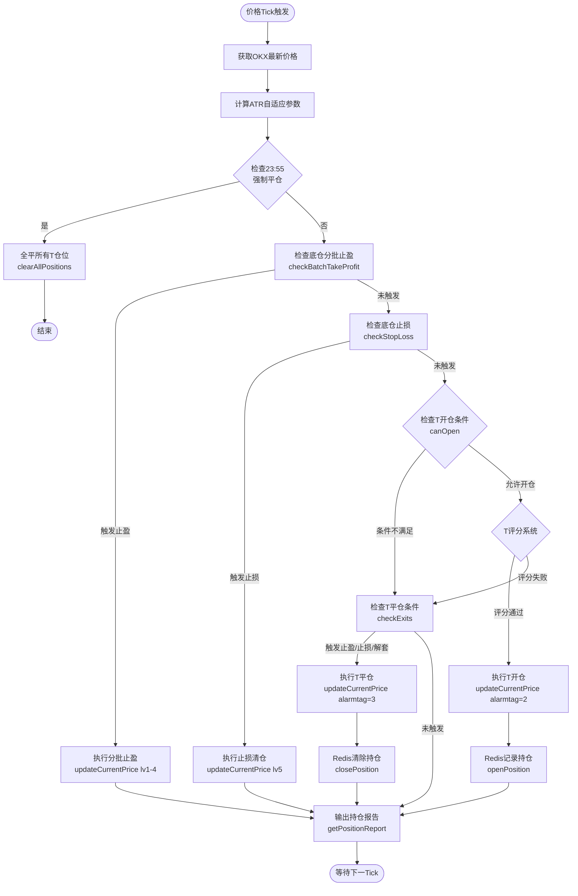
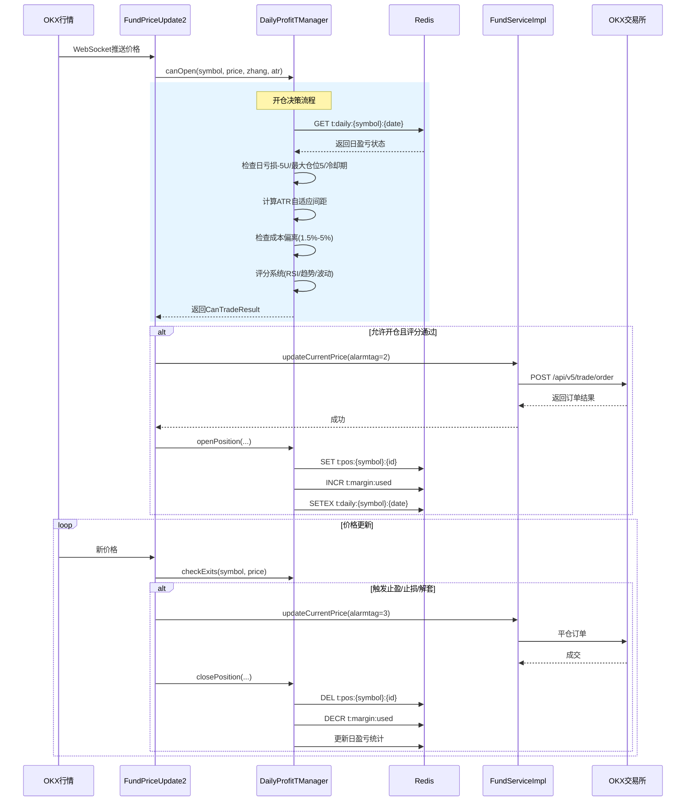
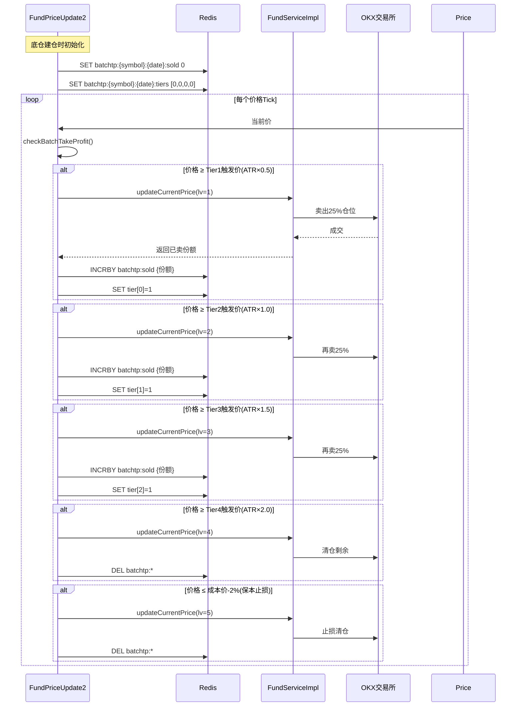
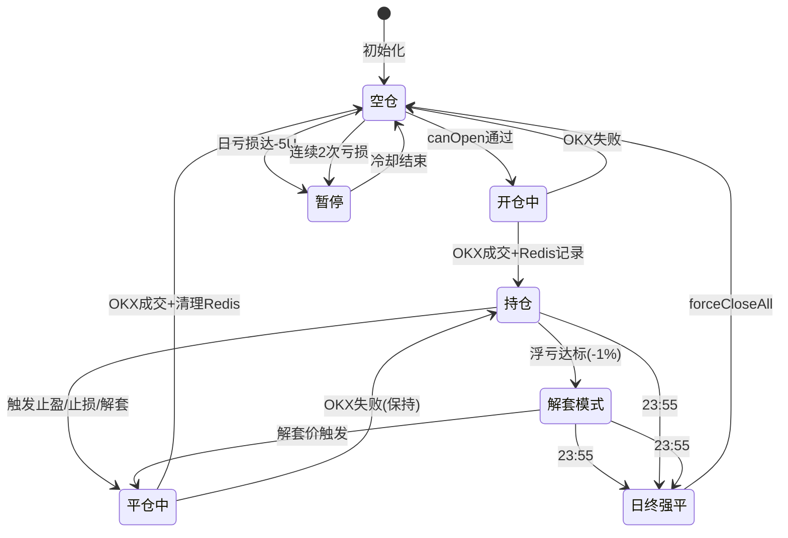
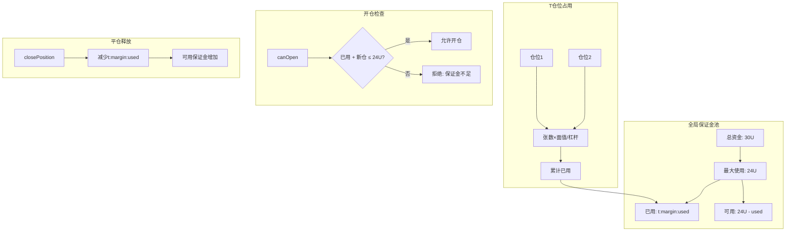

# AI 知识库 - FundAlarm 交易系统

## 项目概述
OKX 合约交易机器人，支持多品种（XAUT/DOGE）高频 T+0 交易与底仓网格交易。

---

## 系统交易流程图



---

## 核心组件

### 1. DailyProfitTManager（T交易管理器）
**文件**: `robotium-fundalarm-service/src/main/java/cn/exrick/manager/service/task/DailyProfitTManager.java`

**功能**: 
- 日内高频 T+0 交易管理
- ATR自适应网格间距（max 3x base）
- 动态成本偏离限制（ATR-based，1.5%-5%）
- 解套模式（Rescue Mode，间距 ATR×0.8，max 3%）

**合约配置**:
```java
// XAUT-USDT-SWAP（黄金币）- 波动小
- 杠杆: 5倍
- 面值: 1张 = 4U
- 最小开仓: 1张
- 网格间距: 0.15%（ATR自适应，max 0.45%）
- 止盈: 0.3% / 止损: 0.2%（1.5:1盈亏比）

// DOGE-USDT-SWAP（狗狗币）- 波动大  
- 杠杆: 3倍
- 面值: 1张 = 170U
- 最小开仓: 0.01张
- 网格间距: 0.3%（ATR自适应，max 0.9%）
- 止盈: 0.45% / 止损: 0.3%（1.5:1盈亏比）
```

**关键参数**:
```java
MAX_POSITIONS = 5;                    // 最大并发T仓位
DAILY_PROFIT_TARGET = 999U;           // 盈利无上限
DAILY_LOSS_LIMIT = -5U;               // 日亏损硬停
ATR_PERIOD = 14;                      // 1分钟K线，14周期
MARGIN_LIMIT = 24U;                   // 最大保证金使用（80% of 30U）
```

**核心方法**:
- `canOpen()`: 入场验证（ATR间距、保证金、冷却、偏离检测）
- `openPosition()/closePosition()`: 本地状态管理（Redis only）
- `forceCloseAll()`: 日终合并平仓
- `checkDailyForceClose()`: 23:55触发，防重复（1h过期）
- `getPositionReport()`: 实时持仓报告

---

### 2. FundPriceUpdate2（主交易循环）
**文件**: `robotium-fundalarm-service/src/main/java/cn/exrick/manager/service/task/FundPriceUpdate2.java`

**功能**:
- 价格数据获取（OKX K线+Ticker）
- ATR实时计算（1分钟K线，15根）
- T交易调度（开仓/平仓/日终）
- 底仓网格管理（分批止盈/止损/全平）

**执行流程**:
```java
// T-开仓（方案B-2：订单优先）
if (canTrade.allowed && score.passed) {
    // 1. 生成唯一ID（负数，避免DB冲突）
    int tId = -1 * (posId.hashCode() % 100000);
    int uniqueLevel = 900 + (posId.hashCode() % 100);  // 900-999
    
    // 2. 执行订单
    caiService.updateCurrentPrice(tableName, jingzhi, 2, jingzhi, canTrade.zhang, fund, cwTemp, "T" + posId);
    
    // 3. 成功后才写Redis
    dailyProfitTManager.openPosition(fund.getCode(), jingzhi, score, canTrade.zhang, atrPercent);
}

// T-平仓
checkExits() → updateCurrentPrice(alarmtag=3) → closePosition()

// 日终强平（23:55）
checkDailyForceClose() → forceCloseAll() → 合并close-position

// 自动报告（每30秒）
getPositionReport() → 控制台输出 + 文件记录
```

**底仓全平检测逻辑**:
```java
// 1. 从OKX获取盈亏平衡价（break-even price）
String ykp = okxService.trade("/api/v5/account/positions" + keyString, "GET", "");
// 解析JSON提取 bePx
BigDecimal ykPrice = dt.getBigDecimal("bePx");  // 盈亏平衡价

// 2. 设置T交易参考成本价
dailyProfitTManager.setBreakevenPrice(fund.getCode(), ykPrice);

// 3. 全平触发检测（盈亏平衡价 + 0.2%利润）
BigDecimal closeAllPrice = ykPrice.multiply(new BigDecimal("1.002"));
if (jingzhi.compareTo(closeAllPrice) >= 0) {
    // 【全平触发】
    System.out.println("【全平触发】当前价" + jingzhi + " >= 盈亏平衡价" + closeAllPrice);
    
    // 3.1 清理T仓位
    dailyProfitTManager.forceCloseAll(fund.getCode(), jingzhi);
    
    // 3.2 清理分批止盈Redis记录
    for (int level = 1; level <= 5; level++) {
        jedisClient.del("batchtp:" + tableName + ":" + level);
        jedisClient.del("highest:" + tableName + ":" + level);
        jedisClient.del("buyprice:" + tableName + ":" + level);
    }
    
    // 3.3 调用OKX一键全平接口
    cwMain.setComment("全平清仓：OKX一键全平");
    caiService.updatezhiying(cwMain, tableName, cangweis, fund);
}
```

---

### 3. FundServiceImpl（订单执行）
**文件**: `robotium-fundalarm-service/src/main/java/cn/exrick/manager/service/impl/FundServiceImpl.java`

**关键方法**:
- `updateCurrentPrice()`: 通用下单接口
- `updatezhiying()`: 止盈/止损/调仓
- `okxClosePosition()`: 一键全平（close-position API）

**特殊处理**:
```java
// 全平检测（comment含"全平"）
if (comment.contains("全平")) {
    // 使用 /api/v5/trade/close-position
    // Redis dedup（60s过期）
    // 结果存储：closeall:result:{instId}
}

// 重试机制：3次尝试，1秒间隔
// 错误日志：d:\okxError.txt
```

---

## T交易详细流程

### 开仓流程
```
1. 日状态检查
   ├─ 是否已触及日亏损-5U？→ 暂停交易
   ├─ 是否已达到最大仓位5个？→ 禁止开仓
   └─ 是否在冷却期？→ 等待

2. 评分系统（ScoreResult）
   ├─ RSI指标（超卖加分）
   ├─ 趋势方向（均线排列）
   ├─ 波动率（ATR百分比）
   └─ 时间衰减（持仓时间越长得分越低）
   
3. 入场条件（CanTradeResult）
   ├─ ATR自适应间距 ≥ max(baseGap, ATR×0.5)
   ├─ 保证金检查（全局24U池）
   ├─ 成本偏离 ≤ max(1.5%, ATR×2, 5%)
   └─ 解套模式检测（浮亏达标启用ATR×0.8间距）

4. 订单执行
   ├─ 生成唯一负ID（-100000~0）
   ├─ Level 900-999（避免与底仓1-100冲突）
   ├─ 先执行OKX订单
   └─ 成功后写Redis（原子操作）
```

### 平仓流程
```
1. 止盈检测
   ├─ 当前价 ≥ 开仓价 × (1 + TP%)
   └─ 触发 → alarmtag=3 平仓

2. 止损检测
   ├─ 当前价 ≤ 开仓价 × (1 - SL%)
   └─ 触发 → alarmtag=3 平仓

3. 解套检测
   ├─ 新T仓与被套T仓配对
   ├─ 解套价 = (成本1×张数1 + 成本2×张数2) / 总张数 × (1 + gap%)
   └─ 达到解套价 → 批量平仓

4. 日终强平（23:55）
   ├─ 无视盈亏状态
   ├─ 合并所有T仓位
   ├─ 使用close-position接口一键全平
   └─ 清理所有Redis记录
```

---

## 数据流转示意图

### 1. 做T交易数据流



### 2. 分批止盈数据流



### 3. 仓位管理状态机



### 4. 保证金池管理



---

## 底仓网格管理

### 分批止盈（ATR自适应）
```
Tier 1 (25%): 成本价 + ATR×0.5 → Level 1
Tier 2 (25%): 成本价 + ATR×1.0 → Level 2
Tier 3 (25%): 成本价 + ATR×1.5 → Level 3
Tier 4 (25%): 成本价 + ATR×2.0 → Level 4

保本止损: 跌破成本价-2% → Level 5 清仓
```

### 全平触发条件
```java
// 当最新价 ≥ 盈亏平衡价×1.002时
if (jingzhi >= breakEvenPrice × 1.002) {
    // 触发全平（close-position API）
    // 清理分批止盈Redis记录
    // 清理所有T仓位
}
```

### 分批止盈执行逻辑
```java
// FundPriceUpdate2.checkBatchTakeProfit()
public int checkBatchTakeProfit(cw, currentPrice, fund, tableName, atrPercent) {
    BigDecimal buyPrice = cw.getBuypriceReal();
    
    // 动态计算止盈档位（基于ATR）
    BigDecimal tp1 = buyPrice × (1 + atrPercent × 0.5);
    BigDecimal tp2 = buyPrice × (1 + atrPercent × 1.0);
    BigDecimal tp3 = buyPrice × (1 + atrPercent × 1.5);
    BigDecimal tp4 = buyPrice × (1 + atrPercent × 2.0);
    BigDecimal stopLoss = buyPrice × 0.98;  // 保本止损-2%
    
    // 检查各档位
    if (currentPrice >= tp4) return 4;  // Tier 4 全平
    if (currentPrice >= tp3) return 3;  // Tier 3
    if (currentPrice >= tp2) return 2;  // Tier 2
    if (currentPrice >= tp1) return 1;  // Tier 1
    if (currentPrice <= stopLoss) return 5;  // 止损
    
    return 0;  // 未触发
}

// 执行后更新Redis
jedisClient.set("batchtp:" + tableName + ":sold", soldFene);
jedisClient.set("batchtp:" + tableName + ":tiers", tierStatus);
```

---

## Redis Key 规范

```
// T交易状态
t:daily:{symbol}:{YYYYMMDD}     - 每日盈亏统计（24h过期）
t:pos:{symbol}:{posId}          - 单个持仓详情

// 保证金池
t:margin:used                   - 当前使用保证金
t:margin:limit                  - 保证金上限（24U）

// 分批止盈
batchtp:{symbol}:{date}:sold    - 已卖出份额
batchtp:{symbol}:{date}:tiers   - 各档位触发状态

// 日终强平
daily_close_all:{symbol}:{date} - 强平执行标记（1h过期）

// 全平结果
closeall:result:{instId}        - 全平API返回结果（60s）

// ATR缓存
atr:{symbol}:{timestamp}        - ATR值缓存（短暂）
```

---

## 风控规则

| 规则 | 参数 | 说明 |
|------|------|------|
| 日亏损上限 | -5U | 硬止损，触发后当日停止T交易 |
| 保证金上限 | 24U | 总资金30U的80%，防止爆仓 |
| 最大仓位 | 5个 | 并发T仓位数量限制 |
| 成本偏离 | 1.5%-5% | ATR自适应，偏离过大禁止新开仓 |
| 网格间距 | base-3x | ATR自适应，波动大时间距扩大 |
| 日终强平 | 23:55 | 所有T仓位必须平仓，避免隔夜风险 |
| 自动重启 | 00:00 | 系统重启，开始新交易日 |

---

## 日志规范

**关键交易事件**（保留）:
```
【T开仓-下单成功】{posId} {张数}张 @{价格}
【T开仓】Redis记录成功 {posId} @{价格}
【T平仓】{posId} 盈亏={盈亏} 累计={累计}
【全平触发】当前价{价格} >= 盈亏平衡价{价格}
【全平】清理所有分批止盈Redis记录
【保本止损】第一批已卖{份额}张，当前价{价格}跌破成本价-2%
【ATR计算】K线ATR={ATR}% for {品种}
【T状态】{品种} {状态}
```

**定期报告**（每30秒）:
```
===== T仓位报告 =====
品种: XAUT-USDT-SWAP
持仓: 3/5
保证金: 12.5U/24U
今日盈亏: +2.3U / -5U
=====================
```

**已注释的调试日志**:
- `开始处理：{tableName}`
- `成功更新基金价格：{基金名}`
- API响应详情（resultStringa）

---

## 关键设计模式

### 方案B-2：订单优先模式（Order-First Pattern）

**问题背景**: 传统"先写Redis再下单"模式存在风险——如果Redis写入成功但OKX订单失败，会造成"幽灵仓位"（系统认为有仓位但实际无持仓）。

**解决方案**: 订单优先，成功后状态同步

```java
// 传统模式（有风险）
// 1. 写Redis记录持仓
// 2. 发OKX订单
// 问题：步骤2失败 → 有Redis记录无实际持仓 → 无法平仓

// 方案B-2（安全）
// 1. 准备临时持仓对象（负数ID，Level 900-999）
int tId = -1 * (posId.hashCode() % 100000);
int uniqueLevel = 900 + (posId.hashCode() % 100);
cwTemp.setId(tId);
cwTemp.setLevel(uniqueLevel);

// 2. 先执行OKX订单（这是关键！）
caiService.updateCurrentPrice(tableName, jingzhi, 2, jingzhi, canTrade.zhang, fund, cwTemp, "T" + posId);

// 3. OKX返回成功后，才写Redis
dailyProfitTManager.openPosition(fund.getCode(), jingzhi, score, canTrade.zhang, atrPercent);
jedisClient.setex(posKey + ":zhang", 86400, canTrade.zhang.toString());

// 失败处理：如果步骤2失败，没有Redis记录，下次tick会重新判断canOpen，不会留下垃圾数据
```

**ID分配策略**:
| 类型 | ID范围 | Level范围 | 用途 |
|------|--------|-----------|------|
| 底仓 | 正数（DB自增） | 1-100 | 长期持有仓位 |
| T仓位 | 负数（-100000~0） | 900-999 | 日内临时仓位 |

**Level哈希生成**:
```java
// 确保每个T仓位有唯一Level（避免数据库唯一索引冲突）
int uniqueLevel = 900 + (posId.hashCode() % 100);  // 900-999
// posId = symbol + timestamp + sequence
```

---

### 日终强平实现细节

**触发条件**:
```java
// 检查时间（23:55 - 23:59）
Calendar now = Calendar.getInstance();
int hour = now.get(Calendar.HOUR_OF_DAY);
int minute = now.get(Calendar.MINUTE);
boolean isForceCloseTime = (hour == 23 && minute >= 55);

// 防重复检查（1小时过期）
String closeKey = "daily_close_all:" + symbol + ":" + dateStr;
boolean alreadyClosed = jedisClient.exists(closeKey);
```

**强平执行流程**:
```java
public BigDecimal forceCloseAll(String symbol, BigDecimal exitPrice) {
    // 1. 获取所有T持仓
    List<TPosition> positions = getAllPositions(symbol);
    
    // 2. 合并计算总张数
    BigDecimal totalZhang = positions.stream()
        .map(p -> p.zhang)
        .reduce(BigDecimal.ZERO, BigDecimal::add);
    
    // 3. 调用OKX close-position接口（一键全平，不依赖数据库fene）
    // 注意：这个接口会平掉该品种所有仓位，包括底仓！
    // 实际实现中T仓位和底仓需要分开处理
    
    // 4. 清理Redis
    for (TPosition pos : positions) {
        jedisClient.del("t:pos:" + symbol + ":" + pos.id);
    }
    jedisClient.del("t:daily:" + symbol + ":" + dateStr);
    jedisClient.setex(closeKey, 3600, "1");  // 标记已强平
    
    // 5. 返回实际盈亏（通过OKX接口查询）
    return realizedPnl;
}
```

**关键问题**: OKX `close-position` 接口会平掉该品种**所有**仓位（包括底仓），与底仓全平冲突。解决方案：
- T仓位单独标记，日终时不使用close-position
- 改为遍历T持仓逐个平仓（alarmtag=3）
- 或者T仓位使用独立的posSide标识

---

### ATR计算实现

```java
public class DailyProfitTManager {
    
    // 价格历史队列（每个品种独立）
    private Map<String, List<PriceData>> priceHistoryMap = new ConcurrentHashMap<>();
    
    /**
     * 更新价格并计算ATR
     */
    public void updatePrice(String symbol, BigDecimal high, BigDecimal low, 
                           BigDecimal close, long timestamp) {
        List<PriceData> history = priceHistoryMap.computeIfAbsent(symbol, k -> new ArrayList<>());
        
        // 添加新数据点
        history.add(new PriceData(high, low, close, timestamp));
        
        // 保持最近100个数据点
        if (history.size() > MAX_PRICE_HISTORY) {
            history.remove(0);
        }
        
        // 计算ATR（如果数据足够）
        if (history.size() >= ATR_PERIOD + 1) {
            BigDecimal atr = calculateATR(history, ATR_PERIOD);
            BigDecimal atrPercent = atr.divide(close, 6, RoundingMode.HALF_UP);
            
            // 缓存到Redis供其他组件使用
            jedisClient.setex("atr:" + symbol + ":" + timestamp, 60, atrPercent.toString());
        }
    }
    
    /**
     * ATR计算公式
     * TR = max(high-low, |high-prevClose|, |low-prevClose|)
     * ATR = SMA(TR, 14)
     */
    private BigDecimal calculateATR(List<PriceData> history, int period) {
        List<BigDecimal> trList = new ArrayList<>();
        
        for (int i = 1; i < history.size(); i++) {
            PriceData current = history.get(i);
            PriceData previous = history.get(i - 1);
            
            BigDecimal tr1 = current.high.subtract(current.low);
            BigDecimal tr2 = current.high.subtract(previous.close).abs();
            BigDecimal tr3 = current.low.subtract(previous.close).abs();
            
            BigDecimal tr = tr1.max(tr2).max(tr3);
            trList.add(tr);
        }
        
        // 取最近period个TR的平均
        return trList.subList(trList.size() - period, trList.size())
            .stream()
            .reduce(BigDecimal.ZERO, BigDecimal::add)
            .divide(new BigDecimal(period), 8, RoundingMode.HALF_UP);
    }
}
```

---

### 解套模式（Rescue Mode）- 已统一风控标准（V2026.04）

**触发条件**: 单个T仓位浮亏达到品种阈值（XAUT: -1%，DOGE: -2%）

**重要变更（V2026.04）**: 解套T与标准T使用**相同的ATR倍数**
```java
// 旧逻辑（已废弃）：解套T使用2倍仓位
// 新逻辑（V2026.04）：解套T与标准T使用相同仓位和ATR倍数

// 标准T
BigDecimal atrTP = atrValue.multiply(new BigDecimal("1.5"));
BigDecimal atrSL = atrValue.multiply(new BigDecimal("1.0"));

// 解套T（已统一）
if (pos.rescueCount > 0) {
    BigDecimal atrTP = atrValue.multiply(new BigDecimal("1.5"));  // 相同
    BigDecimal atrSL = atrValue.multiply(new BigDecimal("1.0"));  // 相同
    // 不再使用2倍仓位
}
```

**理由**: 
- 统一风控标准，避免解套T风险过高
- 保持1.5:1盈亏比一致性
- 简化逻辑，减少维护成本

**解套逻辑**:
```java
public boolean checkRescueOpportunity(String symbol, BigDecimal currentPrice) {
    List<TPosition> trappedPositions = getPositionsWithLoss(symbol, rescueThreshold);
    
    for (TPosition trapped : trappedPositions) {
        // 检查是否已有解套仓位配对
        if (hasRescuePair(trapped.id)) continue;
        
        // 计算解套所需张数（通常是被套仓位的1-2倍）
        BigDecimal rescueZhang = trapped.zhang.multiply(new BigDecimal("1.5"));
        
        // 计算解套目标价
        BigDecimal avgCost = trapped.entryPrice.multiply(trapped.zhang)
            .add(currentPrice.multiply(rescueZhang))
            .divide(trapped.zhang.add(rescueZhang), 8, RoundingMode.HALF_UP);
        
        // 解套目标 = 平均成本 × (1 + 解套间距)
        BigDecimal rescueGap = config.gridGap.multiply(new BigDecimal("0.5")); //  tighter gap for rescue
        BigDecimal targetPrice = avgCost.multiply(BigDecimal.ONE.add(rescueGap));
        
        // 存储解套目标（用于checkExits检测）
        jedisClient.setex("t:rescue:" + symbol + ":" + trapped.id + ":target", 
                         3600, targetPrice.toString());
        
        return true; // 允许开仓解套仓位
    }
    return false;
}

// 平仓时检测是否达到解套目标
public boolean checkRescueExit(TPosition pos, BigDecimal currentPrice) {
    String targetKey = "t:rescue:" + pos.symbol + ":" + pos.id + ":target";
    String targetStr = jedisClient.get(targetKey);
    if (targetStr == null) return false;
    
    BigDecimal targetPrice = new BigDecimal(targetStr);
    return currentPrice.compareTo(targetPrice) >= 0;
}
```

---

## 重要变更说明（V2026.04）

### ATR自适应止盈止损统一（V2026.04）

**问题背景**: 标准T和解套T使用不同的ATR倍数，导致风控不一致

**新逻辑**:
```java
// 标准T和解套T统一使用相同ATR倍数
BigDecimal atrTP = atrValue.multiply(new BigDecimal("1.5"));  // 止盈 = ATR × 1.5
BigDecimal atrSL = atrValue.multiply(new BigDecimal("1.0"));  // 止损 = ATR × 1.0
// 盈亏比保持 1.5:1
```

**位置**: `DailyProfitTManager.java`
- 开仓: 第651-653行
- 平仓检测: 第765-770行
- 解套T: 第781-803行（与标准T一致）

---

### 手续费覆盖检查（V2026.04）

**逻辑**:
```java
// 总手续费约0.1%（买+卖）
BigDecimal feeRate = new BigDecimal("0.001");
BigDecimal feeCost = positionValue.multiply(feeRate);
BigDecimal minProfit = positionValue.multiply(new BigDecimal("0.0005")); // 最低0.05%
BigDecimal netProfit = actualTP.subtract(feeCost);

if (netProfit.compareTo(minProfit) < 0) {
    // 调整止盈覆盖手续费
    actualTP = feeCost.add(minProfit);
    actualSL = actualTP.multiply(new BigDecimal("0.667")); // 保持1.5:1盈亏比
}
```

**位置**: `DailyProfitTManager.java:698-719`

---

### 部署记录（V2026.04.07）

**编译状态**: ✅ 编译成功
**部署文件**:
- `FundServiceImpl.class` - 39.6 KB (2026-04-07 10:26:39)
- `DailyProfitTManager.class` - 35.8 KB (2026-04-07 10:26:39)
- `FundPriceUpdate2.class` - 59.7 KB (2026-04-07 10:26:39)

**Tomcat状态**: ✅ 已重启

---

## 重要变更说明（V2024.04）

### 1. 0.15% 固定止盈已关闭 ❌

**旧逻辑**: 固定 0.15% 止盈
- 问题：过于敏感，频繁交易，利润薄

**新逻辑**: ATR自适应 + RSI动态止盈
- Tier 1: 最低 1.5%，最高 12%+
- Tier 2: 最低 3%，最高 22.5%
- 根据市场波动率(ATR)和趋势强度(RSI)动态调整

---

### 2. 价格档位指针（无此概念）⚠️

**iscurrent 指针机制（已验证正常）**:

```
价格 > maxP 或 < minP（触发买卖）
    ↓
FundPriceUpdate2 调用 Service
    ↓
FundServiceImpl/FundServiceKongImpl 内部：
    - 执行OKX买卖
    - 设置新档位的 iscurrent=1
    - 旧档位自动失效
```

**代码位置**：
- `FundServiceImpl.java:360`：`record3.setIscurrent(1)`
- `FundServiceKongImpl.java:380` 类似

**结论**：✅ `iscurrent` 指针会在 Service 层自动随价格档位移动，统计信息（最大最小价）基于正确的活跃档位。

---

### 3. 状态一致性保证 ✅

**方案B-2：订单优先模式**
```
1. 执行OKX订单
2. 成功 → 写Redis
3. 失败 → 不记录，下次重试
```

**避免幽灵仓位**: Redis记录与真实持仓保持一致。

---

## 注意事项

1. **状态一致性**: 采用"订单优先"模式，OKX订单成功后才写Redis，失败不记录避免幽灵仓位
2. **ID冲突避免**: T仓位使用负ID（-100000~0）和Level 900-999，与底仓（正ID，Level 1-100）完全分离
3. **保证金安全**: 全局24U池，开仓前检查，平仓后释放
4. **ATR计算**: 优先1分钟K线（15根），失败时使用Ticker数据回退
5. **日终处理**: 23:55强制平仓使用close-position接口，避免与底仓close-position冲突
6. **订单幂等性**: 同一笔交易可能因网络超时被重试，需用唯一ID去重（OKX支持clientOrderId）
7. **时钟同步**: 服务器时间必须与OKX同步（NTP），否则可能导致日终强平时机错误

---

## RSI计算与智能建仓（V2024.04）

### 1. RSI计算与缓存

**位置**: `FundPriceUpdate2.java`

**逻辑**:
```java
// 获取K线后计算RSI（14周期）
List<Candle> candles = okx.getline(klineUrl);
if (candles.size() >= 15) {
    BigDecimal rsi = calculateRSIFromCandles(candles);
    jedisClient.setex("rsi:" + fund.getCode(), 60, rsi.toString());
}

// RSI计算方法（简化14周期）
private BigDecimal calculateRSIFromCandles(List<Candle> candles) {
    // 计算14周期平均涨跌
    BigDecimal avgGain = sum(gains) / 14;
    BigDecimal avgLoss = sum(losses) / 14;
    BigDecimal rs = avgGain / avgLoss;
    return 100 - (100 / (1 + rs));
}
```

**Redis Key**:
```
rsi:{symbol}    - RSI值，60秒过期
```

---

### 2. 底仓建仓 - RSI过滤

**位置**: `FundPriceUpdate2.java` 约1925行

**逻辑**:
```java
// RSI>70：超买，不建仓（避免追高）
if (rsi > 70) {
    System.out.println("【建仓阻止】RSI=" + rsi + " 超买，避免高位接盘");
    // 不建仓，继续等待
} 
// RSI 30-70：正常区间，可以建仓
else if (rsi >= 30) {
    System.out.println("【建仓确认】RSI=" + rsi + " 正常区间，执行建仓");
    executeBuild();
}
// RSI<30：超卖，最佳建仓时机
else {
    System.out.println("【建仓确认】RSI=" + rsi + " 超卖区间，执行建仓");
    executeBuild();
}
```

**目的**: 避免在高位追涨，只在RSI正常或超卖时建仓。

---

### 3. 做T交易 - RSI评分

**位置**: `DailyProfitTManager.calculateTradeScore()`

**评分规则**:
```java
RSI 45-60（健康）    → 25分
RSI 30-45（超卖反弹）→ 20分
RSI 60-70（偏强）    → 15分
RSI<30 或 >70（极端）→ 0分（blocked=true，禁止开仓）
```

---

## 成交量辅助判断（V2024.04）

### 做T开仓 - 量比评分

**逻辑**:
```java
// 计算量比（当前成交量 / 前N-1周期均量）
volumeRatio >= 1.5  → 15分（放量）
volumeRatio >= 1.2  → 10分（温和）
volumeRatio < 1.2   →  5分（缩量）
```

**效果**: 缩量时降低开仓意愿，避免假突破。

---

## 底仓止盈策略（V2024.04）

### 1. 分批止盈（ATR自适应）

**旧逻辑（已废弃）**: 固定0.15%止盈 → 过于敏感，频繁交易

**新逻辑（ATR+RSI动态）**:
```java
// 基础比例（RSI决定）
trend = rsi > 60 ? 强势 : rsi > 40 ? 震荡 : 弱势;
baseTp1 = 强势 ? 8% : 震荡 ? 5% : 3%;   // Tier1
baseTp2 = 强势 ? 15% : 震荡 ? 10% : 6%;  // Tier2

// ATR自适应
atrMultiplier = 低波动 ? 0.5 : 高波动 ? 1.5 : 1.0;
tp1 = baseTp1 * atrMultiplier;  // 最终止盈比例
```

**实际止盈比例范围**:
- Tier 1: 1.5% - 12%（根据RSI和ATR动态调整）
- Tier 2: 3% - 22.5%
- Tier 3: 移动止盈（回撤3%-8%触发）

---

### 2. 底仓全平 - 立即卖出

**位置**: `FundPriceUpdate2.java`

**逻辑**:
```java
// 盈亏平衡价 * 1.002 = 0.2%利润
BigDecimal closeAllPrice = ykPrice.multiply(new BigDecimal("1.002"));

if (jingzhi >= closeAllPrice) {
    shouldCloseAll = true;
    System.out.println("【底仓全平触发】利润0.2%达标，立即全平");
    // 无移动止盈，见好就收
}
```

**为什么不用移动止盈**:
- 0.2%利润本身不大，经不起回撤
- 底仓目的是"保本出"，不是"赚大钱"
- 简单直接，不贪心

---

## 扩展方法

如需添加新品种（如 BTC）:
```java
// DailyProfitTManager.ContractConfig
CONTRACT_CONFIGS.put("BTC-USDT-SWAP", new ContractConfig(
    new BigDecimal("100"),     // 面值: 1张=100U
    new BigDecimal("0.01"),    // 最小开仓: 0.01张
    5,                          // 杠杆: 5倍
    new BigDecimal("0.002"),   // 网格间距: 0.2%
    new BigDecimal("0.004"),   // 止盈: 0.4%
    new BigDecimal("0.0025"),  // 止损: 0.25%
    5                           // 最大仓位: 5个
));
```

---

## AI增强交易（未来方向）

### 大模型在交易中的定位

| 应用场景 | 可行性 | 推荐方案 |
|---------|--------|---------|
| **直接K线预测** | ⭐⭐ 低 | 不推荐，LLM不擅长时间序列数字 |
| **特征描述分析** | ⭐⭐⭐ 中 | 将K线转为文字描述，LLM分析趋势/形态 |
| **专业模型+LLM** | ⭐⭐⭐⭐⭐ 高 | LSTM/LightGBM预测 + LLM解读和风险提示 |
| **Vision图表分析** | ⭐⭐⭐ 中 | 截图给多模态模型识别技术形态 |

### 推荐架构

```
┌─────────────────────────────────────────────────────────────┐
│                     AI Trading Advisor                       │
├─────────────────────────────────────────────────────────────┤
│  数据层  │  OKX K线 → 特征工程(RSI/MACD/ATR/订单簿)         │
├──────────┼──────────────────────────────────────────────────┤
│  模型层  │  LSTM价格预测 + HMM状态识别 + 异常检测           │
├──────────┼──────────────────────────────────────────────────┤
│  决策层  │  强化学习Agent(PPO)生成买卖信号                  │
├──────────┼──────────────────────────────────────────────────┤
│  解释层  │  LLM生成交易理由、风险提示、市场解读             │
├──────────┼──────────────────────────────────────────────────┤
│  执行层  │  Java交易引擎执行订单 + 风控检查                 │
└──────────┴──────────────────────────────────────────────────┘
```

### 关键要点

1. **大模型不做价格预测**: 用专业时序模型（LSTM/Transformer）做预测
2. **大模型做"副驾驶"**: 解释信号、识别异常、生成报告
3. **渐进式上线**: 影子模式 → 辅助模式 → 半自动 → 全自动
4. **严格Fallback**: AI失效时立即回退到规则系统

详见 `AI_TRADING_ENHANCEMENT.md` 完整方案。

---

## alarmtag 说明

`alarmtag` 是 `updateCurrentPrice()` 方法的关键参数，决定交易行为和 iscurrent 指针移动逻辑。

### Tag 定义表

| tag | 含义 | 移动 iscurrent | OKX 下单 | 使用场景 |
|-----|------|---------------|----------|---------|
| **1** | 正常买入 | ✅ 下移 (level+1) | ✅ **买入** | RSI 正常区间建仓 |
| **2** | 正常卖出 | ✅ 上移 (level-1) | ✅ 卖出 | 达到 maxP 止盈卖出 |
| **3** | 快速卖出 | ✅ 上移 (level-1) | ✅ 卖出 | star/stop 标记触发 |
| **4** | 快速买入 | ✅ 下移 (level+1) | ✅ 买入 | 温度=4/5/5.5 快速抄底 |
| **7** | 回调中/阻止 | ✅ 下移 (level+1) | ❌ **不买入** | RSI>70 或建仓次数满 |
| **8** | 谨慎追涨 | ✅ 上移 (level-1) | ✅ 卖出 | 温度=6/6.5/7 追涨模式 |

### iscurrent 指针移动规则

```java
// 卖出方向 (tag=2,3,8)：指针向上移动（level-1）
if ((tag == 2) || (tag == 3) || (tag == 8)) {
    int level = fundItem.getLevel().intValue() - 1;
    // 设置下一档 iscurrent=1
}

// 买入方向 (tag=1,4,7)：指针向下移动（level+1）
else if ((tag == 1) || (tag == 4) || (tag == 7)) {
    int level = fundItem.getLevel().intValue() + 1;
    // 设置下一档 iscurrent=1
    
    // 只有 tag=1 执行 OKX 买入
    if (tag == 1) {
        // 执行 OKX 买入订单
    }
}
```

### 关键区别

| 场景 | alarmtag | 效果 |
|------|----------|------|
| RSI 正常 (30-70) | 1 | 移动指针 + 买入 |
| RSI 超买 (>70) | 7 | 移动指针 + 不买入 |
| 建仓次数满 | 7 | 移动指针 + 不买入 |
| 达到 maxP 止盈 | 2/8 | 移动指针 + 卖出 |

---

## RSI 智能建仓系统

### 实现位置
`FundPriceUpdate2.java` - 底仓买入逻辑中

### RSI 计算
```java
// 从 1分钟K线 计算 14周期 RSI
BigDecimal rsiValue = calculateRSIFromCandles(candles);
// 缓存到 Redis，60秒过期
jedisClient.setex("rsi:" + fund.getCode(), 60, rsiValue.toString());
```

### 建仓决策逻辑

```java
// RSI > 70：超买，不建仓（避免追高）
if (rsi.compareTo(new BigDecimal("70")) > 0) {
    System.out.println("【建仓阻止】" + fund.getCode() + " RSI=" + rsi + " 超买，避免高位接盘");
    // 不建仓，但移动指针记录档位
    alarmtag = 7;
    caiService.updateCurrentPrice(tableName, jingzhi, alarmtag, ...);
} 
// RSI 30-70：正常区间，可以建仓
else if (rsi.compareTo(new BigDecimal("30")) >= 0) {
    System.out.println("【建仓确认】" + fund.getCode() + " RSI=" + rsi + " 正常区间，执行建仓");
    alarmtag = 1;
    caiService.updateCurrentPrice(tableName, jingzhi, alarmtag, ...);
}
// RSI < 30：超卖，最佳建仓时机
else {
    System.out.println("【建仓确认】" + fund.getCode() + " RSI=" + rsi + " 超卖区间，技术性反弹概率高，执行建仓");
    alarmtag = 1;
    caiService.updateCurrentPrice(tableName, jingzhi, alarmtag, ...);
}
```

### 决策规则表

| RSI 区间 | 决策 | alarmtag | 是否买入 | 理由 |
|---------|------|----------|---------|------|
| > 70 | 阻止 | 7 | ❌ | 超买，避免高位接盘 |
| 30-70 | 允许 | 1 | ✅ | 正常区间，按标准逻辑建仓 |
| < 30 | 允许 | 1 | ✅ | 超卖，技术性反弹概率高 |

### 日内建仓次数限制

```java
// 检查今日建仓次数
boolean canBuild = checkBuildLimit(fund.getCode());
if (!canBuild) {
    System.out.println("【建仓限制】" + fund.getCode() + " 今日建仓次数已满，跳过买入");
    // 不建仓，但移动指针记录档位
    alarmtag = 7;
    caiService.updateCurrentPrice(tableName, jingzhi, alarmtag, ...);
}
```

**限制规则**:
- 每日最多建仓次数由业务逻辑决定
- 超过次数后，价格档位仍然更新（`alarmtag=7`），但不下单
- 保证价格追踪连续性，次日可从正确档位继续

### 完整建仓流程

```
达到 minP（买入档位）
    ↓
检查日内建仓次数限制
    ├─ 已满 → alarmtag=7 → 移动指针，不买入
    ↓
检查 RSI 值
    ├─ RSI > 70 → alarmtag=7 → 移动指针，不买入（阻止追高）
    ├─ RSI 30-70 → alarmtag=1 → 移动指针，买入
    └─ RSI < 30 → alarmtag=1 → 移动指针，买入（超卖加分）
```

---

## T 交易详细设计

### T 交易与底仓的区别

| 特性 | 底仓交易 | T 交易 |
|------|---------|--------|
| ID 范围 | 正数（数据库自增） | 负数（-100000~0） |
| Level 范围 | 1-100 | 900-999 |
| 移动 iscurrent | ✅ 是 | ❌ **否** |
| name 标记 | 原始名（如"XAUT"） | 加 `_as` 后缀（如"XAUT_as"） |
| 指针影响 | 影响底仓档位指针 | 不影响底仓档位指针 |

### 为什么 T 交易不移动 iscurrent 指针？

iscurrent 指针用于标记底仓当前活跃的价格档位，T 交易是独立的日内高频交易：
- T 交易使用 Redis 管理仓位状态
- 底仓使用 iscurrent + 数据库存档
- T 交易不应干扰底仓的档位追踪

### T 开仓
```java
// FundPriceUpdate2.java 第1246行
// alarmtag=2 表示 T 交易开仓买入
cwTemp.setName(fund.getName() + "_as");  // 加_as标记，避免被拦截
caiService.updateCurrentPrice(tableName, jingzhi, 2, 
        jingzhi, canTrade.zhang, fund, cwTemp, posId);
```
- **tag**: 2
- **name**: "XAUT_as" / "DOGE_as"
- **side**: "buy"
- **效果**: 执行 OKX 买入，**不移动** iscurrent 指针

### T 平仓
```java
// FundPriceUpdate2.java 第1313行
// alarmtag=3 表示 T 交易平仓卖出
cwTemp2.setName(fund.getName() + "_as");  // 加_as标记
caiService.updateCurrentPrice(tableName, signal.price, 3, 
        signal.price, closeZhang, fund, cwTemp2, "T" + signal.positionId);
```
- **tag**: 3
- **name**: "XAUT_as" / "DOGE_as"
- **side**: "sell"
- **效果**: 执行 OKX 卖出，**不移动** iscurrent 指针

### _as 标记的作用

在 Service 中通过 `_as` 标记区分 T 交易和底仓：

```java
// 1. T 交易开仓买入（tag=2 + name含_as）
if (tag == 2 && fundItem.getName().indexOf("_as") != -1) {
    // 执行买入
}

// 2. T 交易不移动 iscurrent 指针
if (fundItem.getName().indexOf("_as") == -1) {
    // 只有底仓才移动 iscurrent
    record3.setIscurrent(Integer.valueOf(1));
}
```

### 防止错误买入的逻辑

**问题**: tag=2 既用于 T 开仓买入，也用于底仓 >maxP 卖出。

**解决方案**: 通过 name 标记区分

| 场景 | tag | name | 是否买入 | 说明 |
|------|-----|------|---------|------|
| T 开仓 | 2 | "XAUT_as" | ✅ 买入 | `_as` 标记匹配 |
| >maxP 卖出 | 2 | "XAUT" | ❌ 不买入 | 无 `_as` 标记，走卖出逻辑 |
| star 卖出 | 3 | "XAUT" | ❌ 不买入 | tag=3 是卖出 |
| T 平仓 | 3 | "XAUT_as" | ❌ 不买入 | tag=3 是卖出 |
- **tag**: 3
- **side**: "sell"（Service 中设置）
- **效果**: 移动 iscurrent 指针，执行 OKX 卖出

### T 交易特殊处理
- T 仓位使用**负 ID**（-100000~0）避免与底仓冲突
- T 仓位使用 **Level 900-999**，独立于底仓（Level 1-100）
- T 交易通过临时 `Fund1Gaoduanzhuangbei2Ok` 对象传入，不影响底仓 iscurrent 逻辑


---

## DOGE-USDT 接口参数模拟

### 基础配置

```java
CONTRACT_CONFIGS.put("DOGE", new ContractConfig(
    new BigDecimal("170"),    // 1张 = 170U
    new BigDecimal("3"),      // 3倍杠杆
    new BigDecimal("0.003"),  // 网格间距 0.3%
    new BigDecimal("0.0045"), // 止盈 0.45%
    new BigDecimal("0.003"),  // 止损 0.3%
    20,                       // 日最大20次
    60,                       // 冷却60秒
    true,                     // 百分比模式
    new BigDecimal("0.01"),   // 最小下单 0.01张
    new BigDecimal("10")      // 最大下单 10张
));
```

### 场景1：T交易开仓计算

**输入**：价格=0.16U，fund.money=0.05张，本金=30U

**计算**：
```
名义价值 = 0.05张 × 170U = 8.5U
保证金 = 8.5U / 3倍 = 2.83U
止盈 = 0.16 × 1.0045 = 0.16072U
止损 = 0.16 × 0.997 = 0.15952U
```

**结果**：占用 2.83U 保证金，剩余 21.17U 可用

### 场景2：解套模式

**前提**：持仓 0.05张 @0.17，被套 5.88%

**解套**：
- 补仓：0.1张（2倍）
- 保证金：5.67U
- 解套价：0.1627U

### DOGE vs XAUT 对比

| 参数 | XAUT | DOGE |
|------|------|------|
| 面值/张 | 4U | 170U |
| 杠杆 | 5x | 3x |
| 最小下单 | 1张 | 0.01张 |
| 网格间距 | 0.15% | 0.3% |
| 单笔保证金 | 0.04U | 2.83U |

**结论**：DOGE 波动大、单张价值高，需要更保守的风控（间距宽、冷却长、次数少）。


---

## T交易统一设计规范

### 标准T与解套T完全一致

| 参数 | 标准T | 解套T | 说明 |
|------|-------|-------|------|
| **触发条件** | 评分通过+ATR间距 | 被套检测+评分通过 | 触发条件不同 |
| **开仓张数** | fund.money | fund.money | ✅ 统一 |
| **止盈计算** | ATR×1.5 | ATR×1.5 | ✅ 统一 |
| **止损计算** | ATR×1.0 | ATR×1.0 | ✅ 统一 |
| **盈亏比** | 1.5:1 | 1.5:1 | ✅ 统一 |
| **风控逻辑** | 完整 | 完整 | ✅ 统一 |

### 独立仓位管理机制

每个T仓位完全独立：

```java
// 检查平仓时，逐个仓位独立计算
for (TPosition pos : positions) {
    BigDecimal entry = pos.getEntryPrice();      // 独立入场价
    BigDecimal posAtr = new BigDecimal(pos.atrPercent); // 独立ATR（开仓时保存）
    
    // 独立计算止盈止损
    BigDecimal actualTP = ...;  // 基于自己的数据
    BigDecimal actualSL = ...;  // 基于自己的数据
    
    // 独立触发
    if (pnlAmount >= actualTP) 平仓止盈;
    if (pnlAmount <= actualSL) 平仓止损;
}
```

**特点**：
- 各算各的账，各平各的仓
- 先达标先平，不等待其他仓位
- 没有"综合成本"概念

### 止盈止损设计原理

**为什么是 1.5:1 盈亏比？**

```
止盈 = ATR × 1.5
止损 = ATR × 1.0
盈亏比 = 1.5 / 1.0 = 1.5:1
```

**数学期望**：
```
胜率40%时期望 = (0.4 × 1.5) - (0.6 × 1.0) = 0  (不亏)
胜率>40%时期望 > 0  (盈利)
```

**实际参数（DOGE）**：
| 参数 | 数值 | 说明 |
|------|------|------|
| ATR | 0.3% | 市场波动率 |
| 止盈 | 0.45% | ATR×1.5 |
| 止损 | 0.30% | ATR×1.0 |
| 手续费 | 0.10% | 买卖合计 |
| 净利润 | ~0.35% | 扣除手续费后 |

### 被套后反弹止盈示例

**场景**：DOGE @0.16U 开仓

```
建仓：0.16U，0.05张，价值8.5U
被套：跌到0.15U（-6.25%，浮亏-0.53U）
反弹：涨到0.161U
止盈：0.16 × 1.0045 = 0.16072U（+0.45%）
盈利：0.038U - 0.0085U(手续费) = 0.0295U（+0.35%）
```

**关键**：不管之前跌多深，只要反弹到**入场价+0.45%**就止盈！

### 手续费处理

```java
// 止盈前检查手续费覆盖
BigDecimal feeRate = new BigDecimal("0.001"); // 0.1%
BigDecimal feeCost = positionValue.multiply(feeRate);
BigDecimal minProfit = positionValue.multiply(new BigDecimal("0.0005")); // 0.05%

// 确保净利润 >= 0.05%
if (netProfit < minProfit) {
    调整止盈 = 手续费 + 最低利润;
}
```

### 解套T触发条件（统一后）

```
被套检测（偏离成本 > 3%）
    ↓
评分检查（评分必须通过）✅ 新增
    ↓
间距检查（ATR自适应）
    ↓
允许开仓（张数与标准T一致）
```

### 总结

| 设计原则 | 说明 |
|---------|------|
 **统一标准** | 标准T和解套T完全一致，简化逻辑 |
 **独立管理** | 每个仓位独立计算、独立触发 |
 **ATR动态** | 根据市场波动自适应调整目标 |
 **盈亏比1.5:1** | 胜率40%即可盈利 |
 **覆盖成本** | 确保每笔交易净利润>0 |


---

## 更新日志

### 2026-04-07 T交易系统优化

#### 1. 网格间距配置统一
**文件**: `DailyProfitTManager.java`

| 币种 | 修改前 | 修改后 | 说明 |
|-----|--------|--------|------|
| DOGE | 0.30% | **0.15%** | 与XAUT统一，便于管理 |
| XAUT | 0.15% | 0.15% | 保持不变 |

**自适应逻辑**:
```java
// 间距 = max(0.15%, ATR×0.5)
// 上限 = 2%（绝对上限，防止极端行情无法开仓）
BigDecimal adaptiveGap = config.gridGap.max(atrBasedGap);
if (adaptiveGap > 0.02) adaptiveGap = 0.02;
```

#### 2. 止盈止损逻辑统一
**修复**: 开仓和平仓逻辑不一致的问题

**新逻辑**（ATR主导，保底上限）:
```java
// 止盈计算
actualTP = atrTP;  // ATR×1.5
if (actualTP < baseTP) actualTP = baseTP;           // 保底：不小于基础值
if (actualTP > baseTP×3) actualTP = baseTP×3;       // 上限：不超过3倍基础值

// 止损计算同理
actualSL = atrSL;  // ATR×1.0
if (actualSL < baseSL) actualSL = baseSL;
if (actualSL > baseSL×3) actualSL = baseSL×3;
```

**效果对比**（XAUT，基础止盈0.3%）:

| ATR | 理论止盈 | 实际止盈 | 说明 |
|-----|---------|---------|------|
| 0.1% | 0.15% | **0.3%** | 保底 |
| 0.3% | 0.45% | **0.45%** | ATR主导 |
| 0.6% | 0.9% | **0.9%** | 上限 |
| 1.0% | 1.5% | **0.9%** | 超上限，取0.9% |

#### 3. 底仓止盈日志优化
**文件**: `FundPriceUpdate2.java`

**修改**: 减少日志频率，避免刷屏
```java
// 只在趋势或ATR乘数变化时打印
if (!currentTrend.equals(lastTrend) || !currentMult.equals(lastMult)) {
    System.out.println("【底仓止盈】ATR=" + atrPercent + "...");
    jedisClient.setex(lastTrendKey, 3600, currentTrend);
    jedisClient.setex(lastMultKey, 3600, currentMult);
}
```

#### 4. 编译错误修复
**文件**: `QQBotRealDataProcessor.java`

**修复**: `publishQQBotSearchAsync` 方法参数不匹配
- 原：3个参数
- 现：5个参数（添加 `appId` 和 `clientSecret`）

---

## 核心参数速查表

### T交易配置（当前生效）

| 参数 | XAUT | DOGE | 说明 |
|-----|------|------|------|
| 杠杆 | 5x | 3x | - |
| 面值 | 4U/张 | 170U/张 | - |
| 最小下单 | 1张 | 0.01张 | - |
| 网格间距 | 0.15% | 0.15% | ATR自适应，上限2% |
| 基础止盈 | 0.3% | 0.45% | ATR×1.5，保底，3倍上限 |
| 基础止损 | 0.2% | 0.3% | ATR×1.0，保底，3倍上限 |
| 日最大交易 | 30次 | 20次 | - |
| 冷却时间 | 30秒 | 60秒 | - |
| 最大持仓 | 5个 | 5个 | 两币种共享 |
| 日亏损限制 | -5U | -5U | 硬停线 |

### 底仓止盈配置

| 参数 | 数值 | 说明 |
|-----|------|------|
| Tier1 | 30%仓位 @ RSI自适应 | 价格达标即触发 |
| Tier2 | 30%仓位 @ RSI自适应×1.5 | 价格达标即触发 |
| Tier3 | 40%仓位 | 移动止盈，回撤触发 |
| 移动回撤 | 3%-8% | ATR自适应 |

---
