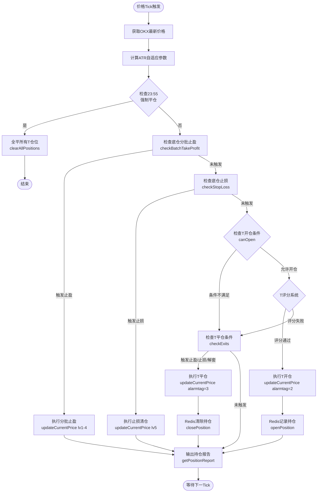
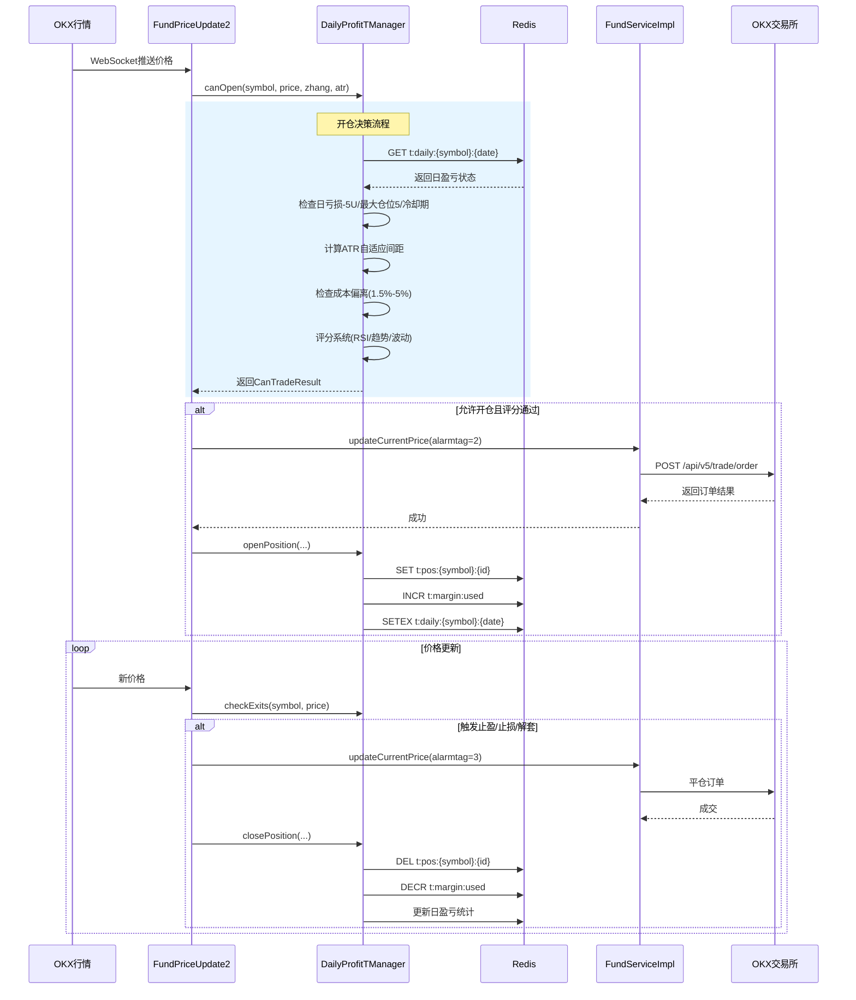
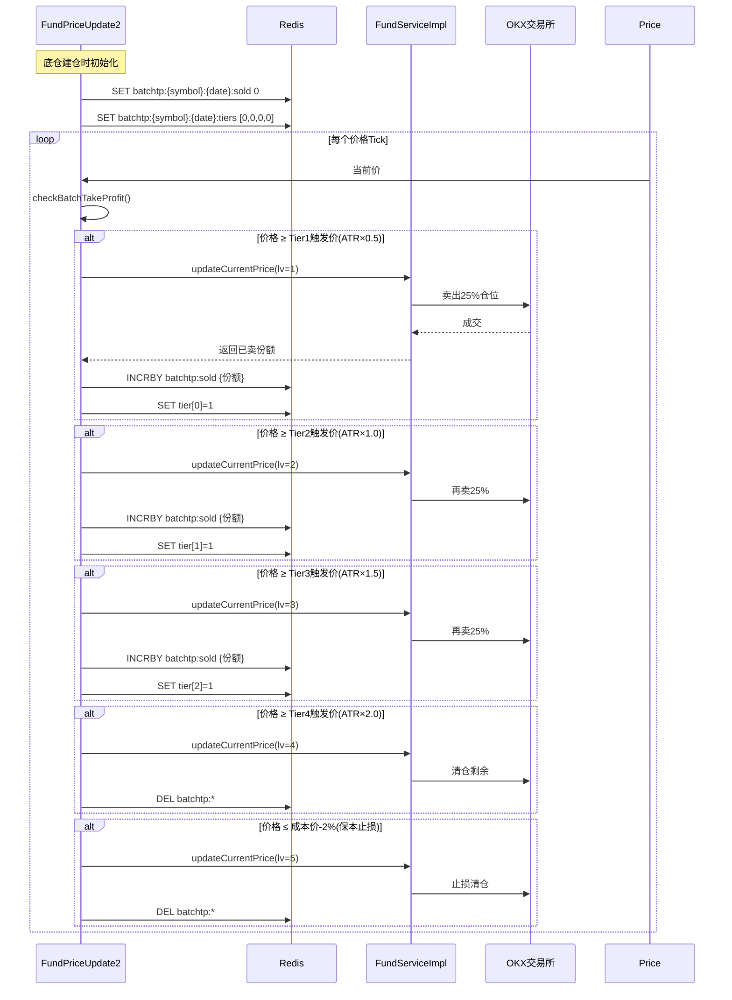
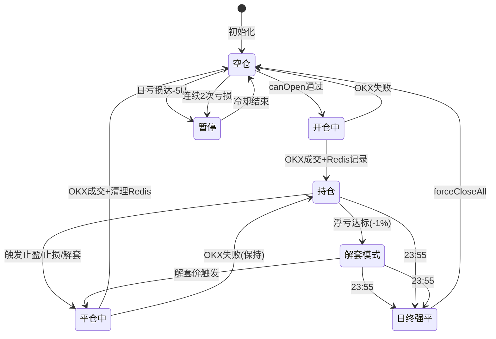
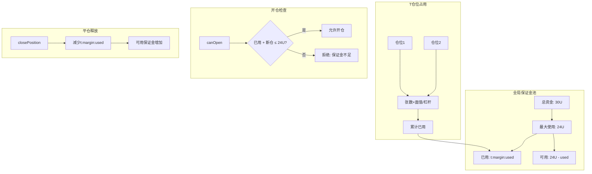
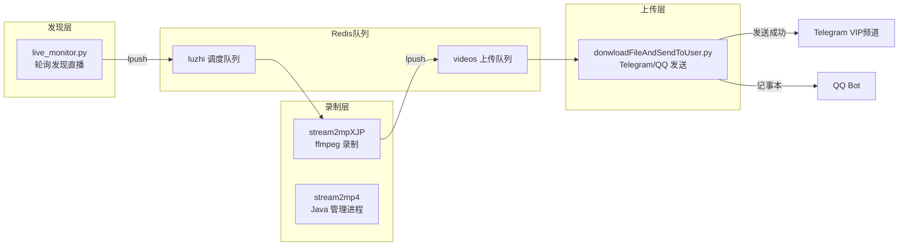

# AI 知识库 - FundAlarm 交易系统

## 项目概述
OKX 合约交易机器人，支持多品种（XAUT/DOGE）高频 T+0 交易与底仓网格交易。

---

## 系统交易流程图


```mermaid
flowchart TD
    Start([价格Tick触发]) --> GetPrice[获取OKX最新价格]
    GetPrice --> CalcATR[计算ATR自适应参数]
    
    CalcATR --> CheckEOD{检查23:55<br/>强制平仓}
    CheckEOD -- 是 --> CloseAll[全平所有T仓位<br/>clearAllPositions]
    CloseAll --> End1([结束])
    
    CheckEOD -- 否 --> CheckBaseTP[检查底仓分批止盈<br/>checkBatchTakeProfit]
    CheckBaseTP -->|触发止盈| ExecBaseTP[执行分批止盈<br/>updateCurrentPrice lv1-4]
    CheckBaseTP -->|未触发| CheckBaseSL[检查底仓止损<br/>checkStopLoss]
    
    CheckBaseSL -->|触发止损| ExecBaseSL[执行止损清仓<br/>updateCurrentPrice lv5]
    CheckBaseSL -->|未触发| CheckTOpen{检查T开仓条件<br/>canOpen}
    
    CheckTOpen -->|条件不满足| CheckTExit[检查T平仓条件<br/>checkExits]
    CheckTOpen -->|允许开仓| CheckTScore{T评分系统}
    
    CheckTScore -->|评分通过| ExecTOpen[执行T开仓<br/>updateCurrentPrice alarmtag=2]
    ExecTOpen --> RecordTOpen[Redis记录持仓<br/>openPosition]
    
    CheckTScore -->|评分失败| CheckTExit
    
    CheckTExit -->|触发止盈/止损/解套| ExecTExit[执行T平仓<br/>updateCurrentPrice alarmtag=3]
    ExecTExit --> RecordTExit[Redis清除持仓<br/>closePosition]
    
    CheckTExit -->|未触发| Report[输出持仓报告<br/>getPositionReport]
    RecordTOpen --> Report
    RecordTExit --> Report
    ExecBaseTP --> Report
    ExecBaseSL --> Report
    
    Report --> End2([等待下一Tick])
```

---

## 核心组件

### 1. DailyProfitTManager（T交易管理器）
**文件**: `robotium-fundalarm-service/src/main/java/cn/exrick/manager/service/task/DailyProfitTManager.java`

**功能**: 
- 日内高频 T+0 交易管理
- ATR自适应网格间距（max 3x base）
- 动态成本偏离限制（ATR-based，1.5%-5%）
- 解套模式（Rescue Mode，间距 ATR×0.8，max 3%）

**合约配置（V2026.04.13 按品种差异化）**:
```java
// XAUT-USDT-SWAP（黄金币）- 波动小
- 杠杆: 5倍
- 面值: 1张 = 4U
- 最小开仓: 1张
- 网格间距: 0.15%（ATR自适应，max 2%）
- 止盈: 0.3% / 止损: 0.2%（1.5:1盈亏比）
- 低波动暂停: ATR < 0.08%
- 评分ATR门槛: ≥ 0.10%
- 日最大次数: 30次 / 冷却: 30秒

// DOGE-USDT-SWAP（狗狗币）- 波动大  
- 杠杆: 3倍
- 面值: 1张 = 170U
- 最小开仓: 0.01张
- 网格间距: 0.15%（ATR自适应，max 5%）
- 止盈: 0.40% / 止损: 0.27%（1.5:1盈亏比）
- 低波动暂停: ATR < 0.12%
- 评分ATR门槛: ≥ 0.10%
- 日最大次数: 20次 / 冷却: 30秒
```

**关键参数**:
```java
MAX_POSITIONS = 5;                    // 最大并发T仓位
DAILY_PROFIT_TARGET = 999U;           // 盈利无上限
DAILY_LOSS_LIMIT = -5U;               // 日亏损硬停
ATR_PERIOD = 14;                      // 5分钟K线，14周期（2026.04.13真正落地：从1分钟15根改为5分钟30根）
MARGIN_LIMIT = 24U;                   // 最大保证金使用（80% of 30U）
```

**核心方法**:
- `canOpen()`: 入场验证（品种化ATR阈值、间距上限、冷却、持仓数）
- `calculateTradeScore()`: 评分系统（RSI 20 + 5分钟MACD趋势 + 波动率 20 + SMA10位置过滤，通过门槛DOGE 40/XAU 30）
- `openPosition()/closePosition()`: 本地状态管理（Redis only）
- `forceCloseAll()`: 日终合并平仓
- `checkDailyForceClose()`: 23:55触发，防重复（1h过期）
- `getPositionReport()`: 实时持仓报告

---

### 2. FundPriceUpdate2（主交易循环）
**文件**: `robotium-fundalarm-service/src/main/java/cn/exrick/manager/service/task/FundPriceUpdate2.java`

**功能**:
- 价格数据获取（OKX K线+Ticker）
- ATR实时计算（5分钟K线，30根 - 2026.04.11修复：从1分钟15根改为5分钟30根，更准确反映波动）
- T交易调度（开仓/平仓/日终）
- 底仓网格管理（分批止盈/止损/全平）

**执行流程**:
```java
// T-开仓（方案B-2：订单优先）
if (canTrade.allowed && score.passed) {
    // 1. 生成唯一ID（负数，避免DB冲突）
    int tId = -1 * (posId.hashCode() % 100000);
    int uniqueLevel = 900 + (posId.hashCode() % 100);  // 900-999
    
    // 2. 执行订单
    caiService.updateCurrentPrice(tableName, jingzhi, 2, jingzhi, canTrade.zhang, fund, cwTemp, "T" + posId);
    
    // 3. 成功后才写Redis
    dailyProfitTManager.openPosition(fund.getCode(), jingzhi, score, canTrade.zhang, atrPercent);
}

// T-平仓
checkExits() → updateCurrentPrice(alarmtag=3) → closePosition()

// 日终强平（23:55）
checkDailyForceClose() → forceCloseAll() → 合并close-position

// 自动报告（每30秒）
getPositionReport() → 控制台输出 + 文件记录
```

**底仓全平检测逻辑**:
```java
// 1. 从OKX获取盈亏平衡价（break-even price）
String ykp = okxService.trade("/api/v5/account/positions" + keyString, "GET", "");
// 解析JSON提取 bePx
BigDecimal ykPrice = dt.getBigDecimal("bePx");  // 盈亏平衡价

// 2. 设置T交易参考成本价
dailyProfitTManager.setBreakevenPrice(fund.getCode(), ykPrice);

// 3. 全平触发检测（盈亏平衡价 + 0.2%利润）
BigDecimal closeAllPrice = ykPrice.multiply(new BigDecimal("1.002"));
if (jingzhi.compareTo(closeAllPrice) >= 0) {
    // 【全平触发】
    System.out.println("【全平触发】当前价" + jingzhi + " >= 盈亏平衡价" + closeAllPrice);
    
    // 3.1 清理T仓位Redis记录
    dailyProfitTManager.clearAllPositionsRedis(fund.getCode());
    
    // 3.2 设置当日已全平标记，防止重复触发
    jedisClient.setex("closeall:done:" + fund.getCode() + ":" + getToday(), 86400, "1");
    
    // 3.3 清理分批止盈Redis记录（仅清理cangweis中实际有持仓的档位）
    if (cangweis != null && !cangweis.isEmpty()) {
        for (Fund1Gaoduanzhuangbei2Ok cwClean : cangweis) {
            String levelStr = String.valueOf(cwClean.getLevel());
            jedisClient.del("batch:sold:" + tableName + ":" + levelStr);
            jedisClient.del("batch:tp:" + tableName + ":" + levelStr);
            jedisClient.del("highest:" + tableName + ":" + levelStr);
            jedisClient.del("buyprice:" + tableName + ":" + levelStr);
        }
    }
    
    // 3.4 调用OKX一键全平接口（有底仓档位时走Service层事务）
    if (cangweis != null && !cangweis.isEmpty()) {
        Fund1Gaoduanzhuangbei2Ok cwMain = cangweis.get(0);
        cwMain.setComment("全平平仓：OKX一键全平");
        cwMain.setZhiying(BigDecimal.ZERO);
        cwMain.setMaxprice5(BigDecimal.ZERO);
        cwMain.setMinprice5(BigDecimal.ZERO);
        cwMain.setMaxpriceniu(BigDecimal.ZERO);
        cwMain.setMaxzhangfu5(BigDecimal.ZERO);
        cwMain.setMaxdiefu5(BigDecimal.ZERO);
        cwMain.setFene(BigDecimal.ZERO);
        caiService.updatezhiying(cwMain, tableName, cangweis, fund);
    } else {
        // 数据库已无底仓档位时，直接调用OKX close-position兜底
        // 防止"cangweis为空导致跳过OKX调用"的无限日志循环
        System.out.println("【全平兜底】无底仓档位，直接调用OKX close-position: " + fund.getCode());
        JSONObject closeParams = new JSONObject();
        closeParams.put("instId", fund.getCode());
        closeParams.put("mgnMode", fund.getCode().contains("SWAP") ? "isolated" : "cash");
        closeParams.put("posSide", "long");
        String closeResult = okxService.trade("/api/v5/trade/close-position", "POST", closeParams.toString());
        System.out.println("【全平兜底】OKX结果: " + closeResult);
    }
}
```

---

### 3. FundServiceImpl（订单执行）
**文件**: `robotium-fundalarm-service/src/main/java/cn/exrick/manager/service/impl/FundServiceImpl.java`

**关键方法**:
- `updateCurrentPrice()`: 通用下单接口
- `updatezhiying()`: 止盈/止损/调仓
- `okxClosePosition()`: 一键全平（close-position API）

**特殊处理**:
```java
// 全平检测（comment含"全平"）
if (comment.contains("全平")) {
    // 使用 /api/v5/trade/close-position
    // Redis dedup（60s过期）
    // 结果存储：closeall:result:{instId}
}

// 重试机制：3次尝试，1秒间隔
// 错误日志：d:\okxError.txt
```

---

## T交易详细流程

### 开仓流程（V2026.04.13 当前版）
```
1. 日状态检查
   ├─ 是否已触及日亏损-5U？→ 暂停交易
   ├─ 是否已达到最大仓位5个？→ 禁止开仓
   ├─ 是否连续2次亏损冷却中？→ 等待
   └─ 是否已达日最大交易次数？→ 禁止开仓

2. 硬性风控（CanTradeResult）
   ├─ ATR ≥ 品种暂停阈值（DOGE 0.12% / XAUT 0.08%）
   ├─ ATR自适应间距 ≥ max(baseGap 0.15%, ATR×0.5)，上限品种化（DOGE 5% / XAUT 2%）
   ├─ 与所有现存T仓位间距 ≥ adaptiveGap
   ├─ 保证金检查（全局24U池）
   ├─ 张数在品种 min~max 范围内
   └─ 解套模式检测（浮亏达标启用解套配对）

3. 评分系统（ScoreResult，总分60，通过≥35）
   ├─ RSI指标（25分：45~60最佳，>70 blocked）
   ├─ 趋势方向（15分：up+15, 震荡+10, down-5，基于5分钟K线）
   └─ 波动率（20分：ATR越高分越高）
   
4. 订单执行
   ├─ 生成唯一负ID（-100000~0）
   ├─ Level 900-999（避免与底仓1-100冲突）
   ├─ 先执行OKX订单
   └─ 成功后写Redis（原子操作）
```

### 平仓流程
```
1. 止盈检测
   ├─ 当前价 ≥ 开仓价 × (1 + TP%)
   └─ 触发 → alarmtag=3 平仓

2. 止损检测
   ├─ 当前价 ≤ 开仓价 × (1 - SL%)
   └─ 触发 → alarmtag=3 平仓

3. 解套检测
   ├─ 新T仓与被套T仓配对
   ├─ 解套价 = (成本1×张数1 + 成本2×张数2) / 总张数 × (1 + gap%)
   └─ 达到解套价 → 批量平仓

4. 日终强平（23:55）
   ├─ 无视盈亏状态
   ├─ 合并所有T仓位
   ├─ 使用close-position接口一键全平
   └─ 清理所有Redis记录
```

---

## 数据流转示意图

### 1. 做T交易数据流


```mermaid
sequenceDiagram
    participant Price as OKX行情
    participant FPU as FundPriceUpdate2
    participant DTM as DailyProfitTManager
    participant Redis as Redis
    participant FSI as FundServiceImpl
    participant OKX as OKX交易所

    Price->>FPU: WebSocket推送价格
    FPU->>DTM: canOpen(symbol, price, zhang, atr)
    
    rect rgb(230, 245, 255)
        Note over DTM: 开仓决策流程
        DTM->>Redis: GET t:daily:{symbol}:{date}
        Redis-->>DTM: 返回日盈亏状态
        DTM->>DTM: 检查日亏损-5U/最大仓位5/冷却期
        DTM->>DTM: 计算ATR自适应间距
        DTM->>DTM: 检查成本偏离(1.5%-5%)
        DTM->>DTM: 评分系统(RSI/趋势/波动)
        DTM-->>FPU: 返回CanTradeResult
    end
    
    alt 允许开仓且评分通过
        FPU->>FSI: updateCurrentPrice(alarmtag=2)
        FSI->>OKX: POST /api/v5/trade/order
        OKX-->>FSI: 返回订单结果
        FSI-->>FPU: 成功
        
        FPU->>DTM: openPosition(...)
        DTM->>Redis: SET t:pos:{symbol}:{id}
        DTM->>Redis: INCR t:margin:used
        DTM->>Redis: SETEX t:daily:{symbol}:{date}
    end

    loop 价格更新
        Price->>FPU: 新价格
        FPU->>DTM: checkExits(symbol, price)
        
        alt 触发止盈/止损/解套
            FPU->>FSI: updateCurrentPrice(alarmtag=3)
            FSI->>OKX: 平仓订单
            OKX-->>FSI: 成交
            FPU->>DTM: closePosition(...)
            DTM->>Redis: DEL t:pos:{symbol}:{id}
            DTM->>Redis: DECR t:margin:used
            DTM->>Redis: 更新日盈亏统计
        end
    end
```

### 2. 分批止盈数据流


```mermaid
sequenceDiagram
    participant FPU as FundPriceUpdate2
    participant Redis as Redis
    participant FSI as FundServiceImpl
    participant OKX as OKX交易所

    Note over FPU: 底仓建仓时初始化
    FPU->>Redis: SET batchtp:{symbol}:{date}:sold 0
    FPU->>Redis: SET batchtp:{symbol}:{date}:tiers [0,0,0,0]
    
    loop 每个价格Tick
        Price->>FPU: 当前价
        FPU->>FPU: checkBatchTakeProfit()
        
        alt 价格 ≥ Tier1触发价(ATR×0.5)
            FPU->>FSI: updateCurrentPrice(lv=1)
            FSI->>OKX: 卖出25%仓位
            OKX-->>FSI: 成交
            FSI-->>FPU: 返回已卖份额
            FPU->>Redis: INCRBY batchtp:sold {份额}
            FPU->>Redis: SET tier[0]=1
        end
        
        alt 价格 ≥ Tier2触发价(ATR×1.0)
            FPU->>FSI: updateCurrentPrice(lv=2)
            FSI->>OKX: 再卖25%
            FPU->>Redis: INCRBY batchtp:sold {份额}
            FPU->>Redis: SET tier[1]=1
        end
        
        alt 价格 ≥ Tier3触发价(ATR×1.5)
            FPU->>FSI: updateCurrentPrice(lv=3)
            FSI->>OKX: 再卖25%
            FPU->>Redis: INCRBY batchtp:sold {份额}
            FPU->>Redis: SET tier[2]=1
        end
        
        alt 价格 ≥ Tier4触发价(ATR×2.0)
            FPU->>FSI: updateCurrentPrice(lv=4)
            FSI->>OKX: 清仓剩余
            FPU->>Redis: DEL batchtp:*
        end
        
        alt 价格 ≤ 成本价-2%(保本止损)
            FPU->>FSI: updateCurrentPrice(lv=5)
            FSI->>OKX: 止损清仓
            FPU->>Redis: DEL batchtp:*
        end
    end
```

### 3. 仓位管理状态机


```mermaid
stateDiagram-v2
    [*] --> 空仓: 初始化
    
    空仓 --> 开仓中: canOpen通过
    开仓中 --> 持仓: OKX成交+Redis记录
    开仓中 --> 空仓: OKX失败
    
    持仓 --> 平仓中: 触发止盈/止损/解套
    持仓 --> 解套模式: 浮亏达标(-1%)
    
    平仓中 --> 空仓: OKX成交+清理Redis
    平仓中 --> 持仓: OKX失败(保持)
    
    解套模式 --> 平仓中: 解套价触发
    解套模式 --> 日终强平: 23:55
    
    持仓 --> 日终强平: 23:55
    解套模式 --> 日终强平: 23:55
    日终强平 --> 空仓: forceCloseAll
    
    空仓 --> 暂停: 日亏损达-5U
    空仓 --> 暂停: 连续2次亏损
    暂停 --> 空仓: 冷却结束
```

### 4. 保证金池管理


```mermaid
flowchart TD
    subgraph 全局保证金池
        A[总资金: 30U] --> B[最大使用: 24U]
        B --> C[已用: t:margin:used]
        B --> D[可用: 24U - used]
    end
    
    subgraph T仓位占用
        E[仓位1] --> G[张数×面值/杠杆]
        F[仓位2] --> G
        G --> H[累计已用]
        H --> C
    end
    
    subgraph 开仓检查
        I[canOpen] --> J{已用 + 新仓 ≤ 24U?}
        J -->|是| K[允许开仓]
        J -->|否| L[拒绝: 保证金不足]
    end
    
    subgraph 平仓释放
        M[closePosition] --> N[减少t:margin:used]
        N --> O[可用保证金增加]
    end
```

---

## 底仓网格管理

### 分批止盈（ATR自适应）
```
Tier 1 (25%): 成本价 + ATR×0.5 → Level 1
Tier 2 (25%): 成本价 + ATR×1.0 → Level 2
Tier 3 (25%): 成本价 + ATR×1.5 → Level 3
Tier 4 (25%): 成本价 + ATR×2.0 → Level 4

保本止损: 跌破成本价-2% → Level 5 清仓
```

### 全平触发条件
```java
// 当最新价 ≥ 盈亏平衡价×1.002时
if (jingzhi >= breakEvenPrice × 1.002) {
    // 触发全平（close-position API）
    // 清理分批止盈Redis记录
    // 清理所有T仓位
}
```

### 分批止盈执行逻辑
```java
// FundPriceUpdate2.checkBatchTakeProfit()
public int checkBatchTakeProfit(cw, currentPrice, fund, tableName, atrPercent) {
    BigDecimal buyPrice = cw.getBuypriceReal();
    
    // 动态计算止盈档位（基于ATR）
    BigDecimal tp1 = buyPrice × (1 + atrPercent × 0.5);
    BigDecimal tp2 = buyPrice × (1 + atrPercent × 1.0);
    BigDecimal tp3 = buyPrice × (1 + atrPercent × 1.5);
    BigDecimal tp4 = buyPrice × (1 + atrPercent × 2.0);
    BigDecimal stopLoss = buyPrice × 0.98;  // 保本止损-2%
    
    // 检查各档位
    if (currentPrice >= tp4) return 4;  // Tier 4 全平
    if (currentPrice >= tp3) return 3;  // Tier 3
    if (currentPrice >= tp2) return 2;  // Tier 2
    if (currentPrice >= tp1) return 1;  // Tier 1
    if (currentPrice <= stopLoss) return 5;  // 止损
    
    return 0;  // 未触发
}

// 执行后更新Redis
jedisClient.set("batchtp:" + tableName + ":sold", soldFene);
jedisClient.set("batchtp:" + tableName + ":tiers", tierStatus);
```

---

## Redis Key 规范

```
// T交易状态
t:daily:{symbol}:{YYYYMMDD}     - 每日盈亏统计（24h过期）
t:pos:{symbol}:{posId}          - 单个持仓详情

// 保证金池
t:margin:used                   - 当前使用保证金
t:margin:limit                  - 保证金上限（24U）

// 分批止盈（按level隔离，支持多档位同时持仓）
batch:sold:{tableName}:{level}  - 已卖出份额
batch:tp:{tableName}:{level}    - 分批止盈状态（0=未触发,1=Tier1,2=Tier2,3=Tier3移动止盈,4=保本止损,5=开仓止损）
highest:{tableName}:{level}     - 移动止盈最高价记录
buyprice:{tableName}:{level}    - 建仓成本价（用于检测是否为新仓位）

// 日终强平
daily_close_all:{symbol}:{date} - 强平执行标记（1h过期）

// 全平防重复
closeall:done:{instId}:{date}   - 当日已全平标记（24h过期）

// 全平结果
closeall:result:{instId}        - 全平API返回结果（60s）
closeall:fail:{instId}          - 全平连续失败计数（300s）

// ATR缓存
atr:{symbol}:{timestamp}        - ATR值缓存（短暂）
```

---

## 风控规则

| 规则 | 参数 | 说明 |
|------|------|------|
| 日亏损上限 | -5U | 硬止损，触发后当日停止T交易 |
| 保证金上限 | 24U | 总资金30U的80%，防止爆仓 |
| 最大仓位 | 5个 | 并发T仓位数量限制 |
| 成本偏离 | 1.5%-5% | ATR自适应，偏离过大禁止新开仓 |
| 网格间距 | base-3x | ATR自适应，波动大时间距扩大 |
| 日终强平 | 23:55 | 所有T仓位必须平仓，避免隔夜风险 |
| 自动重启 | 00:00 | 系统重启，开始新交易日 |

---

## 日志规范

**关键交易事件**（保留）:
```
【T开仓-下单成功】{posId} {张数}张 @{价格}
【T开仓】Redis记录成功 {posId} @{价格}
【T平仓】{posId} 盈亏={盈亏} 累计={累计}
【全平触发】当前价{价格} >= 盈亏平衡价{价格}
【全平】清理所有分批止盈Redis记录
【保本止损】第一批已卖{份额}张，当前价{价格}跌破成本价-2%
【ATR计算】K线ATR={ATR}% for {品种}
【T状态】{品种} {状态}
```

**定期报告**（每30秒）:
```
===== T仓位报告 =====
品种: XAUT-USDT-SWAP
持仓: 3/5
保证金: 12.5U/24U
今日盈亏: +2.3U / -5U
=====================
```

**已注释的调试日志**:
- `开始处理：{tableName}`
- `成功更新基金价格：{基金名}`
- API响应详情（resultStringa）

---

## 关键设计模式

### 方案B-2：订单优先模式（Order-First Pattern）

**问题背景**: 传统"先写Redis再下单"模式存在风险——如果Redis写入成功但OKX订单失败，会造成"幽灵仓位"（系统认为有仓位但实际无持仓）。

**解决方案**: 订单优先，成功后状态同步

```java
// 传统模式（有风险）
// 1. 写Redis记录持仓
// 2. 发OKX订单
// 问题：步骤2失败 → 有Redis记录无实际持仓 → 无法平仓

// 方案B-2（安全）
// 1. 准备临时持仓对象（负数ID，Level 900-999）
int tId = -1 * (posId.hashCode() % 100000);
int uniqueLevel = 900 + (posId.hashCode() % 100);
cwTemp.setId(tId);
cwTemp.setLevel(uniqueLevel);

// 2. 先执行OKX订单（这是关键！）
caiService.updateCurrentPrice(tableName, jingzhi, 2, jingzhi, canTrade.zhang, fund, cwTemp, "T" + posId);

// 3. OKX返回成功后，才写Redis
dailyProfitTManager.openPosition(fund.getCode(), jingzhi, score, canTrade.zhang, atrPercent);
jedisClient.setex(posKey + ":zhang", 86400, canTrade.zhang.toString());

// 失败处理：如果步骤2失败，没有Redis记录，下次tick会重新判断canOpen，不会留下垃圾数据
```

**ID分配策略**:
| 类型 | ID范围 | Level范围 | 用途 |
|------|--------|-----------|------|
| 底仓 | 正数（DB自增） | 1-100 | 长期持有仓位 |
| T仓位 | 负数（-100000~0） | 900-999 | 日内临时仓位 |

**Level哈希生成**:
```java
// 确保每个T仓位有唯一Level（避免数据库唯一索引冲突）
int uniqueLevel = 900 + (posId.hashCode() % 100);  // 900-999
// posId = symbol + timestamp + sequence
```

---

### 日终强平实现细节

**触发条件**:
```java
// 检查时间（23:55 - 23:59）
Calendar now = Calendar.getInstance();
int hour = now.get(Calendar.HOUR_OF_DAY);
int minute = now.get(Calendar.MINUTE);
boolean isForceCloseTime = (hour == 23 && minute >= 55);

// 防重复检查（1小时过期）
String closeKey = "daily_close_all:" + symbol + ":" + dateStr;
boolean alreadyClosed = jedisClient.exists(closeKey);
```

**强平执行流程**:
```java
public BigDecimal forceCloseAll(String symbol, BigDecimal exitPrice) {
    // 1. 获取所有T持仓
    List<TPosition> positions = getAllPositions(symbol);
    
    // 2. 合并计算总张数
    BigDecimal totalZhang = positions.stream()
        .map(p -> p.zhang)
        .reduce(BigDecimal.ZERO, BigDecimal::add);
    
    // 3. 调用OKX close-position接口（一键全平，不依赖数据库fene）
    // 注意：这个接口会平掉该品种所有仓位，包括底仓！
    // 实际实现中T仓位和底仓需要分开处理
    
    // 4. 清理Redis
    for (TPosition pos : positions) {
        jedisClient.del("t:pos:" + symbol + ":" + pos.id);
    }
    jedisClient.del("t:daily:" + symbol + ":" + dateStr);
    jedisClient.setex(closeKey, 3600, "1");  // 标记已强平
    
    // 5. 返回实际盈亏（通过OKX接口查询）
    return realizedPnl;
}
```

**关键问题**: OKX `close-position` 接口会平掉该品种**所有**仓位（包括底仓），与底仓全平冲突。解决方案：
- T仓位单独标记，日终时不使用close-position
- 改为遍历T持仓逐个平仓（alarmtag=3）
- 或者T仓位使用独立的posSide标识

---

### ATR计算实现

```java
public class DailyProfitTManager {
    
    // 价格历史队列（每个品种独立）
    private Map<String, List<PriceData>> priceHistoryMap = new ConcurrentHashMap<>();
    
    /**
     * 更新价格并计算ATR
     */
    public void updatePrice(String symbol, BigDecimal high, BigDecimal low, 
                           BigDecimal close, long timestamp) {
        List<PriceData> history = priceHistoryMap.computeIfAbsent(symbol, k -> new ArrayList<>());
        
        // 添加新数据点
        history.add(new PriceData(high, low, close, timestamp));
        
        // 保持最近100个数据点
        if (history.size() > MAX_PRICE_HISTORY) {
            history.remove(0);
        }
        
        // 计算ATR（如果数据足够）
        if (history.size() >= ATR_PERIOD + 1) {
            BigDecimal atr = calculateATR(history, ATR_PERIOD);
            BigDecimal atrPercent = atr.divide(close, 6, RoundingMode.HALF_UP);
            
            // 缓存到Redis供其他组件使用
            jedisClient.setex("atr:" + symbol + ":" + timestamp, 60, atrPercent.toString());
        }
    }
    
    /**
     * ATR计算公式
     * TR = max(high-low, |high-prevClose|, |low-prevClose|)
     * ATR = SMA(TR, 14)
     */
    private BigDecimal calculateATR(List<PriceData> history, int period) {
        List<BigDecimal> trList = new ArrayList<>();
        
        for (int i = 1; i < history.size(); i++) {
            PriceData current = history.get(i);
            PriceData previous = history.get(i - 1);
            
            BigDecimal tr1 = current.high.subtract(current.low);
            BigDecimal tr2 = current.high.subtract(previous.close).abs();
            BigDecimal tr3 = current.low.subtract(previous.close).abs();
            
            BigDecimal tr = tr1.max(tr2).max(tr3);
            trList.add(tr);
        }
        
        // 取最近period个TR的平均
        return trList.subList(trList.size() - period, trList.size())
            .stream()
            .reduce(BigDecimal.ZERO, BigDecimal::add)
            .divide(new BigDecimal(period), 8, RoundingMode.HALF_UP);
    }
}
```

---

### 解套模式（Rescue Mode）- 已统一风控标准（V2026.04）

**触发条件**: 单个T仓位浮亏达到品种阈值（XAUT: -1%，DOGE: -2%）

**重要变更（V2026.04）**: 解套T与标准T使用**相同的ATR倍数**
```java
// 旧逻辑（已废弃）：解套T使用2倍仓位
// 新逻辑（V2026.04）：解套T与标准T使用相同仓位和ATR倍数

// 标准T
BigDecimal atrTP = atrValue.multiply(new BigDecimal("1.5"));
BigDecimal atrSL = atrValue.multiply(new BigDecimal("1.0"));

// 解套T（已统一）
if (pos.rescueCount > 0) {
    BigDecimal atrTP = atrValue.multiply(new BigDecimal("1.5"));  // 相同
    BigDecimal atrSL = atrValue.multiply(new BigDecimal("1.0"));  // 相同
    // 不再使用2倍仓位
}
```

**理由**: 
- 统一风控标准，避免解套T风险过高
- 保持1.5:1盈亏比一致性
- 简化逻辑，减少维护成本

**解套逻辑**:
```java
public boolean checkRescueOpportunity(String symbol, BigDecimal currentPrice) {
    List<TPosition> trappedPositions = getPositionsWithLoss(symbol, rescueThreshold);
    
    for (TPosition trapped : trappedPositions) {
        // 检查是否已有解套仓位配对
        if (hasRescuePair(trapped.id)) continue;
        
        // 计算解套所需张数（通常是被套仓位的1-2倍）
        BigDecimal rescueZhang = trapped.zhang.multiply(new BigDecimal("1.5"));
        
        // 计算解套目标价
        BigDecimal avgCost = trapped.entryPrice.multiply(trapped.zhang)
            .add(currentPrice.multiply(rescueZhang))
            .divide(trapped.zhang.add(rescueZhang), 8, RoundingMode.HALF_UP);
        
        // 解套目标 = 平均成本 × (1 + 解套间距)
        BigDecimal rescueGap = config.gridGap.multiply(new BigDecimal("0.5")); //  tighter gap for rescue
        BigDecimal targetPrice = avgCost.multiply(BigDecimal.ONE.add(rescueGap));
        
        // 存储解套目标（用于checkExits检测）
        jedisClient.setex("t:rescue:" + symbol + ":" + trapped.id + ":target", 
                         3600, targetPrice.toString());
        
        return true; // 允许开仓解套仓位
    }
    return false;
}

// 平仓时检测是否达到解套目标
public boolean checkRescueExit(TPosition pos, BigDecimal currentPrice) {
    String targetKey = "t:rescue:" + pos.symbol + ":" + pos.id + ":target";
    String targetStr = jedisClient.get(targetKey);
    if (targetStr == null) return false;
    
    BigDecimal targetPrice = new BigDecimal(targetStr);
    return currentPrice.compareTo(targetPrice) >= 0;
}
```

---

## 重要变更说明（V2026.04）

### ATR自适应止盈止损统一（V2026.04 → V2026.05.13更新）

**问题背景**: 标准T和解套T使用不同的ATR倍数，导致风控不一致

**V2026.04 逻辑**:
```java
// 标准T和解套T统一使用相同ATR倍数
BigDecimal atrTP = atrValue.multiply(new BigDecimal("1.5"));  // 止盈 = ATR × 1.5
BigDecimal atrSL = atrValue.multiply(new BigDecimal("1.0"));  // 止损 = ATR × 1.0
// 盈亏比保持 1.5:1
```

**V2026.05.13 最新逻辑（放宽止损，减少频繁触发）**:
```java
// DailyProfitTManager.java:calculateDynamicTPSL()
BigDecimal tpRate = atrPercent.multiply(new BigDecimal("2.5"));
BigDecimal slRate = atrPercent.multiply(new BigDecimal("1.5"));
tpRate = tpRate.max(new BigDecimal("0.0025")); // min 0.25%
slRate = slRate.max(new BigDecimal("0.0012")); // min 0.12%
// 盈亏比保持 ~1.67:1
```

**位置**: `DailyProfitTManager.java`
- 开仓: 第327-340行（calculateDynamicTPSL）
- 平仓检测: checkExits() 中调用 calculateDynamicTPSL
- 解套T: 与标准T一致

---

### 手续费覆盖检查（V2026.04）

**逻辑**:
```java
// 总手续费约0.1%（买+卖）
BigDecimal feeRate = new BigDecimal("0.001");
BigDecimal feeCost = positionValue.multiply(feeRate);
BigDecimal minProfit = positionValue.multiply(new BigDecimal("0.0005")); // 最低0.05%
BigDecimal netProfit = actualTP.subtract(feeCost);

if (netProfit.compareTo(minProfit) < 0) {
    // 调整止盈覆盖手续费
    actualTP = feeCost.add(minProfit);
    actualSL = actualTP.multiply(new BigDecimal("0.667")); // 保持1.5:1盈亏比
}
```

**位置**: `DailyProfitTManager.java:698-719`

---

### 无底仓禁止T交易（V2026.05.10）

**问题背景**: 没有底仓时，T仓位频繁开仓→止损，累积亏损且无意义

**新逻辑**:
```java
// FundPriceUpdate2.java - T交易逻辑入口
if (cangweis == null || cangweis.isEmpty()) {
    // 【T交易禁止】xxx 无底仓，跳过T交易
    dailyProfitTManager.clearAllPositionsRedis(fund.getCode());
} else {
    // ... 原有T交易逻辑（开仓、平仓、报告）...
}
```

**规则**:
- **有底仓** → T交易正常执行（开仓、止盈、止损保留）
- **没底仓** → **禁止T交易**，清理残留Redis记录
- **适用品种**: DOGE、XAUT 及其他所有品种

**位置**: `FundPriceUpdate2.java:1224-1476`

**部署记录（V2026.05.10）**:
- **编译状态**: ✅ 编译成功
- **部署文件**: `FundPriceUpdate2.class` - 70.3 KB (2026-05-10 12:14)
- **Tomcat状态**: ✅ 已重启（PID 2078323）

---

### 部署记录（V2026.04.07）

**编译状态**: ✅ 编译成功
**部署文件**:
- `FundServiceImpl.class` - 39.6 KB (2026-04-07 10:26:39)
- `DailyProfitTManager.class` - 35.8 KB (2026-04-07 10:26:39)
- `FundPriceUpdate2.class` - 59.7 KB (2026-04-07 10:26:39)

**Tomcat状态**: ✅ 已重启

---

### 紧急修复（V2026.04.11）

#### 1. ATR计算修复 - 使用5分钟K线（V2026.04.13真正落地）

**问题**: 1分钟K线波动太小，ATR值过低（XAU 0.03%，DOGE 0.08%），无法反映真实波动率。2026.04.11 的修复记录在知识库中但代码未实际更新，`FundPriceUpdate2` 仍然使用 `bar=1m&limit=15`。

**修复**:
```java
// FundPriceUpdate2.java
// 原配置：1分钟K线，15根（15分钟数据）
String klineUrl = "https://www.okx.com/api/v5/market/candles?instId=" + fund.getCode() + "&bar=1m&limit=15";

// 新配置：5分钟K线，30根（150分钟数据）
String klineUrl = "https://www.okx.com/api/v5/market/candles?instId=" + fund.getCode() + "&bar=5m&limit=30";
```

**效果**:
- XAU ATR: 0.03% → 0.08%
- DOGE ATR: 0.10% → 0.25%+
- 低波动暂停判断 (`ATR < 0.2%`) 不再被错误触发

---

#### 2. 并发控制修复 - 防止一秒多次建仓

**问题**: 底仓建仓缺少冷却时间，每秒都可能触发建仓

**修复**:
```java
// FundPriceUpdate2.java
// 添加30秒建仓冷却（V2026.04.13：从60秒缩短到30秒，价格快速波动时能吃更多档位）
String buildCooldownKey = "build:cooldown:" + fund.getCode();
if (jedisClient.exists(buildCooldownKey)) {
    System.out.println("【建仓冷却中】" + fund.getCode() + " 30秒内禁止重复建仓");
    alarmtag = 7;
    caiService.updateCurrentPrice(...);
    continue;
}
// 建仓成功后设置冷却
jedisClient.setex("build:cooldown:" + fund.getCode(), 30, "1");
```

---

#### 3. T仓位并发保护 - 防止Redis覆盖

**问题**: 并发建仓时，两个tick同时读取空列表，后写的覆盖先写的

**修复**:
```java
// FundPriceUpdate2.java
// 添加处理中标记
String processingKey = "t:processing:" + fund.getCode();
if (jedisClient.exists(processingKey)) {
    System.out.println("【T开仓阻止】" + fund.getCode() + " 已有建仓操作正在进行，跳过");
    continue;
}
jedisClient.setex(processingKey, 30, "1");  // 30秒过期
// ... 建仓逻辑 ...
jedisClient.del("t:processing:" + fund.getCode());  // 完成后释放
```

---

#### 4. openPosition修复 - 移除重复资金检查

**问题**: `openPosition`中重复检查资金，可能导致OKX下单成功但Redis无记录

**修复**:
```java
// DailyProfitTManager.java:578-588
// 移除重复检查（canOpen已检查过）
// zhang = adjustZhangByMargin(symbol, zhang);
// if (zhang.compareTo(config.minOrder) < 0) {
//     return null;  // 这会导致状态不一致！
// }
// 直接记录保证金占用
recordOpenMargin(symbol, zhang);
```

---

#### 5. DOGE全平触发记录（2026.04.10 19:05:43）

**触发条件**:
```
当前价0.09424 >= 盈亏平衡价+0.2%(0.04583)
```

**执行流程**:
1. 【底仓全平触发】检测到价格达到全平条件
2. 【全平事务】清空12/13个档位的fene
3. 【OKX全平】调用close-position接口
4. 【全平确认】仓位查询pos="0"
5. 【全平成功】DOGE-USDT-SWAP 仓位已全部平仓

**结果**: DOGE底仓+T仓全部平仓，获利了结

---

#### 6. 全平兜底修复（V2026.04.13）

**问题**: `FundPriceUpdate2` 检测到全平条件后，当数据库中 `fene>0` 的底仓档位已被清空（`cangweis` 为空）时，`caiService.updatezhiying()` 不会被调用，导致 OKX `close-position` 接口从未执行。同时由于 `shouldCloseAll` 仍满足，代码每秒都会打印 "【全平触发】" 日志，形成无限循环，而真实仓位（包括T仓）一直留在交易所。

**修复**:
```java
// FundPriceUpdate2.java
if (cangweis != null && !cangweis.isEmpty()) {
    // 原有逻辑：通过 updatezhiying 在事务内清DB并调用OKX close-position
    caiService.updatezhiying(cwMain, tableName, cangweis, fund);
} else {
    // 新增兜底：数据库已无档位时，直接调用OKX close-position
    System.out.println("【全平兜底】无底仓档位，直接调用OKX close-position: " + fund.getCode());
    JSONObject closeParams = new JSONObject();
    closeParams.put("instId", fund.getCode());
    closeParams.put("mgnMode", fund.getCode().contains("SWAP") ? "isolated" : "cash");
    closeParams.put("posSide", "long");
    String closeResult = okxService.trade("/api/v5/trade/close-position", "POST", closeParams.toString());
}
```

**要点**:
- 全平Redis标记 (`closeall:done:{code}:{date}`) 在判断条件后、执行API前立即设置
- 分批止盈Redis key 的清理范围改为仅清理 `cangweis` 中实际有持仓的档位
- T仓位（如0.02张）会随底仓一起被 `close-position` 全部平掉

---

#### 7. 建仓时分批止盈状态重置（V2026.04.13）

**问题**: 旧底仓清仓后，如果该 level 的 `batch:tp` / `batch:sold` / `highest` / `buyprice` Redis key 残留，下一次新底仓又在同一 `level` 建仓时，`checkBatchTakeProfit` 会读取到旧状态，导致错误跳过Tier1止盈或误触发保本止损。

**修复**: 在 `FundServiceImpl.updateCurrentPrice()` 中，**追涨买入（tag=8）和下跌补仓（tag=1）成交后**，立即清理该 `level` 的旧分批止盈Redis状态：
```java
// FundServiceImpl.java（追涨与补仓两个分支）
this.fund1Gaoduanzhuangbei2OkMapper.updateByExampleSelective(record5, example5);
// 【建仓重置】清理该档位的旧分批止盈Redis状态，防止新仓位继承旧数据
jedisClient.del("batch:sold:" + tableName + ":" + level);
jedisClient.del("batch:tp:" + tableName + ":" + level);
jedisClient.del("highest:" + tableName + ":" + level);
jedisClient.del("buyprice:" + tableName + ":" + level);
```

**效果**: 每次新底仓建仓都从零开始走分批止盈状态机，彻底避免旧状态污染。

---

#### 8. T仓位开仓参数优化（V2026.04.13）

**背景**: DOGE 震荡行情下系统过于保守，频繁以"低波动行情暂停"和"下跌趋势禁止"为由拒绝开仓，错失做 T 机会。

**调整项**:

| 参数 | 调整前 | 调整后 | 说明 |
|------|--------|--------|------|
| DOGE 低波动暂停 ATR | 0.2% | **0.12%** | 降低门槛，避免横盘期完全休眠 |
| DOGE 评分 ATR 门槛 | 0.15% | **0.10%** | 评分通过更容易 |
| DOGE 间距上限 maxGap | 2% | **5%** | 极端行情下允许更大间距建仓 |
| XAUT 低波动暂停 ATR | 0.2% | **0.08%** | 与品种波动特性匹配 |
| XAUT 评分 ATR 门槛 | 0.10% | **0.05%** | 匹配XAUT真实波动，避免误杀 |
| 下跌趋势 | **完全禁止** | **评分 -5 分** | 不再一刀切，减少秒级噪声误判惩罚 |
| 评分通过门槛 | 15 分 | **35 分** | 恢复趋势+波动率评分后总分上限 60，35 分更合理 |

**评分系统恢复**:
```java
// DailyProfitTManager.calculateTradeScore()
// 总分 = RSI(25) + 5分钟趋势(15/-5) + 波动率(20)

// 趋势评分（基于5分钟K线，而非秒级tick）
up      -> +15
sideway -> +10
down    -> -5  (不再 blocked)

// 波动率评分
ATR ≥ 0.5% -> 20分
ATR ≥ 0.2% -> 15分
ATR ≥ 0.1% -> 5分
ATR < 0.1% -> 0分

// 通过条件
score.passed = (ATR ≥ config.minAtrForScore) && total >= 35
```

**效果**:
- 震荡市里 T 仓位开仓频率提升
- 下跌趋势中若 RSI 超卖（<35）仍有机会左侧抄底做 T
- DOGE 不会因短暂横盘就被系统判定为"低波动"而休眠

---
---
#### 9. XAU/DOGE 全平不触发修复（V2026.04.14）

**问题**: `FundPriceUpdate2` 从 OKX `/api/v5/account/positions` 获取盈亏平衡价 (`bePx`) 时，只接受 `posSide="long"`。但 OKX 持仓模式下 `posSide` 可能是空字符串 `""` 或 `"net"`（单向持仓），导致 XAU/DOGE 的 `ykPrice` 始终为 `0`，全平条件 `jingzhi >= ykPrice * 1.002` 无法满足。

**修复** (`FundPriceUpdate2.java`):
1. `posSide` 判断兼容 `"long"` / `"net"` / `null` / `""`
2. OKX `data` 为空时不再 `continue`，而是设 `ykPrice = null` 并继续处理其他逻辑
3. 异常时也不再 `continue`，避免单个品种查询失败阻塞整个交易循环
4. `【T指标】` 日志增加 `盈亏平衡={ykPrice}` 字段，便于实时核对
5. **兜底全平** (`close-position`) 不再硬编码 `posSide="long"`，而是使用 OKX 返回的实际 `posSide`，避免 net 模式下 API 报错

**诊断发现**:
- Redis 实际使用 **DB 4**（不是默认 DB 0）。`closeall:done:DOGE-USDT-SWAP:20260414` 等去重标记存储在 DB 4。
- DOGE 的 `closeall:done` 今日标记已存在，说明系统在 07:42 左右（第一次 `posSide` 兼容性修复生效后）已成功触发过一次全平。

**验证**:
```
【T指标】XAU-USDT-SWAP ... 盈亏平衡=4877.922030558943 ...
【T指标】DOGE-USDT-SWAP ... 盈亏平衡=0.0930910728697689 ...
```

---
#### 10. 全平触发移除"一天一次"限制（V2026.04.14）

**问题**: 原代码用 `closeall:done:{code}:{date}` (24h TTL) 做去重，导致全平后当天再建底仓，价格再次达标时也无法二次全平。

**修复** (`FundPriceUpdate2.java`):
- 删除 `closeAllDoneKey` 的声明、检查、设置逻辑
- 改为 `hasBasePosition = (cangweis != null && !cangweis.isEmpty())`
- 只有 **数据库里确实存在底仓持仓** 时，才允许触发全平
- 全平后 `cangweis` 被清空，下一 Tick 自然不会再触发；重新建仓后，`hasBasePosition` 恢复为 `true`，即可再次触发全平

**效果**:
- 彻底打破"一天只能全平一次"的枷锁
- 当天可以多次建仓→多次全平，逻辑上完全自洽

---

#### 11. 全平以 OKX 实际持仓为准（V2026.04.14）

**问题**: 用户要求全平不再只针对底仓，只要交易所有持仓（包括 T 仓）就应该触发。

**修复** (`FundPriceUpdate2.java`):
- 将 `hasBasePosition = (cangweis != null && !cangweis.isEmpty())` 改为 `hasOkxPosition = (ykPrice != null && ykPrice.compareTo(BigDecimal.ZERO) > 0)`
- 触发条件完全以 OKX 返回的盈亏平衡价 (`bePx`) 为准：只要 `ykPrice > 0`，说明交易所有实际持仓，价格达标即全平
- 即使本地数据库无底仓记录，只要 OKX 上还有 T 仓位，也会触发 `close-position` 一键全平
- 指标日志中，"底仓=无" 时也会显示 `盈亏平衡={ykPrice}`，便于核对交易所持仓状态

**效果**:
- 全平逻辑完全以交易所实际仓位为依据，不再受本地状态（DB / Redis）误导
- 有底仓 → 走 `updatezhiying`（清 DB + close-position）
- 只有 T 仓 → 走 `close-position` 兜底（直接平掉交易所所有仓位）

---

#### 12. 移除所有"当日最大次数"限制（V2026.04.14）

**问题**: 用户要求彻底删除所有当日最大次数限制。

**修复内容**:
1. **底仓建仓限制** (`FundPriceUpdate2.checkBuildLimit`):
   - 已删除每日 20 次上限，仅保留 30 秒冷却
   - 同步删除 `recordBuild` 中的 `build:count` 统计逻辑

2. **T 仓位日交易次数限制** (`DailyProfitTManager.canOpen`):
   - 已删除 `state.tradeCount >= config.maxTrades` 判断
   - 不再出现 "已达日最大交易次数20" 的禁止状态

**效果**:
- 底仓建仓：只有 30 秒冷却，无日次数上限
- T 仓位开仓：受 ATR、评分、间距、冷却、最大持仓数约束，但无日次数上限

---

#### 13. 日志优化：解决 `【全平检查】` 刷屏并恢复 `【T指标】` 显示（V2026.04.14）

**问题**:
- `【全平检查】` 原本每秒打印，导致日志刷屏
- 改为 `logIndicator` 后，由于与 `【T指标】` 共用同一品种的 60 秒频控槽位，`【T指标】` 被挤占无法显示

**修复** (`FundPriceUpdate2.java`):
- 删除独立的 `【全平检查】` logIndicator 调用
- 将 `OKX持仓={hasOkxPosition}` 直接并入 `【T指标】` 日志
- 避免 `盈亏平衡价` 在 `底仓=无` 场景下重复打印

**效果**:
- `【T指标】` 恢复正常显示（每分钟 1 次）
- 全平相关信息在同一行内一目了然

#### 14. 新增 QQ Bot #10（V2026.04.14）

**变更**:
- 在 `qqbot_bots.json` 中新增机器人 `1903830571`（clientSecret: `a7RZUBfx2tXx98tQ`），命名为 "机器人10"
- 已同步更新源码 `src/main/resources/qqbot_bots.json` 并部署到 Tomcat

**验证**:
```
[MultiQQBot] 启动机器人: 机器人10 (appId: 1903830571)
[QQBot] 收到事件: READY (username: 机器人1903830571)
```

---

#### 15. T 交易止损优化（V2026.04.15）

**问题**: DOGE/XAU 频繁触发止损，根因分析如下：
1. **止损空间过窄**：DOGE 止损 0.27% 仅相当于 1.3 倍 ATR，震荡市中正常回调即触损
2. **开仓时机偏追高**：RSI 45-60 最佳区间给分 25 分，导致在震荡区间中上部频繁开仓
3. **无保本机制**：先盈后损时，盈利仓位会被止损扫成亏损
4. **DOGE 间距过密**：DOGE 高波动品种，基础间距仅 0.15%，仓位容易扎堆
5. **XAU 低波动硬做**：ATR 0.09% 时仍在交易，盈亏比不划算

**修复内容** (`DailyProfitTManager.java`):

| 参数 | 修改前 | 修改后 | 说明 |
|------|--------|--------|------|
| **DOGE 止盈** | 0.40% | **0.60%** | 止盈空间扩大，避免正常抖动误止盈 |
| **DOGE 止损** | 0.27% | **0.40%** | 盈亏比保持 1.5:1，过滤噪音 |
| **XAU 止盈** | 0.30% | **0.40%** | 与 DOGE 统一盈亏比标准 |
| **XAU 止损** | 0.20% | **0.27%** | 扩大止损容忍度 |
| **DOGE 基础间距** | 0.15% | **0.30%** | 高波动品种匹配更宽间距 |
| **XAU 低波动暂停** | 0.08% | **0.15%** | ATR<0.15% 时暂停，避免无效交易 |
| **RSI 最佳区间** | 25分 | **20分** | 降低追高分值 |
| **RSI 偏强谨慎** | 15分 | **10分** | RSI 60-70 时更难通过 |
| **RSI 超卖反弹** | 15分 | **20分** | 鼓励左侧抄底 |

**新增保本机制**:
```java
// 当最大盈利 >= |止损目标| 时，止损线上移到成本价
if (pos.getMaxProfit().compareTo(actualSL.abs()) >= 0) {
    actualSL = BigDecimal.ZERO;
}
```
- 浮盈达到止损金额后，最差情况**保本出**，不再从盈利变亏损
- 日志显示为 **"保本止损"**

**新增震荡偏高位扣分**:
```java
if ("sideway".equals(trend) && rsi != null && rsi.compareTo(new BigDecimal("50")) > 0) {
    score.trendScore -= 5;
    score.trendComment += " 偏高位-5分";
}
```
- 震荡市中 RSI > 50 时，趋势分从 10 分降为 5 分
- 压线开仓（35 分）更困难，减少低质量交易

**部署记录**:
- 编译时间: 2026-04-15 18:07
- Tomcat PID: 3760198 → 3778377 → 3838694
- 状态: ✅ 已重启并生效

---

## 重要变更说明（V2024.04）

### 1. 0.15% 固定止盈已关闭 ❌

**旧逻辑**: 固定 0.15% 止盈
- 问题：过于敏感，频繁交易，利润薄

**新逻辑**: ATR自适应 + RSI动态止盈
- Tier 1: 最低 1.5%，最高 12%+
- Tier 2: 最低 3%，最高 22.5%
- 根据市场波动率(ATR)和趋势强度(RSI)动态调整

---

### 2. 价格档位指针（无此概念）⚠️

**iscurrent 指针机制（已验证正常）**:

```
价格 > maxP 或 < minP（触发买卖）
    ↓
FundPriceUpdate2 调用 Service
    ↓
FundServiceImpl/FundServiceKongImpl 内部：
    - 执行OKX买卖
    - 设置新档位的 iscurrent=1
    - 旧档位自动失效
```

**代码位置**：
- `FundServiceImpl.java:360`：`record3.setIscurrent(1)`
- `FundServiceKongImpl.java:380` 类似

**结论**：✅ `iscurrent` 指针会在 Service 层自动随价格档位移动，统计信息（最大最小价）基于正确的活跃档位。

---

### 3. 状态一致性保证 ✅

**方案B-2：订单优先模式**
```
1. 执行OKX订单
2. 成功 → 写Redis
3. 失败 → 不记录，下次重试
```

**避免幽灵仓位**: Redis记录与真实持仓保持一致。

---

## 注意事项

1. **状态一致性**: 采用"订单优先"模式，OKX订单成功后才写Redis，失败不记录避免幽灵仓位
2. **ID冲突避免**: T仓位使用负ID（-100000~0）和Level 900-999，与底仓（正ID，Level 1-100）完全分离
3. **保证金安全**: 全局24U池，开仓前检查，平仓后释放
4. **ATR计算**: 使用5分钟K线（30根），150分钟数据，更准确反映波动率（2026.04.11修复）
5. **日终处理**: 23:55强制平仓使用close-position接口，避免与底仓close-position冲突
6. **订单幂等性**: 同一笔交易可能因网络超时被重试，需用唯一ID去重（OKX支持clientOrderId）
7. **时钟同步**: 服务器时间必须与OKX同步（NTP），否则可能导致日终强平时机错误
8. **Tomcat多实例问题**: 部署时需确保只有一个Tomcat实例运行，检查`webapps/`目录下无重复应用（如`fundalarmai-manager-service-1.0-SNAPSHOT`），清理`work/Catalina/localhost/*`缓存
9. **并发控制**: T仓位使用`t:processing:{symbol}`标记防止并发覆盖，底仓使用`build:lasttime:{symbol}`30秒冷却防止频繁建仓

---

## RSI计算与智能建仓（V2024.04）

### 1. RSI计算与缓存

**位置**: `FundPriceUpdate2.java`

**逻辑**:
```java
// 获取K线后计算RSI（14周期）
List<Candle> candles = okx.getline(klineUrl);
if (candles.size() >= 15) {
    BigDecimal rsi = calculateRSIFromCandles(candles);
    jedisClient.setex("rsi:" + fund.getCode(), 60, rsi.toString());
}

// RSI计算方法（简化14周期）
private BigDecimal calculateRSIFromCandles(List<Candle> candles) {
    // 计算14周期平均涨跌
    BigDecimal avgGain = sum(gains) / 14;
    BigDecimal avgLoss = sum(losses) / 14;
    BigDecimal rs = avgGain / avgLoss;
    return 100 - (100 / (1 + rs));
}
```

**Redis Key**:
```
rsi:{symbol}    - RSI值，60秒过期
```

---

### 2. 底仓建仓 - RSI过滤

**位置**: `FundPriceUpdate2.java` 约1925行

**逻辑**:
```java
// RSI>70：超买，不建仓（避免追高）
if (rsi > 70) {
    System.out.println("【建仓阻止】RSI=" + rsi + " 超买，避免高位接盘");
    // 不建仓，继续等待
} 
// RSI 30-70：正常区间，可以建仓
else if (rsi >= 30) {
    System.out.println("【建仓确认】RSI=" + rsi + " 正常区间，执行建仓");
    executeBuild();
}
// RSI<30：超卖，最佳建仓时机
else {
    System.out.println("【建仓确认】RSI=" + rsi + " 超卖区间，执行建仓");
    executeBuild();
}
```

**目的**: 避免在高位追涨，只在RSI正常或超卖时建仓。

---

### 3. 做T交易 - RSI评分

**位置**: `DailyProfitTManager.calculateTradeScore()`

**评分规则**:
```java
RSI 45-60（健康）    → 25分
RSI 30-45（超卖反弹）→ 20分
RSI 60-70（偏强）    → 15分
RSI<30 或 >70（极端）→ 0分（blocked=true，禁止开仓）
```

---

## 成交量辅助判断（V2024.04）

### 做T开仓 - 量比评分

**逻辑**:
```java
// 计算量比（当前成交量 / 前N-1周期均量）
volumeRatio >= 1.5  → 15分（放量）
volumeRatio >= 1.2  → 10分（温和）
volumeRatio < 1.2   →  5分（缩量）
```

**效果**: 缩量时降低开仓意愿，避免假突破。

---

## 底仓止盈策略（V2024.04）

### 1. 分批止盈（ATR自适应）

**旧逻辑（已废弃）**: 固定0.15%止盈 → 过于敏感，频繁交易

**新逻辑（ATR+RSI动态）**:
```java
// 基础比例（RSI决定）
trend = rsi > 60 ? 强势 : rsi > 40 ? 震荡 : 弱势;
baseTp1 = 强势 ? 8% : 震荡 ? 5% : 3%;   // Tier1
baseTp2 = 强势 ? 15% : 震荡 ? 10% : 6%;  // Tier2

// ATR自适应
atrMultiplier = 低波动 ? 0.5 : 高波动 ? 1.5 : 1.0;
tp1 = baseTp1 * atrMultiplier;  // 最终止盈比例
```

**实际止盈比例范围**:
- Tier 1: 1.5% - 12%（根据RSI和ATR动态调整）
- Tier 2: 3% - 22.5%
- Tier 3: 移动止盈（回撤3%-8%触发）

---

### 2. 底仓全平 - 立即卖出

**位置**: `FundPriceUpdate2.java`

**逻辑**:
```java
// 盈亏平衡价 * 1.002 = 0.2%利润
BigDecimal closeAllPrice = ykPrice.multiply(new BigDecimal("1.002"));

if (jingzhi >= closeAllPrice) {
    shouldCloseAll = true;
    System.out.println("【底仓全平触发】利润0.2%达标，立即全平");
    // 无移动止盈，见好就收
}
```

**为什么不用移动止盈**:
- 0.2%利润本身不大，经不起回撤
- 底仓目的是"保本出"，不是"赚大钱"
- 简单直接，不贪心

---

## 扩展方法

如需添加新品种（如 BTC）:
```java
// DailyProfitTManager.ContractConfig
CONTRACT_CONFIGS.put("BTC-USDT-SWAP", new ContractConfig(
    new BigDecimal("100"),     // 面值: 1张=100U
    new BigDecimal("0.01"),    // 最小开仓: 0.01张
    5,                          // 杠杆: 5倍
    new BigDecimal("0.002"),   // 网格间距: 0.2%
    new BigDecimal("0.004"),   // 止盈: 0.4%
    new BigDecimal("0.004"),   // 止盈: 0.40%
    5                           // 最大仓位: 5个
));
```

---

## AI增强交易（未来方向）

### 大模型在交易中的定位

| 应用场景 | 可行性 | 推荐方案 |
|---------|--------|---------|
| **直接K线预测** | ⭐⭐ 低 | 不推荐，LLM不擅长时间序列数字 |
| **特征描述分析** | ⭐⭐⭐ 中 | 将K线转为文字描述，LLM分析趋势/形态 |
| **专业模型+LLM** | ⭐⭐⭐⭐⭐ 高 | LSTM/LightGBM预测 + LLM解读和风险提示 |
| **Vision图表分析** | ⭐⭐⭐ 中 | 截图给多模态模型识别技术形态 |

### 推荐架构

```
┌─────────────────────────────────────────────────────────────┐
│                     AI Trading Advisor                       │
├─────────────────────────────────────────────────────────────┤
│  数据层  │  OKX K线 → 特征工程(RSI/MACD/ATR/订单簿)         │
├──────────┼──────────────────────────────────────────────────┤
│  模型层  │  LSTM价格预测 + HMM状态识别 + 异常检测           │
├──────────┼──────────────────────────────────────────────────┤
│  决策层  │  强化学习Agent(PPO)生成买卖信号                  │
├──────────┼──────────────────────────────────────────────────┤
│  解释层  │  LLM生成交易理由、风险提示、市场解读             │
├──────────┼──────────────────────────────────────────────────┤
│  执行层  │  Java交易引擎执行订单 + 风控检查                 │
└──────────┴──────────────────────────────────────────────────┘
```

### 关键要点

1. **大模型不做价格预测**: 用专业时序模型（LSTM/Transformer）做预测
2. **大模型做"副驾驶"**: 解释信号、识别异常、生成报告
3. **渐进式上线**: 影子模式 → 辅助模式 → 半自动 → 全自动
4. **严格Fallback**: AI失效时立即回退到规则系统

详见 `AI_TRADING_ENHANCEMENT.md` 完整方案。

---

## alarmtag 说明

`alarmtag` 是 `updateCurrentPrice()` 方法的关键参数，决定交易行为和 iscurrent 指针移动逻辑。

### Tag 定义表

| tag | 含义 | 移动 iscurrent | OKX 下单 | 使用场景 |
|-----|------|---------------|----------|---------|
| **1** | 正常买入 | ✅ 下移 (level+1) | ✅ **买入** | RSI 正常区间建仓 |
| **2** | 正常卖出 | ✅ 上移 (level-1) | ✅ 卖出 | 达到 maxP 止盈卖出 |
| **3** | 快速卖出 | ✅ 上移 (level-1) | ✅ 卖出 | star/stop 标记触发 |
| **4** | 快速买入 | ✅ 下移 (level+1) | ✅ 买入 | 温度=4/5/5.5 快速抄底 |
| **7** | 回调中/阻止 | ✅ 下移 (level+1) | ❌ **不买入** | RSI>70 或建仓次数满 |
| **8** | 谨慎追涨 | ✅ 上移 (level-1) | ✅ 卖出 | 温度=6/6.5/7 追涨模式 |

### iscurrent 指针移动规则

```java
// 卖出方向 (tag=2,3,8)：指针向上移动（level-1）
if ((tag == 2) || (tag == 3) || (tag == 8)) {
    int level = fundItem.getLevel().intValue() - 1;
    // 设置下一档 iscurrent=1
}

// 买入方向 (tag=1,4,7)：指针向下移动（level+1）
else if ((tag == 1) || (tag == 4) || (tag == 7)) {
    int level = fundItem.getLevel().intValue() + 1;
    // 设置下一档 iscurrent=1
    
    // 只有 tag=1 执行 OKX 买入
    if (tag == 1) {
        // 执行 OKX 买入订单
    }
}
```

### 关键区别

| 场景 | alarmtag | 效果 |
|------|----------|------|
| RSI 正常 (30-70) | 1 | 移动指针 + 买入 |
| RSI 超买 (>70) | 7 | 移动指针 + 不买入 |
| 建仓次数满 | 7 | 移动指针 + 不买入 |
| 达到 maxP 止盈 | 2/8 | 移动指针 + 卖出 |

---

## RSI 智能建仓系统

### 实现位置
`FundPriceUpdate2.java` - 底仓买入逻辑中

### RSI 计算
```java
// 从 1分钟K线 计算 14周期 RSI
BigDecimal rsiValue = calculateRSIFromCandles(candles);
// 缓存到 Redis，60秒过期
jedisClient.setex("rsi:" + fund.getCode(), 60, rsiValue.toString());
```

### 建仓决策逻辑

```java
// RSI > 70：超买，不建仓（避免追高）
if (rsi.compareTo(new BigDecimal("70")) > 0) {
    System.out.println("【建仓阻止】" + fund.getCode() + " RSI=" + rsi + " 超买，避免高位接盘");
    // 不建仓，但移动指针记录档位
    alarmtag = 7;
    caiService.updateCurrentPrice(tableName, jingzhi, alarmtag, ...);
} 
// RSI 30-70：正常区间，可以建仓
else if (rsi.compareTo(new BigDecimal("30")) >= 0) {
    System.out.println("【建仓确认】" + fund.getCode() + " RSI=" + rsi + " 正常区间，执行建仓");
    alarmtag = 1;
    caiService.updateCurrentPrice(tableName, jingzhi, alarmtag, ...);
}
// RSI < 30：超卖，最佳建仓时机
else {
    System.out.println("【建仓确认】" + fund.getCode() + " RSI=" + rsi + " 超卖区间，技术性反弹概率高，执行建仓");
    alarmtag = 1;
    caiService.updateCurrentPrice(tableName, jingzhi, alarmtag, ...);
}
```

### 决策规则表

| RSI 区间 | 决策 | alarmtag | 是否买入 | 理由 |
|---------|------|----------|---------|------|
| > 70 | 阻止 | 7 | ❌ | 超买，避免高位接盘 |
| 30-70 | 允许 | 1 | ✅ | 正常区间，按标准逻辑建仓 |
| < 30 | 允许 | 1 | ✅ | 超卖，技术性反弹概率高 |

### 日内建仓次数限制

```java
// 检查今日建仓次数
boolean canBuild = checkBuildLimit(fund.getCode());
if (!canBuild) {
    System.out.println("【建仓限制】" + fund.getCode() + " 今日建仓次数已满，跳过买入");
    // 不建仓，但移动指针记录档位
    alarmtag = 7;
    caiService.updateCurrentPrice(tableName, jingzhi, alarmtag, ...);
}
```

**限制规则**:
- 每日最多建仓次数由业务逻辑决定
- 超过次数后，价格档位仍然更新（`alarmtag=7`），但不下单
- 保证价格追踪连续性，次日可从正确档位继续

### 完整建仓流程

```
达到 minP（买入档位）
    ↓
检查日内建仓次数限制
    ├─ 已满 → alarmtag=7 → 移动指针，不买入
    ↓
检查 RSI 值
    ├─ RSI > 70 → alarmtag=7 → 移动指针，不买入（阻止追高）
    ├─ RSI 30-70 → alarmtag=1 → 移动指针，买入
    └─ RSI < 30 → alarmtag=1 → 移动指针，买入（超卖加分）
```

---

## T 交易详细设计

### T 交易与底仓的区别

| 特性 | 底仓交易 | T 交易 |
|------|---------|--------|
| ID 范围 | 正数（数据库自增） | 负数（-100000~0） |
| Level 范围 | 1-100 | 900-999 |
| 移动 iscurrent | ✅ 是 | ❌ **否** |
| name 标记 | 原始名（如"XAUT"） | 加 `_bs` 后缀（如"XAUT_bs"） |
| 指针影响 | 影响底仓档位指针 | 不影响底仓档位指针 |

### 为什么 T 交易不移动 iscurrent 指针？

iscurrent 指针用于标记底仓当前活跃的价格档位，T 交易是独立的日内高频交易：
- T 交易使用 Redis 管理仓位状态
- 底仓使用 iscurrent + 数据库存档
- T 交易不应干扰底仓的档位追踪

### T 开仓
```java
// FundPriceUpdate2.java 第1246行
// alarmtag=2 表示 T 交易开仓买入
cwTemp.setName(fund.getName() + "_bs");  // 加_bs标记，避免被拦截
caiService.updateCurrentPrice(tableName, jingzhi, 2, 
        jingzhi, canTrade.zhang, fund, cwTemp, posId);
```
- **tag**: 2
- **name**: "XAUT_bs" / "DOGE_bs"
- **side**: "buy"
- **效果**: 执行 OKX 买入，**不移动** iscurrent 指针

### T 平仓
```java
// FundPriceUpdate2.java 第1313行
// alarmtag=3 表示 T 交易平仓卖出
cwTemp2.setName(fund.getName() + "_bs");  // 加_bs标记
caiService.updateCurrentPrice(tableName, signal.price, 3, 
        signal.price, closeZhang, fund, cwTemp2, "T" + signal.positionId);
```
- **tag**: 3
- **name**: "XAUT_as" / "DOGE_as"
- **side**: "sell"
- **效果**: 执行 OKX 卖出，**不移动** iscurrent 指针

### _bs 标记的作用

在 Service 中通过 `_bs` 标记区分 T 交易和底仓：

```java
// 1. T 交易开仓买入（tag=2 + name含_as）
if (tag == 2 && fundItem.getName().indexOf("_as") != -1) {
    // 执行买入
}

// 2. T 交易不移动 iscurrent 指针
if (fundItem.getName().indexOf("_bs") == -1) {
    // 只有底仓才移动 iscurrent
    record3.setIscurrent(Integer.valueOf(1));
}
```

### 防止错误买入的逻辑

**问题**: tag=2 既用于 T 开仓买入，也用于底仓 >maxP 卖出。

**解决方案**: 通过 name 标记区分

| 场景 | tag | name | 是否买入 | 说明 |
|------|-----|------|---------|------|
| T 开仓 | 2 | "XAUT_bs" | ✅ 买入 | `_bs` 标记匹配 |
| >maxP 卖出 | 2 | "XAUT" | ❌ 不买入 | 无 `_bs` 标记，走卖出逻辑 |
| star 卖出 | 3 | "XAUT" | ❌ 不买入 | tag=3 是卖出 |
| T 平仓 | 3 | "XAUT_bs" | ❌ 不买入 | tag=3 是卖出 |
- **tag**: 3
- **side**: "sell"（Service 中设置）
- **效果**: 移动 iscurrent 指针，执行 OKX 卖出

### star 档位 vs T 仓位（重要区分）

| 属性 | `star` 档位 | T 仓位 |
|------|-------------|--------|
| **name** | `dogealarmstarstopsarab`（含 `star`） | `..._bs`（含 `_bs`） |
| **level** | `9999998`（数据库配置） | `9999999`（代码硬编码） |
| **日志中显示的 level** | — | `9999998`（代码中 `level = getLevel() - 1`） |
| **买入日志** | `【补仓】买入` | `【追涨】买入` |
| **卖出日志** | 无 OKX 卖出（仅移指针） | `【卖出】okx卖出` |
| **实际交易** | ❌ 不执行 OKX 订单 | ✅ 执行 OKX 订单 |

**关键澄清**：
- `d:/okx.txt` 中所有 `level:9999998` 的 `【卖出】okx卖出` 日志，**全部是 T 仓位**，不是 `star` 档位。
- `star` 档位的 `alarmtag=3` 触发后，在 `updateCurrentPrice` 中仅设置 `iscurrent=0` 并返回，**不执行 OKX 卖出**。
- `star` 档位的止盈目标（`catePrice = buypriceReal × (1 + ATR×3)`）只影响 `iscurrent` 指针移动频率，**不影响实际交易**。

### T 交易特殊处理
- T 仓位使用**负 ID**（-100000~0）避免与底仓冲突
- T 仓位使用 **Level 900-999**，独立于底仓（Level 1-100）
- T 交易通过临时 `Fund1Gaoduanzhuangbei2Ok` 对象传入，不影响底仓 iscurrent 逻辑


---

## DOGE-USDT 接口参数模拟

### 基础配置

```java
CONTRACT_CONFIGS.put("DOGE", new ContractConfig(
    new BigDecimal("170"),    // 1张 = 170U
    new BigDecimal("3"),      // 3倍杠杆
    new BigDecimal("0.0015"), // 网格间距 0.15%
    new BigDecimal("0.004"),  // 止盈 0.40%
    new BigDecimal("0.0027"), // 止损 0.27%
    20,                       // 日最大20次
    60,                       // T交易冷却60秒
    true,                     // 百分比模式
    new BigDecimal("0.01"),   // 最小下单 0.01张
    new BigDecimal("10")      // 最大下单 10张
));
```

### 场景1：T交易开仓计算

**输入**：价格=0.16U，fund.money=0.05张，本金=30U

**计算**：
```
名义价值 = 0.05张 × 170U = 8.5U
保证金 = 8.5U / 3倍 = 2.83U
止盈 = 0.16 × 1.0045 = 0.16072U
止损 = 0.16 × 0.997 = 0.15952U
```

**结果**：占用 2.83U 保证金，剩余 21.17U 可用

### 场景2：解套模式

**前提**：持仓 0.05张 @0.17，被套 5.88%

**解套**：
- 补仓：0.1张（2倍）
- 保证金：5.67U
- 解套价：0.1627U

### DOGE vs XAUT 对比

| 参数 | XAUT | DOGE |
|------|------|------|
| 面值/张 | 4U | 170U |
| 杠杆 | 5x | 3x |
| 最小下单 | 1张 | 0.01张 |
| 网格间距 | 0.15% | 0.3% |
| 单笔保证金 | 0.04U | 2.83U |

**结论**：DOGE 波动大、单张价值高，需要更保守的风控（间距宽、冷却长、次数少）。


---

## T交易统一设计规范

### 标准T与解套T完全一致

| 参数 | 标准T | 解套T | 说明 |
|------|-------|-------|------|
| **触发条件** | 评分通过+ATR间距 | 被套检测+评分通过 | 触发条件不同 |
| **开仓张数** | fund.money | fund.money | ✅ 统一 |
| **止盈计算** | ATR×2.5 | ATR×2.5 | ✅ 统一 |
| **止损计算** | ATR×1.5 | ATR×1.5 | ✅ 统一 |
| **盈亏比** | ~1.67:1 | ~1.67:1 | ✅ 统一 |
| **风控逻辑** | 完整 | 完整 | ✅ 统一 |

### 独立仓位管理机制

每个T仓位完全独立：

```java
// 检查平仓时，逐个仓位独立计算
for (TPosition pos : positions) {
    BigDecimal entry = pos.getEntryPrice();      // 独立入场价
    BigDecimal posAtr = new BigDecimal(pos.atrPercent); // 独立ATR（开仓时保存）
    
    // 独立计算止盈止损
    BigDecimal actualTP = ...;  // 基于自己的数据
    BigDecimal actualSL = ...;  // 基于自己的数据
    
    // 独立触发
    if (pnlAmount >= actualTP) 平仓止盈;
    if (pnlAmount <= actualSL) 平仓止损;
}
```

**特点**：
- 各算各的账，各平各的仓
- 先达标先平，不等待其他仓位
- 没有"综合成本"概念

### 止盈止损设计原理

**为什么是 1.5:1 盈亏比？**

```
止盈 = ATR × 2.5
止损 = ATR × 1.5
盈亏比 = 2.5 / 1.5 ≈ 1.67:1
```

**数学期望**：
```
胜率40%时期望 = (0.4 × 1.5) - (0.6 × 1.0) = 0  (不亏)
胜率>40%时期望 > 0  (盈利)
```

**实际参数（DOGE）**：
| 参数 | 数值 | 说明 |
|------|------|------|
| ATR | 0.3% | 市场波动率 |
| 止盈 | 0.75% | ATR×2.5 |
| 止损 | 0.45% | ATR×1.5 |
| 手续费 | 0.10% | 买卖合计 |
| 净利润 | ~0.35% | 扣除手续费后 |

### 被套后反弹止盈示例

**场景**：DOGE @0.16U 开仓

```
建仓：0.16U，0.05张，价值8.5U
被套：跌到0.15U（-6.25%，浮亏-0.53U）
反弹：涨到0.161U
止盈：0.16 × 1.004 = 0.16064U（+0.40%）
盈利：0.034U - 0.0085U(手续费) = 0.0255U（+0.30%）
```

**关键**：不管之前跌多深，只要反弹到**入场价+0.40%**就止盈！

### 手续费处理

```java
// 止盈前检查手续费覆盖
BigDecimal feeRate = new BigDecimal("0.001"); // 0.1%
BigDecimal feeCost = positionValue.multiply(feeRate);
BigDecimal minProfit = positionValue.multiply(new BigDecimal("0.0005")); // 0.05%

// 确保净利润 >= 0.05%
if (netProfit < minProfit) {
    调整止盈 = 手续费 + 最低利润;
}
```

### 解套T触发条件（统一后）

```
被套检测（偏离成本 > 3%）
    ↓
评分检查（评分必须通过）✅ 新增
    ↓
间距检查（ATR自适应）
    ↓
允许开仓（张数与标准T一致）
```

### 总结

| 设计原则 | 说明 |
|---------|------|
 **统一标准** | 标准T和解套T完全一致，简化逻辑 |
 **独立管理** | 每个仓位独立计算、独立触发 |
 **ATR动态** | 根据市场波动自适应调整目标 |
 **盈亏比1.5:1** | 胜率40%即可盈利 |
 **覆盖成本** | 确保每笔交易净利润>0 |


---

## 更新日志

### 2026-04-17 VIP群月租管理 + zhuanma链接优化 + 主播识别系统

#### 多级主播识别系统
**项目路径**: `/home/www/telegramsender/Telegram_Restricted_Media_Downloader-main/`

**功能**: 识别群聊图片中的主播是谁，使用三级识别策略

**数据库来源**:
- **主播资料表**:
  - `wanwu_author_details` - anchorLevel > 1 是主播
  - `wanwu_author` - livenums > 0 是主播
  - `taolu3_author` - livenums > 0 是主播
- **作品封面表**:
  - `wanwu_video` - 玩物作品（带封面）
  - `zmq_video` - 网页作品（带封面）
  - `taolu3_video` - 套路作品（带封面）
  - `waiwang2_video` - 最新作品

**识别策略**（依次尝试）:
1. **人脸识别** (face_recognition) - 最准确，需要清晰人脸
2. **CLIP特征匹配** (OpenAI CLIP) - AI模型，可识别无脸图片
3. **图片哈希相似度** - 适合相同/相似图片

**脚本文件**:
- `anchor_recognizer_db.py` - 数据库版（推荐），自动从数据库加载主播信息
- `anchor_recognizer_practical.py` - 实用版，从本地目录加载
- `anchor_recognizer.py` - 原始版本

**使用方法**:
```bash
# 识别图片
python3 anchor_recognizer_db.py --limit 100 /path/to/image.jpg

# 分步执行
python3 anchor_recognizer_db.py --limit 50 --download-only  # 只下载图片
python3 anchor_recognizer_db.py --limit 50 --build-only     # 只构建特征库
python3 anchor_recognizer_db.py --limit 50 /path/to/image.jpg  # 识别

# 查看帮助
python3 anchor_recognizer_db.py --help
```

**识别阈值**:
| 方法 | 阈值 | 说明 |
|------|------|------|
| 人脸识别 | 距离 < 0.6 | 越小越相似 |
| CLIP匹配 | 相似度 > 0.85 | 越大越好 |
| 图片哈希 | 汉明距离 < 15 | 越小越好 |

**缓存目录**: `/tmp/anchor_db_full/{author_id}/`

**测试结果**（2026-04-17）:
- 加载50个主播：126个（含不同表的重复）
- 下载图片：48/126 主播有可用图片
- 人脸识别：18/125 成功提取人脸
- CLIP特征：64/125 成功提取
- 图片哈希：64/125 成功计算

**依赖库**:
- ✅ face_recognition 1.3.0
- ✅ CLIP 1.0 + torch + torchvision
- ✅ deepface（可选）
- ✅ pymysql, cv2, PIL

**详细文档**: `ANCHOR_RECOGNIZER_GUIDE.md`

---

#### VIP群月租缴费管理
**工具**: `send_vip_reminders.py` + `analyze_monthly_rent.py`
**Session**: `mybot_collect`（Telethon MTProto API）
**通知记录文件**: `/tmp/vip_remind_targets.csv`（昨日通知名单）

**缴费表**: `vip_payment`（MySQL test数据库）
```sql
CREATE TABLE vip_payment (
    id INT AUTO_INCREMENT PRIMARY KEY,
    user_id VARCHAR(50) NOT NULL,
    username VARCHAR(100),
    full_name VARCHAR(200),
    group_id VARCHAR(50) NOT NULL,
    month VARCHAR(7) NOT NULL,
    paid TINYINT(1) DEFAULT 0,
    paid_time DATETIME,
    amount DECIMAL(10,2),
    join_date DATETIME,
    remark VARCHAR(500),
    create_time DATETIME DEFAULT CURRENT_TIMESTAMP,
    update_time DATETIME DEFAULT CURRENT_TIMESTAMP ON UPDATE CURRENT_TIMESTAMP
);
```

**通知策略**:
1. 私聊通知（Telethon mybot_collect）→ 触发FloodWait则停止
2. 群话题通知（topic_id=6）→ @未缴费成员

**2026-04-17 通知记录**:
| 日期 | 通知方式 | 通知对象 | 结果 |
|------|---------|---------|------|
| 04-16 | 私聊 | 鸟巢OK、好好补补渔具、话动姜、已、小小钢铁侠、江月诗、xnjh、J ason、哈哈哈、yao can、☁️、秋 括、w yw、木 柯、哒啦啦 嘎嘎（15人） | 部分已缴费 |
| 04-17 | 私聊 | summer | ✅ 成功 |
| 04-17 | 私聊 | 伏特加 hh、Curranih Cophrelofffour | ❌ FloodWait |
| 04-17 | 群话题(topic 6) | @JDBDK678 @wahahahappy | ✅ 成功 |

**已缴费（4月）**: 飞 雪、右 左、老干妈销售顾问、jack ananan、雨阳

**关键脚本**:
- 获取成员加入时间: `get_members_join_time.py`
- 分析月租到期: `analyze_monthly_rent.py`
- 发送私聊通知: `send_vip_reminders.py`
- CSV名单: `/tmp/vip_remind_targets.csv`（昨天）→ `/tmp/vip_remind_targets_20260417.csv`（今天）

**FloodWait处理**:
- Telegram私聊频率限制严格，短时间多发会触发
- 解决方案：改用群话题@通知（topic_id=6）

---

### 2026-04-17 Telegram VIP群机器人zhuanma链接优化

#### RobotServiceImpl zhuanma链接显示逻辑修复
**文件**: `robotium-fundalarm-service/src/main/java/cn/exrick/manager/service/impl/RobotServiceImpl.java`

**问题**:
1. vipok=1（VIP群成员）也返回zhuanma网盘链接（应该只有vipok=0才返回）
2. zhuanma链接以追加消息形式添加到replyText后面，而不是覆盖pan2字段

**修复内容**:

| 修改项 | 修改前 | 修改后 | 说明 |
|--------|--------|--------|------|
| ww类型zhuanma追加消息 | 追加"☁️ zhuanma网盘链接"消息 | **删除追加** | ww类型不考虑zhuanma特殊情况 |
| zm类型zhuanma追加消息 | 追加"☁️ zhuanma网盘链接"消息 | **删除追加** | 改用pan2字段覆盖 |
| zm类型pan2覆盖 | 无 | **topicok=0时pan2=url** | 仅限vipok=0的情况 |

**当前逻辑（仅限topicok=0）**:
```java
// vipok=0时，zm类型url含有zhuanma且byString不是feijipan/quark，用url覆盖pan2
if (topicok == 0 && pri.contentEquals("zm") && url != null && url.contains("zhuanma")) {
    boolean isFeijipan = byString != null && 
            (byString.contains("feijipan.com") || byString.contains("feijipan.cn")
            || byString.contains("quark.cn") || byString.contains("quark.com"));
    if (!isFeijipan) {
        pan2 = url;  // 用zhuanma链接覆盖byString
    }
}
```

**显示效果**:
```
为你提取到的作品链接是：
{title}
{url2}          ← 受yc标记控制，yc=1时为空
网盘分享链接：{pan2}   ← zm类型且topicok=0时显示zhuanma链接
所在网盘：{wpString}
```

**关键规则**:
- **topicok=0**（VIP群私有提取）：zm类型url含zhuanma且byString不是feijipan/quark → pan2显示zhuanma链接
- **topicok=1**（VIP群成员）：不处理zhuanma链接，pan2保持byString原值
- **ww类型**：任何情况都不特殊处理zhuanma，按原逻辑
- **tl/tg/bc/ch类型**：不受影响，保持原逻辑
- **yc标记**：yc=1时url2和pan2都清空（非特定用户不显示直链）

**未修改部分**:
- ✅ GroupNotepadBot 未动
- ✅ QQBotRealDataProcessor 未动
- ✅ tg/bc/ch/tl 分支未动
- ✅ vipok=1 分支不显示zhuanma链接

**部署**: 已编译并重启Tomcat

---

### 2026-04-07 T交易系统优化

#### 1. 网格间距配置统一
**文件**: `DailyProfitTManager.java`

| 币种 | 修改前 | 修改后 | 说明 |
|-----|--------|--------|------|
| DOGE | 0.30% | **0.15%** | 与XAUT统一，便于管理 |
| XAUT | 0.15% | 0.15% | 保持不变 |

**自适应逻辑**:
```java
// 间距 = max(0.15%, ATR×0.5)
// 上限按品种配置（XAUT 2%，DOGE 5%）
BigDecimal adaptiveGap = config.gridGap.max(atrBasedGap);
if (adaptiveGap.compareTo(config.maxGap) > 0) adaptiveGap = config.maxGap;
```

#### 2. 止盈止损逻辑统一
**修复**: 开仓和平仓逻辑不一致的问题

**新逻辑**（ATR主导，保底上限）:
```java
// 止盈计算
actualTP = atrTP;  // ATR×1.5
if (actualTP < baseTP) actualTP = baseTP;           // 保底：不小于基础值
if (actualTP > baseTP×3) actualTP = baseTP×3;       // 上限：不超过3倍基础值

// 止损计算同理
actualSL = atrSL;  // ATR×1.0
if (actualSL < baseSL) actualSL = baseSL;
if (actualSL > baseSL×3) actualSL = baseSL×3;
```

**效果对比**（XAUT，基础止盈0.3%）:

| ATR | 理论止盈 | 实际止盈 | 说明 |
|-----|---------|---------|------|
| 0.1% | 0.15% | **0.3%** | 保底 |
| 0.3% | 0.45% | **0.45%** | ATR主导 |
| 0.6% | 0.9% | **0.9%** | 上限 |
| 1.0% | 1.5% | **0.9%** | 超上限，取0.9% |

#### 3. 底仓止盈日志优化
**文件**: `FundPriceUpdate2.java`

**修改**: 减少日志频率，避免刷屏
```java
// 只在趋势或ATR乘数变化时打印
if (!currentTrend.equals(lastTrend) || !currentMult.equals(lastMult)) {
    System.out.println("【底仓止盈】ATR=" + atrPercent + "...");
    jedisClient.setex(lastTrendKey, 3600, currentTrend);
    jedisClient.setex(lastMultKey, 3600, currentMult);
}
```

#### 4. 编译错误修复
**文件**: `QQBotRealDataProcessor.java`

**修复**: `publishQQBotSearchAsync` 方法参数不匹配
- 原：3个参数
- 现：5个参数（添加 `appId` 和 `clientSecret`）

---

## 核心参数速查表

### T交易配置（当前生效）

| 参数 | XAUT | DOGE | 说明 |
|-----|------|------|------|
| 杠杆 | 5x | 3x | - |
| 面值 | 4U/张 | 170U/张 | - |
| 最小下单 | 1张 | 0.01张 | - |
| 网格间距 | 0.15% | 0.15% | ATR自适应，XAUT上限2%，DOGE上限5% |
| 基础止盈 | 0.3% | 0.40% | ATR×2.5，保底0.25% |
| 基础止损 | 0.2% | 0.27% | ATR×1.5，保底0.12% |
| 日最大交易 | 30次 | 20次 | - |
| 冷却时间 | 30秒 | 60秒 | - |
| 最大持仓 | 5个 | 5个 | 两币种共享 |
| 日亏损限制 | -5U | -5U | 硬停线 |

### 底仓止盈配置

| 参数 | 数值 | 说明 |
|-----|------|------|
| Tier1 | 30%仓位 @ RSI自适应 | 价格达标即触发 |
| Tier2 | 30%仓位 @ RSI自适应×1.5 | 价格达标即触发 |
| Tier3 | 40%仓位 | 移动止盈，回撤触发 |
| 移动回撤 | 3%-8% | ATR自适应 |

---


---

## 底仓高频买入原因分析（2025-04-09）

### 现象
Tomcat 日志中出现大量高频买入请求：
```
requestdata:{"sz":"3","instId":"XAU-USDT-SWAP","posSide":"long","side":"buy",...}
requestdata:{"sz":"0.03","instId":"DOGE-USDT-SWAP","posSide":"long","side":"buy",...}
```

### 根本原因

#### 1. T交易（做T）开仓
**触发位置**: `FundPriceUpdate2.run()` → T交易模块

**触发条件**（需同时满足）：
1. `DailyProfitTManager.canOpen()` 返回 `allowed=true`
   - 当前无持仓或持仓未满（最大5个）
   - 距离上次交易超过冷却时间（XAUT 30秒，DOGE 60秒）
   - 日交易次数未超限（XAUT 30次，DOGE 20次）
   - 日亏损未超限制（-5U）
2. `DailyProfitTManager.calculateTradeScore()` 评分通过
   - RSI 不在超买区（<70）
   - 价格波动率正常（ATR 范围内）
   - 趋势方向符合要求

**买入量**: 
- XAUT: 2张/次
- DOGE: 0.03张/次

**日志标识**: 
```
【T开仓-下单成功】Txxxxx 2张 @ 价格
```

#### 2. 底仓建仓（网格建仓）
**触发位置**: `FundPriceUpdate2.run()` → 底仓网格模块

**触发条件**：
1. 价格触及新档位（下跌到下一个网格档位）
2. `checkBuildLimit()` 通过（当日建仓次数未超限）
3. RSI 检查通过：
   - RSI > 70：超买，跳过买入（防止追高）
   - RSI 30-70：正常区间，执行建仓
   - RSI < 30：超卖，最佳建仓时机
4. 非全平后暂停期（`t:pause:code` Redis 键不存在）

**买入标识**: 
- `alarmtag=1`：建仓买入
- `alarmtag=8`：智能建仓（RSI过滤后）

### 高频原因总结

| 原因 | 频率 | 说明 |
|------|------|------|
| T交易开仓 | 每30-60秒可触发一次 | 高频做T，赚取日内波动 |
| 底仓网格建仓 | 每跌一个档位触发 | 价格下跌时逐步建仓摊薄成本 |
| 价格震荡 | 高频 | 价格在档位附近震荡会反复触发 |

### 风险控制机制

系统已内置多重保护防止过度交易：

1. **日交易次数限制**：XAUT 30次，DOGE 20次
2. **日亏损硬停线**：-5U 停止当日交易
3. **RSI 超买保护**：RSI>70 时跳过买入
4. **冷却时间**：每次交易后需等待 30-60秒
5. **建仓次数限制**：`checkBuildLimit()` 限制单日建仓次数

### 排查建议

如怀疑异常高频买入：

```bash
# 1. 查看日志确认买入类型
tail -f /home/www/tomcat/apache-tomcat-9.0.102/logs/catalina.out | grep -E "(T开仓|底仓|建仓|alarmtag)"

# 2. 检查RSI值是否异常（RSI<30会频繁触发买入）
redis-cli get rsi:XAU-USDT-SWAP
redis-cli get rsi:DOGE-USDT-SWAP

# 3. 检查当日交易次数
redis-cli get t:trade:count:XAU-USDT-SWAP
redis-cli get t:trade:count:DOGE-USDT-SWAP

# 4. 检查持仓情况（是否已达到最大持仓）
redis-cli keys "t:position:*"
```

### 相关源码文件

- **T交易逻辑**: `DailyProfitTManager.java`
- **底仓建仓逻辑**: `FundPriceUpdate2.java`（alarmtag=1/8）
- **RSI判断**: `FundPriceUpdate2.getRSIFromRedis()`
- **建仓限制**: `FundPriceUpdate2.checkBuildLimit()` / `recordBuild()`

---

## 底仓高频买入问题分析（2025-04-09紧急）

### 问题现象
几秒内连续下单买入底仓：
```
03:14:49.187 - DOGE 下单 0.03张
03:14:50.182 - DOGE 下单 0.03张  (间隔1秒！)
03:14:51.175 - DOGE 下单 0.03张  (间隔1秒！)
```

### 根本原因

**底仓建仓限制代码**（`FundPriceUpdate2.checkBuildLimit`）：

```java
private boolean checkBuildLimit(String symbol) {
    String key = "build:count:" + symbol + ":" + getToday();
    String count = jedisClient.get(key);
    if (count == null) return true;
    return Integer.parseInt(count) < 3;  // 只有每日次数限制！
}
```

**关键缺陷**：
- ✅ 有每日建仓次数限制（<3次）
- ❌ **没有冷却时间限制**（上次建仓后需等待X秒）

### 触发机制

当价格快速下跌时，可能连续触及多个档位：
1. 价格触及档位A → 建仓（第1次）→ recordBuild
2. 价格继续跌触及档位B → 建仓（第2次）→ recordBuild  
3. 价格继续跌触及档位C → 建仓（第3次）→ recordBuild

**这3次建仓可以在几秒内完成**，因为没有冷却时间保护。

### 修复方案

在 `checkBuildLimit` 中添加冷却时间检查：

```java
private boolean checkBuildLimit(String symbol) {
    // 1. 检查每日次数
    String countKey = "build:count:" + symbol + ":" + getToday();
    String count = jedisClient.get(countKey);
    if (count != null && Integer.parseInt(count) >= 3) {
        return false;  // 今日已达上限
    }
    
    // 2. 【新增】检查冷却时间（上次建仓后需等待30秒）
    String lastBuildKey = "build:lasttime:" + symbol;
    String lastBuild = jedisClient.get(lastBuildKey);
    if (lastBuild != null) {
        long lastTime = Long.parseLong(lastBuild);
        if (System.currentTimeMillis() - lastTime < 30000) {  // 30秒冷却
            System.out.println("【建仓冷却】" + symbol + " 上次建仓后未满30秒，跳过");
            return false;
        }
    }
    
    return true;
}

private void recordBuild(String symbol) {
    // 记录次数
    String countKey = "build:count:" + symbol + ":" + getToday();
    String count = jedisClient.get(countKey);
    if (count == null) {
        jedisClient.setex(countKey, 86400, "1");
    } else {
        jedisClient.incr(countKey);
    }
    
    // 【新增】记录上次建仓时间
    String lastBuildKey = "build:lasttime:" + symbol;
    jedisClient.setex(lastBuildKey, 86400, String.valueOf(System.currentTimeMillis()));
}
```

### 临时缓解措施

在修复代码前，可通过Redis手动检查：

```bash
# 查看今日建仓次数
redis-cli get build:count:DOGE-USDT-SWAP:$(date +%Y%m%d)
redis-cli get build:count:XAU-USDT-SWAP:$(date +%Y%m%d)

# 如需暂停建仓，可设置暂停标记（10分钟）
redis-cli setex t:pause:DOGE-USDT-SWAP 1800 "1"
redis-cli setex t:pause:XAU-USDT-SWAP 1800 "1"
```

---

## 底仓高频买入问题根因确认（2025-04-09）

### 问题澄清

**不是T交易！是底仓建仓！**

| 类型 | 买入量 | 冷却时间 | 问题 |
|------|--------|----------|------|
| T交易 | 硬编码 0.02张(DOGE) | ✅ 有（60秒） | 正常 |
| 底仓建仓 | `fund.getMoney()` (0.03张) | ❌ **无** | **问题在这里！** |

### 根因代码

**文件**: `FundPriceUpdate2.java`
**方法**: `checkBuildLimit()` (第2319行)

```java
private boolean checkBuildLimit(String symbol) {
    String key = "build:count:" + symbol + ":" + getToday();
    String count = jedisClient.get(key);
    if (count == null) return true;
    return Integer.parseInt(count) < 3;  // 只有每日3次限制，无冷却时间！
}
```

### 触发场景

当价格快速下跌时：
1. **第1秒**: 价格触及档位1 → `checkBuildLimit`通过 → 建仓（第1次）→ `recordBuild`记录次数
2. **第2秒**: 价格继续跌触及档位2 → `checkBuildLimit`通过（<3次）→ 建仓（第2次）→ `recordBuild`
3. **第3秒**: 价格继续跌触及档位3 → `checkBuildLimit`通过（<3次）→ 建仓（第3次）→ `recordBuild`
4. **第4秒**: 次数已达3次，`checkBuildLimit`返回false，停止建仓

**结果**: 3次建仓在3秒内完成，建仓次数耗尽！

### 紧急修复方案

在 `checkBuildLimit` 中添加**冷却时间检查**（当前为30秒）：

```java
private boolean checkBuildLimit(String symbol) {
    // 1. 检查每日次数
    String countKey = "build:count:" + symbol + ":" + getToday();
    String count = jedisClient.get(countKey);
    if (count != null && Integer.parseInt(count) >= 20) {
        return false;
    }
    
    // 2. 【新增】检查冷却时间（上次建仓后至少等待30秒）
    String lastBuildKey = "build:lasttime:" + symbol;
    String lastBuild = jedisClient.get(lastBuildKey);
    if (lastBuild != null) {
        long lastTime = Long.parseLong(lastBuild);
        long cooldownMs = 30000; // 30秒冷却
        if (System.currentTimeMillis() - lastTime < cooldownMs) {
            long remainSec = (cooldownMs - (System.currentTimeMillis() - lastTime)) / 1000;
            System.out.println("【建仓冷却】" + symbol + " 冷却中，剩余" + remainSec + "秒");
            return false;
        }
    }
    
    return true;
}

private void recordBuild(String symbol) {
    // 记录次数
    String countKey = "build:count:" + symbol + ":" + getToday();
    String count = jedisClient.get(countKey);
    if (count == null) {
        jedisClient.setex(countKey, 86400, "1");
    } else {
        jedisClient.incr(countKey);
    }
    
    // 【新增】记录上次建仓时间
    String lastBuildKey = "build:lasttime:" + symbol;
    jedisClient.setex(lastBuildKey, 86400, String.valueOf(System.currentTimeMillis()));
}
```

### 临时缓解

```bash
# 立即暂停建仓（设置暂停标记10分钟）
redis-cli setex t:pause:DOGE-USDT-SWAP 1800 "1"
redis-cli setex t:pause:XAU-USDT-SWAP 1800 "1"

# 查看今日建仓次数（确认是否已用完）
redis-cli get build:count:DOGE-USDT-SWAP:$(date +%Y%m%d)
redis-cli get build:count:XAU-USDT-SWAP:$(date +%Y%m%d)
```

---

## T交易高频买入BUG分析（2025-04-09）

### BUG描述

**文件**: `FundPriceUpdate2.java`  
**位置**: 第1273-1320行  
**问题**: T交易冷却时间失效导致几秒内多次买入

### 根因代码

```java
DailyProfitTManager.CanTradeResult canTrade = dailyProfitTManager.canOpen(fund.getCode(), jingzhi, zhang, atrPercent);
if (canTrade.allowed && score.passed) {
    // 下单到OKX
    int re = caiService.updateCurrentPrice(tableName, jingzhi, 2, jingzhi, canTrade.zhang, fund, cwTemp, lastvalue);
    if (re == 1) {
        orderSuccess = true;
    }
    
    // 【BUG】只有下单成功才更新lastTradeTime
    if (orderSuccess) {
        dailyProfitTManager.openPosition(...);  // 内部更新lastTradeTime
    }
    // 如果下单失败，lastTradeTime不更新，下一秒又会通过冷却检查！
}
```

### 触发场景

1. **价格下跌快** → T交易触发条件满足
2. **OKX下单失败**（网络、余额不足等）→ `re != 1`
3. `orderSuccess = false` → `openPosition()` 不执行
4. `lastTradeTime` 不更新
5. 下一秒：`canOpen()` 检查 `lastTradeTime`，发现冷却时间已过
6. **再次下单** → 循环重复

**结果**: 几秒内连续多次下单，直到成功或日限！

### 日志特征

```
03:14:49.187 - 下单 0.03张 【失败】
03:14:50.182 - 下单 0.03张 【失败】
03:14:51.175 - 下单 0.03张 【失败】
...
```

没有 **【T开仓-下单成功】** 或 **【T开仓】Redis记录成功** 的日志！

### 修复方案

**方案1**（推荐）：无论成败都更新冷却时间

```java
// 在 FundPriceUpdate2.java 第1292行后添加
if (re == 1) {
    orderSuccess = true;
} else {
    // 【新增】下单失败也要更新冷却时间，防止高频重试
    dailyProfitTManager.updateLastTradeTime(fund.getCode());
    System.out.println("【T开仓-下单失败】更新冷却时间，防止立即重试");
}
```

需要在 `DailyProfitTManager` 中添加方法：

```java
public void updateLastTradeTime(String symbol) {
    DailyState state = getDailyState(symbol);
    state.lastTradeTime = System.currentTimeMillis();
    saveDailyState(symbol, state);
}
```

**方案2**：下单失败时暂停一段时间

```java
if (re != 1) {
    // 暂停30秒
    setPauseUntil(symbol, System.currentTimeMillis() + 30000);
}
```

### 临时缓解

```bash
# 立即停止T交易（设置暂停标记1小时）
redis-cli setex "t:pause:DOGE-USDT-SWAP" 3600 "1"
redis-cli setex "t:pause:XAU-USDT-SWAP" 3600 "1"

# 查看T交易持仓
redis-cli keys "t:position:*"

# 查看每日状态
redis-cli get "t:daily:DOGE-USDT-SWAP:$(date +%Y%m%d)"
redis-cli get "t:daily:XAU-USDT-SWAP:$(date +%Y%m%d)"
```

---

## 重要变更说明（V2026.04.11）

### 1. DOGE 止盈止损调整（低波动行情适配）

**问题**：低波动行情下（ATR ~0.15%），原止盈0.45%难以达到，止损0.30%易触发，导致胜率偏低。

**修改**：
```java
// DOGE配置 - 百分比模式
CONTRACT_CONFIGS.put("DOGE", new ContractConfig(
    ...
    new BigDecimal("0.004"),  // 止盈0.40%（V2026.04.14：从0.25%放宽，避免正常抖动误止损）
    new BigDecimal("0.0027"),  // 止损0.27%（保持1.5:1盈亏比）
    ...
));
```

**保持**：1.5:1盈亏比不变

---

### 2. 低波动行情暂停（ATR过滤，按品种配置）

**新增**：当 ATR 过低时暂停开仓，但**按品种差异化配置**，避免 DOGE 等高波动币种被一刀切误杀。

```java
// canOpen()中添加（按品种读取config.minAtrForPause）
if (atrPercent != null && atrPercent.compareTo(config.minAtrForPause) < 0) {
    result.reason = "低波动行情暂停 (ATR=" + atrPercent.multiply(new BigDecimal("100")).setScale(2, RoundingMode.HALF_UP)
        + "% < " + config.minAtrForPause.multiply(new BigDecimal("100")).setScale(1, RoundingMode.HALF_UP) + "%)";
    result.allowed = false;
    return result;
}
```

**当前配置**:
- DOGE: ATR < 0.12% 暂停
- XAUT: ATR < 0.08% 暂停

---

### 3. 下跌趋势评分（MA趋势过滤，V2026.04.13 改为扣分制）

**旧逻辑**：价格<MA5<MA10 时直接禁止开多（一刀切）。

**新逻辑**：下跌趋势不再在 `canOpen()` 中硬阻断，而是**移入评分系统扣分**，允许 RSI 超卖时的左侧抄底做 T。

```java
// calculateTradeScore() 中
String trend = getTrendDirection(symbol);
if ("up".equals(trend)) {
    score.trendScore = 15;
    score.trendComment = "上升趋势";
} else if ("sideway".equals(trend)) {
    score.trendScore = 10;
    score.trendComment = "震荡";
} else if ("down".equals(trend)) {
    score.trendScore = -10;
    score.trendComment = "下跌趋势-10分";
}
```

**效果**：下跌趋势中若 RSI 超卖（<35，得 15 分）+ 波动率正常（15 分）+ 趋势 -10 分 = 20 分，若此时 RSI 在 45~60（25 分）+ 波动率理想（20 分）= 45 分，仍可 ≥ 35 分通过。

---

### 4. 连续亏损保护恢复

**修复**：恢复被注释掉的连续亏损保护机制。

```java
// closePosition()中
if (netPnl.compareTo(BigDecimal.ZERO) > 0) {
    state.winCount++;
    state.consecutiveLosses = 0; // 重置
} else {
    state.lossCount++;
    state.consecutiveLosses++;   // 恢复：增加计数
    // 连续2亏，暂停10分钟（V2026.04.13：DOGE高波动，30分钟错过太多机会，改为10分钟）
    if (state.consecutiveLosses >= 2) {
        setPauseUntil(symbol, System.currentTimeMillis() + 10 * 60 * 1000);
        System.out.println("【风控】连续" + state.consecutiveLosses + "次亏损，暂停10分钟");
    }
}
```

**新增**：暂停结束后自动重置计数，避免连续暂停循环。

```java
// canOpen()中
if (System.currentTimeMillis() < pauseUntil) {
    return "暂停中，剩余XX秒";
} else if (pauseUntil > 0 && state.consecutiveLosses >= 2) {
    // 暂停结束，重置计数
    state.consecutiveLosses = 0;
    saveDailyState(symbol, state);
}
```

---

### 5. RSI严格模式

**修改**：收紧RSI可交易区间，提高开仓质量。

```java
// 修改前
最佳区间: 45-60 (25分)
超卖反弹: 30-45 (20分)
偏强谨慎: 60-70 (15分)

// 修改后
最佳区间: 48-55 (25分)     ← 收紧
偏弱谨慎: 40-48 (15分)     ← 降低分数
偏强谨慎: 55-65 (15分)     ← 上限收紧到65
极端值: <40 或 >65 (0分, blocked)  ← 禁止范围扩大
```

---

### 6. 间距检查所有仓位

**修改**：原逻辑只检查与最近仓位的间距，可能导致多个仓位密集分布。

```java
// 修改前
TPosition last = positions.get(positions.size() - 1);
BigDecimal priceGap = ... // 只与最后一个比较

// 修改后
BigDecimal minGap = null;
TPosition closestPos = null;
for (TPosition pos : positions) {
    BigDecimal priceGap = currentPrice.subtract(pos.getEntryPrice())
        .divide(pos.getEntryPrice(), 6, RoundingMode.HALF_UP).abs();
    if (minGap == null || priceGap.compareTo(minGap) < 0) {
        minGap = priceGap;
        closestPos = pos;
    }
}
// 使用minGap与adaptiveGap比较
```

---

### 7. ATR计算周期调整（V2026.04.13 真正落地）

**问题**：2026.04.11 的修复记录已写入知识库，但 `FundPriceUpdate2` 代码中仍然使用 `bar=1m&limit=15`，导致 ATR 被 1 分钟 K 线的横盘噪声拉低，DOGE 频繁误判为"低波动行情"。

**修改**：从 1 分钟 K 线 15 根改为 **5 分钟 K 线 30 根**（取最近 15 根计算 14 周期 ATR）。

```java
// FundPriceUpdate2.java
String klineUrl = "https://www.okx.com/api/v5/market/candles?instId=" + fund.getCode()
    + "&bar=5m&limit=30";  // 原：1m&limit=15
```

**效果**：
- DOGE ATR 从 0.10% 提升到 0.25%+
- 低波动暂停判断不再被错误触发

---

## 当前风控体系总结（V2026.04.13）

### 硬性风控（canOpen）

| 风控层级 | 检查项 | 触发条件 | 动作 |
|---------|-------|---------|------|
| 1 | 日亏损限制 | totalPnl <= -5U | 停止当日交易 |
| 2 | 连续亏损 | consecutiveLosses >= 2 | 暂停10分钟 |
| 3 | 低波动 | **DOGE: ATR < 0.12%** / **XAUT: ATR < 0.08%** | 暂停开仓 |
| 4 | 最大持仓 | >=5个 | 禁止开仓 |
| 5 | 仓位间距 | 与任一现存仓位间距 < adaptiveGap | 禁止开仓 |
| 6 | 冷却时间 | **DOGE < 60秒** / **XAUT < 30秒** | 禁止开仓 |
| 7 | 日交易次数 | 已移除限制 | 无限制 |
| 8 | 张数限制 | 不在品种 min~max 范围内 | 禁止开仓 |

### 评分系统（calculateTradeScore，总分60，通过≥35）

| 指标 | 分值 | 规则 |
|------|------|------|
| RSI | 20 | 40-65: 20；35-40/65-70: 10；<35: 5；**>70: 0 (blocked)** |
| 趋势 | 15/-10 | macd_golden: +15；macd_expanding: +10；**其他: -20 (blocked)** |
| 波动率 | 20 | ATR≥0.5%: 20；≥0.2%: 15；≥0.1%: 5；<0.1%: 0 |

**通过条件**：`总分 >= 35` 且 `ATR >= 品种评分门槛（均为 0.10%）`

---

## 部署记录（V2026.04.11）

**编译状态**: ✅ 编译成功
**部署文件**:
- `DailyProfitTManager.class` - 37.0 KB (2026-04-11 22:11)
- `FundPriceUpdate2.class` - 65.0 KB (2026-04-11 22:11)

**Tomcat状态**: ✅ 已重启 (PID: 1670625)


---

## VIP视频系统 - Telegram频道配置管理

**项目路径**: `/home/www/telegramsender/Telegram_Restricted_Media_Downloader-main/`

### 配置文件结构

```
/home/www/telegramsender/
├── Telegram_Restricted_Media_Downloader-main/  # tele1（主采集）
│   ├── record.ini                              # 频道配置
│   ├── getfuture.py                            # 采集程序
│   └── history.txt                             # 采集输出
├── tele2/                                       # 私有频道采集
│   ├── record.ini
│   └── getfuture.py
└── bc43733/                                     # VIP视频处理
```

### record.ini 格式

```ini
[log]
channel_name1 = 12345    # 频道名 = 起始消息ID
channel_name2 = 67890
```

**起始ID设置策略**:
- 新频道：设置为 `latest_id - 100`（采集最近100条）
- 已有频道：设置为当前已采集的最大ID（避免重复）

### 频道历史数据与配置不一致问题

**现象**: 数据库中某些频道已有历史数据，但 `record.ini` 中不存在该频道配置。

**案例分析（2026-04-11）**:

| 频道 | 数据库历史 | 首次采集日期 | 今日配置状态 | 说明 |
|------|-----------|-------------|-------------|------|
| wanwuzhibo8 | 1715条 | 2026-03-15 | ✅ 新增到配置 | 曾存在于tele1配置，后被移除 |
| zlbo_huifang | 37条 | 2026-03-04 | ✅ 新增到配置 | 历史采集后配置丢失 |
| ttfuli520 | 17条 | 2026-04-06 | ✅ 新增到配置 | 临时采集后未保留配置 |
| siwatiantan | 10条 | 2026-04-06 | ✅ 新增到配置 | 同上 |
| pppp111222333 | 8条 | 2026-04-08 | ✅ 新增到配置 | 同上 |

**原因分析**:
1. 频道曾存在于配置中（如tele1/record.ini历史版本），运行采集后数据入库
2. 配置后来被覆盖/重置（如3月24日的配置备份不含这些频道）
3. 今日重新添加到配置中，但数据库已有历史数据

### 配置变更追踪方法

**检查配置历史对比**:

```bash
# 1. 对比当前配置与历史备份
cd /home/www/telegramsender/Telegram_Restricted_Media_Downloader-main

# 提取频道名列表
grep -v "^\[log\]" record.ini | cut -d'=' -f1 | tr -d ' ' | sort > /tmp/current.txt
grep -v "^\[log\]" record.ini.before_test | cut -d'=' -f1 | tr -d ' ' | sort > /tmp/old.txt

# 对比差异
comm -13 /tmp/old.txt /tmp/current.txt    # 当前有但旧配置没有的（新增）
comm -23 /tmp/old.txt /tmp/current.txt    # 旧配置有但当前没有的（被删）
```

**检查频道是否重复配置**:

```bash
# 检查tele1和tele2是否有重复频道
sort /home/www/telegramsender/Telegram_Restricted_Media_Downloader-main/record.ini > /tmp/tele1.txt
sort /home/www/telegramsender/tele2/record.ini > /tmp/tele2.txt
comm -12 /tmp/tele1.txt /tmp/tele2.txt    # 两个配置都存在的频道
```

**检查数据库历史**:

```sql
-- 查询频道历史记录分布
SELECT channel, COUNT(*), MIN(DATE(dt)) as first_date, MAX(DATE(dt)) as last_date
FROM waiwang_video 
WHERE channel IN ('wanwuzhibo8', 'zlbo_huifang', 'ttfuli520')
GROUP BY channel;

-- 查询vid范围（判断数据来源）
SELECT channel, MIN(vid), MAX(vid), COUNT(*)
FROM waiwang_video 
GROUP BY channel
ORDER BY MIN(vid);
```

### vid范围与数据来源对应关系

| vid范围 | 来源 | 说明 |
|--------|------|------|
| 3000-8000 | tele1 早期采集 | wanwuzhibo8, zlbo_huifang 等 |
| 8000-15000 | tele1/tele2 混合 | siwatiantan, ttfuli520 等 |
| 15000-20000 | tele2 私有频道 | -100xxxxxxxxx 格式频道 |
| 20000+ | 近期新增 | pppp111222333 等 |

### 新增频道配置规范

**步骤1**: 查询频道最新消息ID

```bash
# 手动获取频道最新ID，或从 history.txt 中查找
```

**步骤2**: 设置初始ID

```ini
# 策略：latest_id - 100，防止一次性采集过多导致账号限制
new_channel = 28205    # 如最新ID是28305，则设置为28205
```

**步骤3**: 验证无重复后添加

```bash
# 检查是否已在其他配置中存在
grep "new_channel" /home/www/telegramsender/tele2/record.ini
grep "new_channel" /home/www/telegramsender/bc43733/record.ini
```

**步骤4**: 运行测试采集

```bash
cd /home/www/telegramsender/Telegram_Restricted_Media_Downloader-main
./run_main_getfuture.sh
```

**步骤5**: 验证入库情况

```sql
SELECT channel, COUNT(*) 
FROM waiwang_video 
WHERE DATE(dt) = CURDATE() AND channel = 'new_channel';
```

### 重要注意事项

1. **配置与数据分离**: 数据库历史数据不代表当前配置状态，配置可能被覆盖或重置过
2. **备份重要**: 修改配置前备份 `record.ini`，便于追溯变更
3. **vid范围判断**: 通过vid范围可大致判断频道数据来源和采集时间
4. **重复检查**: 添加新频道前务必检查tele2、bc43733等其他配置，避免重复采集
5. **初始ID设置**: 新频道初始ID建议设置为 `latest_id - 100`，防止账号被限制

---

## 当前系统状态（2026-04-11）

### Telegram采集配置

| 实例 | 频道数 | 今日新增 | 状态 |
|------|-------|---------|------|
| tele1 | 50 | 13 | ✅ 正常运行 |
| tele2 | 8 | 0 | ✅ 正常运行 |
| bc43733 | 0 | 0 | 🔄 VIP视频处理 |

### 数据库统计

| 表名 | 总记录数 | 今日新增 | 说明 |
|------|---------|---------|------|
| waiwang_video | 329,223 | 390 | 外网视频采集 |
| zmq_video | 207,031 | - | 自有视频库 |

### Crontab定时任务

```
0 18 * * * /home/www/telegramsender/run_main_getfuture.sh        # tele1采集
0 18 * * * /home/www/telegramsender/run_telegram_daily.sh        # tele2采集
0 18 * * * /home/www/telegramsender/run_wanwu_collection.sh      # 万物采集
```


---

## 群成员管理与月租系统

### 获取群成员加群时间

**使用 Telethon + MTProto API**

Bot API 无法获取群成员列表和加入时间，必须使用用户账号的 MTProto API。

**脚本位置**: `/home/www/telegramsender/Telegram_Restricted_Media_Downloader-main/get_members_join_time.py`

**使用方法**:
```bash
cd /home/www/telegramsender/Telegram_Restricted_Media_Downloader-main
python3 get_members_join_time.py
```

**配置参数**:
```python
API_ID = 20915309
API_HASH = '4c04c9de1a0da46fc9989651230b5f6b'
SESSION_PATH = "mybot_collect"  # 使用已有的 session 文件
GROUP_ID = -1003867299066       # VIP群 ID
```

**Session 文件位置**:
```
/home/www/telegramsender/Telegram_Restricted_Media_Downloader-main/
├── mybot.session
├── mybot1.session
├── mybot2.session
├── mybot_collect.session
└── mybot1_collect.session
```

**输出结果**:
- CSV 文件：`members_join_time_YYYYMMDD_HHMMSS.csv`
- 包含字段：user_id, username, full_name, joined_date, joined_timestamp, is_bot, status

---

### VIP 群月租管理

**群信息**:
- 群链接：https://t.me/c/3867299066
- 群 ID：`-1003867299066`
- 当前成员：46 人

**月租到期分析**（截至 2026-04-12）:

| 类别 | 人数 | 说明 |
|------|------|------|
| 应收月租 | 5 人 | 加入超过 30 天 |
| 暂不收 | 41 人 | 30 天内加入 |

**应收月租名单**（超过30天）:

| 昵称 | 用户名 | 加入日期 | 已加入天数 |
|------|--------|----------|:--:|
| 飞 雪 | @linyuan56 | 未知（群主） | 999天+ |
| 右 左 | @zuoyou001 | 2026-03-08 | 34天 |
| 老干妈销售顾问 | @kaikak09818 | 2026-03-08 | 34天 |
| summer | @summer0011999bot | 2026-03-08 | 34天 |
| 鸟巢 OK | @xiepeng9 | 2026-03-10 | 33天 |

**即将到期**（29天内）:
- jack ananan - 2026-03-13（29天）
- 雨阳 - 2026-03-13（29天）
- 好好补补 渔具 - 2026-03-13（29天）

---

### 月租缴费记录表设计

```sql
-- 缴费记录表
CREATE TABLE vip_payment (
    id INT AUTO_INCREMENT PRIMARY KEY,
    user_id VARCHAR(50) NOT NULL COMMENT 'Telegram用户ID',
    username VARCHAR(100) COMMENT '用户名',
    full_name VARCHAR(200) COMMENT '昵称',
    group_id VARCHAR(50) NOT NULL COMMENT '群组ID',
    month VARCHAR(7) NOT NULL COMMENT '缴费月份 2026-04',
    paid BOOLEAN DEFAULT FALSE COMMENT '是否已缴费',
    paid_time DATETIME COMMENT '缴费时间',
    amount DECIMAL(10,2) COMMENT '缴费金额',
    join_date DATETIME COMMENT '加入群时间',
    remark VARCHAR(500) COMMENT '备注',
    create_time DATETIME DEFAULT CURRENT_TIMESTAMP,
    update_time DATETIME DEFAULT CURRENT_TIMESTAMP ON UPDATE CURRENT_TIMESTAMP,
    INDEX idx_user_month (user_id, month),
    INDEX idx_group_month (group_id, month)
) ENGINE=InnoDB DEFAULT CHARSET=utf8mb4;
```

---

### 群成员管理脚本

**获取成员列表并分析**:
```python
#!/usr/bin/env python3
from telethon import TelegramClient
import csv
from datetime import datetime, timedelta

API_ID = 20915309
API_HASH = '4c04c9de1a0da46fc9989651230b5f6b'
SESSION_PATH = "mybot_collect"
GROUP_ID = -1003867299066

async def analyze_members():
    async with TelegramClient(SESSION_PATH, API_ID, API_HASH) as client:
        entity = await client.get_entity(GROUP_ID)
        
        members = []
        async for user in client.iter_participants(entity):
            joined_date = user.participant.date if user.participant and hasattr(user.participant, 'date') else None
            members.append({
                'user_id': user.id,
                'username': user.username or "",
                'full_name': f"{user.first_name or ''} {user.last_name or ''}".strip(),
                'joined_date': joined_date.strftime("%Y-%m-%d %H:%M:%S") if joined_date else "未知",
                'is_bot': user.bot
            })
        
        # 按加入时间排序
        members.sort(key=lambda x: x['joined_date'])
        
        # 分析月租
        now = datetime.now()
        one_month_ago = now - timedelta(days=30)
        
        for m in members:
            if m['joined_date'] != "未知":
                join_time = datetime.strptime(m['joined_date'], '%Y-%m-%d %H:%M:%S')
                m['due_for_payment'] = join_time < one_month_ago
            else:
                m['due_for_payment'] = True  # 老成员默认应收
        
        # 保存 CSV
        with open('members_analysis.csv', 'w', newline='', encoding='utf-8-sig') as f:
            writer = csv.DictWriter(f, fieldnames=['user_id', 'username', 'full_name', 'joined_date', 'is_bot', 'due_for_payment'])
            writer.writeheader()
            writer.writerows(members)

# 运行
import asyncio
asyncio.run(analyze_members())
```

---

### 自动化月租管理（待实现）

**功能规划**:
1. **自动检测到期成员** - 每日检查哪些成员满30天未缴费
2. **私聊提醒** - 自动发送缴费提醒消息
3. **缴费记录** - 记录谁已交、谁未交
4. **到期踢人** - 逾期未缴费自动移除群聊

**提醒消息模板**:
```
【VIP群月租提醒】

您好 {full_name}！

您加入 VIP 群已满一个月（{join_date}）。
请及时缴纳月租费，感谢支持！

缴费方式：[支付宝/微信链接]
如有疑问请联系管理员。
```

---

## 当前系统状态（2026-04-12）

### Telegram采集配置

| 实例 | 频道数 | 今日新增 | 状态 |
|------|-------|---------|------|
| tele1 | 50 | 13 | ✅ 正常运行 |
| tele2 | 8 | 0 | ✅ 正常运行 |
| bc43733 | 0 | 0 | 🔄 VIP视频处理 |

### 数据库统计

| 表名 | 总记录数 | 今日新增 | 说明 |
|------|---------|---------|------|
| waiwang_video | 329,223 | 390 | 外网视频采集 |
| zmq_video | 207,031 | - | 自有视频库 |

### Crontab定时任务

```
0 18 * * * /home/www/telegramsender/run_main_getfuture.sh        # tele1采集
0 18 * * * /home/www/telegramsender/run_telegram_daily.sh        # tele2采集
0 18 * * * /home/www/telegramsender/run_wanwu_collection.sh      # 万物采集
```

---

## GroupNotepadBot - Telegram 视频提取机器人

### 概述
Telegram Bot 用于从多个视频源提取作品，支持群聊和私聊，具备余额扣费系统。

**文件位置**: 
- `robotium-fundalarm-service/src/main/java/cn/exrick/manager/service/tg/GroupNotepadBot.java`
- `robotium-fundalarm-service/src/main/java/cn/exrick/manager/service/telegram/GroupNotepadBotConfig.java`

**配置项** (`application.properties`):
```properties
group.notepad.bot.token=8766973549:AAFKJb6cNz3WIB31mdLnsBMxH6s8BVZJdIM
group.notepad.target.group=-1003205013648
```

### 支持的指令格式

| 前缀 | 数据源 | 表名 | 返回内容 |
|------|--------|------|----------|
| `ww` | 玩物 | `wanwu_video` | 网盘链接（Feijipan/Quark）或队列下载 |
| `zm` | 网页 | `zmq_video` | 网盘链接（Feijipan/Quark）或队列下载 |
| `tl` | 套路 | `taolu3_video` | 网盘链接（Feijipan/Quark）或队列下载 |
| `bc` | 最新 | `waiwang2_video` | pantag字段网盘链接 |
| `tg` | 外网 | `waiwang_video` | 推送队列自动发送（电报资源） |
| `ch` | 频道搜索 | `isearch` | 推送队列自动发送（isearch结果） |

**指令示例**: `ww12345`, `zm260813`, `bc33884`

### 核心逻辑

#### 1. 网盘链接判断策略（2026-04-13 最终版）

**判断字段**：使用 `byString`（sk 参数）判断网盘链接

| 类型 | byString 来源字段 | 说明 |
|------|------------------|------|
| `ww` | `tria` | 网盘链接 |
| `zm` | `tria` | 网盘链接 |
| `tl` | `tria` | 网盘链接 |
| `bc` | `pantag` | 网盘链接 |
| `tg/ch` | `author` | 电报频道链接 |

**处理逻辑**：
```java
// 使用 byString (sk参数) 判断是否是小飞机/夸克网盘链接
boolean isFeijipan = byString != null && (byString.contains("feijipan.com") || byString.contains("feijipan.cn"));
boolean isQuark = byString != null && (byString.contains("quark.cn") || byString.contains("quark.com"));

if (isFeijipan || isQuark) {
    // 有小飞机/夸克网盘链接，直接返回分享链接，不推队列
    reply.append("☁️ 网盘链接:\n").append(byString).append("\n");
} else {
    // 没有网盘链接，推送到队列自动处理
    reply.append("⏳ 视频将通过机器人自动发送\n");
    jedisClient.rpush("videos", info);
}
```

**各类型处理**：
| 类型 | 有小飞机/夸克链接 | 无网盘链接/其他链接 |
|------|------------------|-------------------|
| `ww/zm/tl/bc` | 返回链接 ☁️ | 推队列 ⏳ |
| `tg/ch` | 推队列 ⏳ | 推队列 ⏳ |

#### 2. 队列信息格式

**Redis 队列 `videos`**：
```
{displayName},{url},{title},{cmd},{chatId},{cover},{byString},{wpString},{author},{zhindex},4
```

**字段说明**：
| 位置 | 字段 | 说明 |
|------|------|------|
| 1 | `displayName` | 用户名（逗号替换为空格） |
| 2 | `url` | 实际下载链接（用于队列消费端） |
| 3 | `title` | 作品标题（逗号替换为空格） |
| 4 | `cmd` | 指令（如 bc33884） |
| 5 | `chatId` | Telegram 聊天ID |
| 6 | `cover` | 封面图URL |
| 7 | `byString` | sk参数/网盘链接判断字段 |
| 8 | `wpString` | wp参数 |
| 9 | `author` | 作者名 |
| 10 | `zhindex` | 索引值 |
| 11 | `4` | topicok 固定值 |

**逗号处理**：所有字段都进行 `replace(",", " ")` 处理，避免 CSV 格式混乱。

#### 3. 扣费系统（2026-04-13更新）

**群聊 vs 私聊区别**:
| 场景 | 余额检测 | 扣费 | 提示信息 |
|------|---------|------|---------|
| 群聊提取 | ❌ 不检测 | ❌ 不扣费 | 🎉 群聊免费提取 |
| 私聊提取 | ✅ 检测 | ✅ 扣费1 | 💰 余额: X → Y (扣费 1) |

**新用户默认余额**: 5
**每次提取扣费**: 1（仅私聊）
**用户标识**: Telegram userId
**余额不足提示**: 引导联系客服充值

### 数据库字段映射

#### wanwu_video (ww)
| 字段 | 用途 | 队列字段 |
|------|------|---------|
| `vid` | 作品ID | - |
| `title` | 标题 | title |
| `url` | 实际下载链接 | url |
| `tria` | 网盘链接（sk判断） | byString |
| `urlkey2` | 作者名 | author |
| `uptag3` | wp参数 | wpString |
| `cover` | 封面图 | cover |

#### zmq_video (zm)
| 字段 | 用途 | 队列字段 |
|------|------|---------|
| `vid` | 作品ID | - |
| `title` | 标题 | title |
| `url` | 实际下载链接 | url |
| `tria` | 网盘链接（sk判断） | byString |
| `author` | 作者ID | - |
| `uptag3` | wp参数 | wpString |
| `cover` | 封面图 | cover |
| `detailurl` | 详情页URL | - |

**注意**: zm类型的 `author` 在队列为**空字符串**（与RobotServiceImpl一致）。

### 万屋视频采集系统

**定时任务**: `0 18 * * * /home/www/pikpakoffline/run_wanwu_daily.sh`

**采集流程**:
```
1. 顺序运行4个Java采集程序
   ├─ getWanwuPageForApi3vidTaolu   (zimuquan25.uk)
   ├─ getWanwuPageForApi3vidTaolu2  (cx2z.52mj.vip)
   ├─ getWanwuPageForApi3vidTaolu3  (am.uvuccnx.xyz)
   └─ getWanwuPageForApi3vidTaolu4  (am.uvuccnx.xyz)
2. 输出文件合并到 /home/www/pikpakoffline/m3u8ListTaoluzhuboapi/zmq.txt
3. LOAD DATA INFILE 导入 zmq_video 表
```

**输出文件列格式** (制表符分隔):
```
title \t url \t cover \t duration \t yunpankey \t detailurl
```

#### taolu3_video (tl)
| 字段 | 用途 | 队列字段 |
|------|------|---------|
| `vid` | 作品ID | - |
| `title` | 标题 | title |
| `url` | 实际下载链接 | url |
| `tria` | 网盘链接（sk判断） | byString |
| `urlkey2` | 作者名 | author |
| `uptag3` | wp参数 | wpString |
| `cover` | 封面图 | cover |

#### waiwang2_video (bc)
| 字段 | 用途 | 队列字段 |
|------|------|---------|
| `id` | 主键ID | - |
| `vid` | 作品ID | - |
| `title` | 标题 | title（拼接vid） |
| `pantag` | 网盘链接（sk判断） | byString/url |
| `nickname` | 作者名 | author |
| `channel` | wp参数 | wpString |
| `cover` | 封面图 | cover |

**注意**: bc类型的`pantag`既用于网盘判断，也作为url推送到队列。

#### waiwang_video (tg)
| 字段 | 用途 | 队列字段 |
|------|------|---------|
| `id` | 主键ID | - |
| `title` | 标题 | title |
| `url` | 电报资源链接 | url |
| `author` | 作者/频道（sk判断） | byString |
| `friendindex` | 索引 | zhindex |

**注意**: tg类型**无cover字段**，author在队列为**空字符串**。

#### isearch (ch) - 2026-04-13更新
| 字段 | 来源 | 用途 | 队列字段 |
|------|------|------|---------|
| `hit.getId()` | isearch文档ID | 作品ID（指令ch{id}） | - |
| `TX` | isearch字段 | 标题 | title |
| `UR` | isearch字段 | 下载链接 | url |
| `DL` | isearch字段 | sk参数/网盘判断 | byString |
| `CH` | isearch字段 | 频道来源 | - |

**查询方式**: 使用`search.in("ID", new long[]{id})`查询isearch
**ID类型**: `Long`（避免int截断）
**无cover字段**

### 搜索功能
支持关键词搜索所有表，生成作品清单TXT文件：
- 支持多关键词（空格分隔）
- 排除无效记录（pantag不含http、friendindex=1等）
- 按时间倒序排列

### 常见问题排查

#### 问题1: 机器人不回复
**排查步骤**:
1. 检查日志：`grep "GroupNotepadBot" /home/www/tomcat/apache-tomcat-9.0.102/logs/catalina.out`
2. 确认 token 配置正确
3. 检查是否有多个实例冲突：`Conflict: terminated by other getUpdates request`
4. 检查是否为目标群组：`非目标群组，忽略`

#### 问题2: 扣费成功后的响应
**响应类型**:
1. **有小飞机/夸克网盘链接**: 返回 `☁️ 网盘链接: xxx`
2. **无网盘链接/其他链接**: 返回 `⏳ 视频将通过机器人自动发送`（已推队列）

**排查步骤**:
```bash
# 查看队列信息
redis-cli lrange videos 0 5

# 查看 Bot 日志
grep "GroupNotepadBot" /home/www/tomcat/apache-tomcat-9.0.102/logs/catalina.out | tail -20

# 检查网盘判断
grep "网盘判断(byString)" /home/www/tomcat/apache-tomcat-9.0.102/logs/catalina.out | tail -5
```

#### 问题3: bc类型查询不到
**检查**:
1. 使用 `selectByPrimaryKey` 查询，确认ID存在
2. 检查 `pantag` 字段是否包含 `http`
3. 查看日志：`查询 bc{vid}, 结果=找到/未找到`

---

## 当前系统状态（2026-04-13）

### Telegram采集配置

| 实例 | 频道数 | 今日新增 | 状态 |
|------|-------|---------|------|
| tele1 | 50 | 13 | ✅ 正常运行 |
| tele2 | 8 | 0 | ✅ 正常运行 |
| bc43733 | 0 | 0 | 🔄 VIP视频处理 |

### GroupNotepadBot 状态
- **状态**: ✅ 正常运行
- **监控群组**: -1003205013648
- **最后验证**: bc33884 提取成功

### 数据库统计

| 表名 | 总记录数 | 今日新增 | 说明 |
|------|---------|---------|------|
| waiwang_video | 329,223 | 390 | 外网视频采集 |
| waiwang2_video | - | - | 最新视频（bc类型）|
| zmq_video | 207,031 | - | 自有视频库（zm类型）|
| wanwu_video | - | - | 玩物视频（ww类型）|
| taolu3_video | - | - | 套路视频（tl类型）|

### Crontab定时任务

```
0 18 * * * /home/www/telegramsender/run_main_getfuture.sh        # tele1采集
0 18 * * * /home/www/telegramsender/run_telegram_daily.sh        # tele2采集
0 18 * * * /home/www/telegramsender/run_wanwu_collection.sh      # 万物采集
```

---

## 最近修复记录

### 2026-04-13

#### GroupNotepadBot 修复
- **CH类型提取修复**: 改为使用`isearch.in("ID", ...)`查询，与RobotServiceImpl保持一致（原使用`waiwangVideoMapper.selectByPrimaryKey`错误）
- **ID类型修复**: SearchResult.id从`Integer`改为`Long`，避免`hits.getId()`返回的long值截断
- **余额检测逻辑**: 群聊提取免费，私聊提取检测余额并扣费
  - 群聊：不检测余额、不扣费、显示"🎉 群聊免费提取"
  - 私聊：检测余额、余额不足提示充值、扣费后显示余额变化
- **标题前缀修复**: CH类型搜索结果标题移除"ch "前缀，与其他类型保持一致
- **isearch初始化统一**: 统一使用`new Isearch()`默认构造函数

#### RobotServiceImpl 修复
- **空结果提示**: 搜索无结果时发送"❌ 未找到相关作品: {keyword}"提示（原空字符串不发送任何消息）
- **封面URL空值修复**: 添加null检查，封面为空时使用默认图片URL

#### 其他修复
- **网盘判断**: 使用`byString`（sk参数）判断网盘链接，区分不同表的字段来源（bc:pantag, tg:author, 其他:tria）
- **bc类型查询修复**: 使用`pantag`字段作为byString/url，有小飞机/夸克链接直接返回
- **队列格式统一**: 统一使用`displayName,url,title,cmd,chatId,cover,byString,wpString,author,zhindex,4`
- **逗号处理**: 所有字段进行`replace(",", " ")`，避免CSV格式混乱
- **author字段修复**: 各类型author与RobotServiceImpl保持一致（tg/ch为空字符串）
- **响应区分**: 有小飞机/夸克链接→展示`☁️ 网盘链接`，其他→推队列提示`⏳ 视频将通过机器人自动发送`

### 2026-04-12
- **Excel CellStyle限制**: 修复DynamicExcelFupan2中64000 Cell Styles超限问题
- **Stock Data Pipeline**: run_stock.sh正常运行，邮件发送Excel

### 2026-04-13 晚间更新

#### QQ Bot 不回复问题修复
- **根因**: 旧 Tomcat 实例中存在 Dubbo 通道异常（`RpcException: message can not send, because channel is closed`），导致 `RobotService.searchAll()` 调用卡住，消息处理线程阻塞
- **表现**: WebSocket 能正常收到私聊消息，但搜索线程阻塞后无法发出回复
- **处理**: 
  - 注释 `FundPriceUpdate2` 的 `@Component` 临时禁用 OKX 交易循环，消除日志干扰
  - 重新编译部署，清除旧的运行时异常状态
  - 为 `QQBotClient` 所有发送接口增加响应体日志，便于后续排查

#### QQ Bot 扩展
- **机器人列表**:
  - 机器人1: `1903745193`
  - 机器人2: `1903756971`
  - 机器人3: `1903768319`
  - 机器人4: `1903777125`
  - 机器人5: `1903781933`
  - 机器人6: `1903828854`
  - 机器人7: `1903828836`
  - 机器人8: `1903778154`
  - 机器人9: `1903830381`
  - 机器人10: `1903830571`
  - 机器人11: `1903837008`
  - 机器人12: `1903849229`
  - 机器人13: `1903849797`
  - 机器人14: `1903871246`
  - 机器人15: `1903900136`
  - 机器人16: `1903918975`
  - 机器人17: `1903918989`
  - 机器人18: `1903922462`
  - 机器人19: `1903922103`
- **配置位置**: `robotium-fundalarm-service/src/main/resources/qqbot_bots.json`
- **当前 bot 数量**: 19 个

#### 记事本条数限制统一调整
- **调整范围**: 所有异步生成的记事本/TXT文件，6个数据来源统一从 `100`/`1000` 条提升到 **`10000` 条**
- **涉及模块**:
  | 模块 | 文件 | 修改点 |
  |------|------|--------|
  | QQ Bot 私聊 | `QQBotRealDataProcessor.java` | `searchAll(keyword, 1, 100)` → `10000` |
  | Telegram 主 Bot | `RobotServiceImpl.java` | `PageHelper.startPage(1, 1000)` → `10000`（5处）<br>`search.setMaxResults(1000/100)` → `10000`（2处） |
  | GroupNotepadBot | `GroupNotepadBot.java` | `PageHelper.startPage(1, 1000)` → `10000`（5处）<br>`isearch.setMaxResults(100)` → `10000`<br>`i < 100` → `i < 10000` |
- **6个数据来源**: 网页(zmq)、最新(bc)、玩物(ww)、淘露(tl)、外网(tg)、频道(ch)
- **未改动**:
  - QQ 即时文本回复仍受 `resultLimit=3` 控制（每类前3条）
  - Telegram 频道即时图片回复仍保持 `PageHelper.startPage(1, 10)`（直接发频道的消息）

### 2026-04-13 日志清理与编译修复

#### FundPriceUpdate2 高频日志清理
- **问题**: `FundPriceUpdate2` 每秒执行一次交易循环，大量 `System.out.println` 造成日志刷屏（Cookie、K线原始数据、Redis TTL、T-trade 调试轨迹等）
- **处理**:
  - 将大部分高频调试日志改为注释，仅保留关键交易指标
  - 引入 `logIndicator(symbol, msg)` 辅助方法，对 RSI / ATR / T-status 等核心指标进行约 1 分钟一次的频控输出，避免刷屏
- **保留的关键日志**:
  - `【ATR计算】K线ATR=...`
  - `【T状态】{symbol} {status}`
  - `【T交易】RSI=... 评分=...`
  - `【T开仓-下单成功】...`
  - `【T平仓】... 盈亏=...`
  - `【全平触发】...`
- **注释掉的日志**:
  - Cookie 输出、OKX 原始 JSON 响应、Redis key 存在性检查、T-trade 详细调试轨迹

#### 编译修复
- **问题**: 批量注释多行日志时，字符串拼接跨行导致 `not a statement` / `';' expected` 编译错误
- **处理**: 将断裂的多行字符串改为整块 `/* ... */` 注释，确保语法完整
- **状态**: ✅ 编译通过并重新部署（Tomcat PID: 2745086 → 2748799）
- **备注**: 
  - 最初 `@Component` 保持注释状态以继续避免 OKX 交易循环干扰 QQ Bot 测试
  - **2026-04-13 19:50 已恢复交易**：取消 `@Component` 注释，OKX 交易循环已重新启动

### 2026-04-13 晚间交易与QQBot修复

#### 1. 统一T指标日志（【T指标】）
**文件**: `FundPriceUpdate2.java`, `DailyProfitTManager.java`

**问题**: T-trade 诊断日志分散且刷屏（RSI、ATR、评分、状态等各自打印）

**修复**:
- 引入 `logIndicator(symbol, msg)` 方法，每个品种每分钟最多打印一次汇总指标
- `DailyProfitTManager.MAX_POSITIONS` 和 `getPositions()` 改为 `public`，供外部组装指标
- 统一输出格式：
  ```
  【T指标】DOGE-USDT-SWAP ATR=0.09% 间距=0.15% 止盈=-- 仓位=0/5 趋势=sideway 评分=25(未通过) 状态=禁止-⏸ 连续2亏，冷却中
  ```

#### 2. 连续亏损冷却无法自动解除修复
**文件**: `DailyProfitTManager.java`

**根因**: `canOpen()` 中先调用 `state.canTrade()`，而 `DailyState.canTrade()` 里 `consecutiveLosses >= 2` 直接返回 `false`，导致代码永远走不到后面的 `pauseUntil` 检查和重置逻辑，冷却状态永久卡死。

**修复**:
- 从 `DailyState.canTrade()` 中移除 `consecutiveLosses >= 2` 的判断（连续亏损暂停不应由日状态管理）
- 将 `pauseUntil` 检查提前到 `state.canTrade()` 之前：
  - 若仍在暂停期 → 返回 "暂停中，剩余X秒"
  - 若暂停已过期且 `consecutiveLosses >= 2` → **自动重置为 0 并保存状态**
  - 然后继续后续检查，恢复可开仓

#### 3. 底仓止盈日志去重
**文件**: `FundPriceUpdate2.java`

**问题**: XAU 有 120 个 level，原来去重 key 是 `tableName + cw.getLevel()`，趋势/乘数变化时 120 个 level 同时各打印一条 `【底仓止盈】`，一次 tick 刷出上百条。

**修复**: 将 Redis 去重 key 改为仅按 `tableName`（品种）维度存储，同一品种无论多少档位，只打印一次汇总日志。

#### 4. QQBot 钱包用户名格式统一
**文件**: `QQBotRealDataProcessor.java`

**变更**:
- 新建钱包时昵称固定为 `{appId}_QQBot_{clientSecret}` 格式
  - 示例：`1903777125_QQBot_0A6501BEFBEDC293DB0E9AB802084386`
- 发现已有钱包但昵称不是标准格式时，自动 `updateByPrimaryKeySelective` 更新
- 扣费时不再覆盖用户昵称为 `nickname[QQ:3]`，保持标准格式不变

#### 5. 钱包并发重复创建修复
**文件**: `QQBotRealDataProcessor.java`

**根因**: `getOrCreateWallet()` 是"先查后插"，QQ Bot 多 WebSocket 线程并发处理消息，同一用户连续两条消息可能同时查到空列表，然后都执行 `insertSelective`，产生重复 `uid` 记录。

**修复**:
- 增加按 `userId` 细粒度的 `ConcurrentHashMap` 锁池
- `getOrCreateWallet` 用 `synchronized(锁)` 包裹查询+插入/更新逻辑，确保同一用户并发串行执行

#### 6. 高频日志进一步清理
**文件**: `FundPriceUpdate2.java`

**新增注释掉的日志**:
- `【诊断】开始获取K线 / K线获取结果 / Redis写入...`
- `【RSI计算】...`
- `【ATR计算】K线ATR=...`（保留在T指标汇总中）
- `【全平检查】...`
- `【全平诊断】...`
- `[DEBUG] tableName=...`
- `[OKX持仓响应] ...`（巨大JSON）
- `存在key:... / 不存在key:... / key ttl:...`
- `bugtag:...`
- `欧易服务器响应jsoup：...`
- `url:... / resultString...`

**保留日志**:
- `【T指标】`（1次/分钟/品种）
- 实际交易事件：`【T开仓】`、`【T平仓】`、`【底仓止盈-TierX】`、`【底仓全平触发】`、`【风控】`、`【日终强平】`
- 异常/错误日志

---


## 视频录制与上传系统

### 0. 直播发现层（live_monitor.py）

`live_monitor.py` 是直播发现的核心，完全替代了旧版的 pcap1/pcap2 抓包分析。

**位置**：`/home/www/code/ww/live_monitor.py`  
**screen 会话**：`livemonitor`（`screen -r livemonitor`）  
**PID 锁**：`/tmp/live_monitor.pid`

**功能：**
1. 定时轮询 `videoList` API 获取正在直播的房间列表（每次扫描 250 个）
2. 调 `getRoomInfo` 获取 `pullUrl`（RTMP 流地址）和主播资料
3. 保存主播信息和观众信息到数据库（`waiwang2_video`、`wanwu_author_details`）
4. 匹配 `goodauthor1.txt` 过滤，**只录收费场**
5. 匹配成功的推入 Redis `luzhi` 队列

**只录收费场：**
`check_filter(author_id, title, is_charge_room)` 要求 `is_charge_room=true`。免费场直接 `[SKIP] 非收费场`。

**主播换房间：**
同一个主播每次开播可能分配不同的 `roomId`。例如狗哥（UID 117431）同一时段换了 4 个房间：
- `396646` → `397145` → `397164` → `397189`

前面几次如果是免费场会被跳过，只有收费场才 `[MATCH] 匹配成功` 并推入 `luzhi`。

**关键配置：**
| 配置项 | 路径/值 | 说明 |
|--------|---------|------|
| `goodauthor1.txt` | `/home/www/telegramsender/Telegram_Restricted_Media_Downloader-main/download/goodauthor1.txt` | 主播过滤列表，格式 `昵称=UID`，如 `狗哥=117431` |
| `record.log` | `download/record.log` | 房间处理记录（去重用） |
| Redis | `DB 4` | `luzhi` 队列 |
| MySQL | `test` 库 | `waiwang2_video`、`wanwu_author` |

**日志：**
```bash
tail -f /home/www/code/ww/live_monitor_screen.log
```

**日志示例：**
```
[SCAN] 发现 250 个直播间（去重后）
[NEW] room=397189, title=爱喝精酿啤酒找我, nick=爱喝精酿啤酒找我, pullUrl=有
[MATCH] 匹配成功: authorId=117431, nick=爱喝精酿啤酒找我
[LUZHI] 推入队列: room=397189, title=全网最强开发教学
[SCAN] 完成: 新直播=1, 跳过=249, 推队列=1
```

---

### 1. 架构概述

系统通过多个 `screen` 会话协同工作，完成直播 RTMP 流抓取、录制为 MP4、并推送到 Telegram/QQ Bot 的全流程。


```mermaid
flowchart LR
    subgraph 发现层
        monitor[live_monitor.py\n轮询发现直播]
    end
    
    subgraph 录制层
        streama[stream2mpXJP\nffmpeg 录制]
        stream2mp4[stream2mp4\nJava 管理进程]
    end

    subgraph Redis队列
        luzhi[luzhi 调度队列]
        videos[videos 上传队列]
    end

    subgraph 上传层
        upload_bot[donwloadFileAndSendToUser.py\nTelegram/QQ 发送]
    end

    monitor -->|lpush| luzhi
    luzhi --> streama
    streama -->|lpush| videos
    videos --> upload_bot
    upload_bot -->|发送成功| TG[Telegram VIP频道]
    upload_bot -->|记事本| QQ[QQ Bot]
```

### 2. screen 会话说明

| 会话名 | 工作目录 | 核心进程 | 职责 |
|--------|----------|----------|------|
| `livemonitor` | `/home/www/code/ww` | `live_monitor.py` | 轮询发现直播，匹配过滤，推入 `luzhi` |
| `stream` | `wanwurecorder` | `PcapStreamAnalyzer` | 抓包分析（旧版，已停用） |
| `stream2` | `wanwurecorder` | `PcapStreamAnalyzer2` | 抓包分析2（旧版，已停用） |
| `streama` | `wanwurecorder` | `stream2mpXJP` | 从 `luzhi` 取任务，调用 ffmpeg 录制 RTMP |
| `stream2mp4` | `wanwurecorder` | `stream2mp4` | 管理进程（当前无活跃 ffmpeg） |

### 3. 录制 -> 上传流程

**步骤 1：任务调度**
- `stream2mpXJP` 从 Redis `luzhi` 队列 `BRPOPLPUSH` 获取任务
- 任务格式（`luzhi_bak` 中的样例）：
  ```
  rtmp://play2.fjefu.cn/ww/room_XXX?txSecret=...&userId=267412&token=...,@linyuan56,/home/www/telegramsender/.../data/标题_vid_作者_日期.mp4,标题_vid_作者_日期,bc_id,135,cover_url,path2,0,作者,0,1
  ```

**步骤 2：ffmpeg 录制**
- `stream2mpXJP` 启动 `ffmpeg -i {rtmp_url} -c copy -f mp4 {output_path}`
- 可同时录制多路（常见 2~3 路并发）

**步骤 3：录制完成后入队**
- 等待 ffmpeg 进程退出
- 读取 MP4 时长（`IsoFile` 库解析 moov box）
- `lpush("videos", item.substring(item.indexOf(",") + 1))` —— 去掉 RTMP URL，只保留从 `@linyuan56` 开始的字段
- `lrem("luzhi_bak", item)` 清理已完成任务

**步骤 4：上传消费**
- `donwloadFileAndSendToUser.py` 持续轮询 `videos` 队列（`BRPOPLPUSH` 到 `videos_bak`）
- 使用 Telethon 发送到 Telegram VIP 频道（`-1003576154874`）
- 或调用 QQ Bot API 发送记事本
- 成功上传后删除本地 MP4 文件

### 4. 孤儿文件问题（V2026.04.14）

**现象**：`data/` 目录下出现大量录制完成但从未上传的 MP4 文件。

**根因**：`stream2mpXJP.RtmpToMp4Task` 在 ffmpeg 录制结束后会执行 `readDuration()`（用 `com.coremedia.iso.IsoFile` 解析 MP4 时长）。**如果这一步抛出异常**（如 MP4 头不完整、文件被截断），异常被 `catch` 后：
- `lpush("videos", ...)` **被跳过** —— 上传队列里永远没有该任务
- `lrem("luzhi_bak", item)` **仍然执行** —— 调度端认为已完成
- 结果就是 MP4 留在磁盘上变成"孤儿"

**2026.04.14 处理记录**：
- 发现 6 个孤儿文件（约 3.7 GB），日期从 4月5日到4月11日不等
- 已手动构造任务推入 `videos` 队列，后又因用户要求将其移除队列并删除磁盘文件
- **当前活跃录制文件正常**（`虎门课室`、`素人开发搞起来` 等，ffmpeg 进程存在且文件持续增长）

**后续建议**：
如需根治，应修改 `stream2mpXJP.java` 的 `RtmpToMp4Task.run()`，在 `readDuration()` 失败时**仍然强制 `lpush` 到 `videos`**（可以 duration=0），确保文件不会被遗弃。

### 5. 录制预过滤系统（V2026.04.16）

**问题**：盲目录制导致大量流量浪费，`data/` 目录堆积大量低价值/引流直播间视频。

**方案**：在 `stream2mpXJP.RtmpToMp4Task.run()` 启动 ffmpeg **之前**，增加 `shouldRecord()` 综合预过滤：

| 层级 | 规则 | 结果 |
|------|------|------|
| **标题黑名单** | 包含 "回放"/"更新"/"进来"/"关注"/"主页"/"特价"/"纯聊"/"加V"/"试看"/"付费"/"External" 等 | ❌ **直接拒绝，零流量录制** |
| **标题白名单** | 包含 "调"/"调教"/"训"/"任务"/"惩罚"/"羞辱"/"圣水"/"黄金"/"榨"/"口舌"/"四爱"/"虐"/"责"/"圈养" 等 | ✅ **直接通过，跳过AI** |
| **作者白名单** | `goodauthor.txt` 中配置的作者匹配 | ✅ **直接通过** |
| **AI 判断** | 调用 `CerebrasFilter.judge(title)`（`gpt-oss-120b`）对边缘标题评分 | 返回 1 则录制，0 则拒绝，-1(API异常) 保守通过 |
| **封面辅助** | 默认封面（`162737_...`）且无白名单词时触发 AI 判断 | 仅作为日志提示 |

**关键改动**：
1. **黑名单命中后直接 `return`**，不再像旧代码那样录 60 秒，实现 **真正零流量浪费**
2. **修复 `luzhi_bak` 堆积问题**：`checkUrls` 中重复 roomid 也执行 `lrem`；预过滤拒绝的任务也执行 `lrem`
3. **修复孤儿文件问题**：`lpush("videos", ...)` 和 `lrem("luzhi_bak", ...)` 统一放到 `finally` 块，确保无论 `readDuration()` 成败都不会遗漏
4. **恢复源码**：反编译并重建 `stream2mpXJP.java` 和 `CerebrasFilter.java`，纳入 `fundalarmcode` 版本控制

**效果**（2026-04-16 重启后 10 分钟内）：
- `record.log` 累计产生 **793+ `_skip`** 记录，说明大量垃圾流被成功拦截
- `luzhi_bak` 积压的 2700+ 旧任务一次性清理完毕
- `luzhi` / `luzhi_bak` 当前均保持为 0

### 6. 队列监控命令

```bash
# 检查录制调度队列
redis-cli -n 4 llen luzhi
redis-cli -n 4 llen luzhi_bak

# 检查上传队列
redis-cli -n 4 llen videos
redis-cli -n 4 llen videos_bak

# 检查过滤跳过记录
grep "_skip" /home/www/telegramsender/Telegram_Restricted_Media_Downloader-main/download/record.log | wc -l

# 检查 screen 会话
screen -ls | grep stream

# 检查活跃 ffmpeg
lsof +D /home/www/telegramsender/Telegram_Restricted_Media_Downloader-main/data/ | grep ffmpeg
```

---

## 快速部署指南（Class 替换 + Kill 重启法）

> 本项目采用 **Spring + Dubbo + Zookeeper** 架构，bean 在启动时注册到注册中心，且存在大量内部类。真正的热部署（如 JRebel）无法稳定支持，因此实际开发和紧急修复时采用 **"编译 → 替换 class → 杀进程 → 重启"** 的冷部署方式。

### 1. 适用场景

| 场景 | 推荐方式 | 说明 |
|------|---------|------|
| **紧急 bug 修复**（改 1~3 个类） | ✅ Class 替换 + 重启 | 最快，5~10 秒完成 |
| **大版本更新 / 新依赖** | ❌ 必须打 WAR 包全量部署 | 避免 class 版本不一致 |
| **修改内部类 / 新增字段** | ⚠️ 必须复制 `*.class` 通配符 | 只复制主类会抛 `NoSuchFieldError` |

### 2. 标准快速部署命令

**文件**: `deploy_class.sh`（建议放在项目根目录）

```bash
#!/bin/bash
# 快速部署脚本：编译指定模块并替换 class，然后重启 Tomcat

set -e

MODULE="robotium-fundalarm-service"
TOMCAT="/home/www/tomcat/apache-tomcat-9.0.102"
CLASS_DIR="${TOMCAT}/webapps/ROOT/WEB-INF/classes"

echo "[1/4] 编译 ${MODULE}..."
cd /home/www/code/fundalarmcode/${MODULE}
mvn compile -q

echo "[2/4] 复制 class 文件..."
# 注意：必须使用 *.class 通配符，确保内部类一起复制
cp target/classes/cn/exrick/manager/service/task/FundPriceUpdate2*.class \
   ${CLASS_DIR}/cn/exrick/manager/service/task/
cp target/classes/cn/exrick/manager/service/task/DailyProfitTManager*.class \
   ${CLASS_DIR}/cn/exrick/manager/service/task/
cp target/classes/cn/exrick/manager/service/impl/FundServiceImpl*.class \
   ${CLASS_DIR}/cn/exrick/manager/service/impl/

echo "[3/4] 查找并停止 Tomcat..."
PID=$(ps -ef | grep "${TOMCAT}" | grep -v grep | awk '{print $2}')
if [ -n "$PID" ]; then
    kill -9 $PID
    sleep 2
    echo "已停止 Tomcat (PID: $PID)"
else
    echo "Tomcat 未运行"
fi

echo "[4/4] 启动 Tomcat..."
${TOMCAT}/bin/startup.sh
echo "部署完成"
```

### 3. 一键执行示例

修改 `FundPriceUpdate2.java` 或 `DailyProfitTManager.java` 后：

```bash
bash /home/www/code/fundalarmcode/deploy_class.sh
```

或手动执行：

```bash
cd /home/www/code/fundalarmcode/robotium-fundalarm-service
mvn compile -q

cp target/classes/cn/exrick/manager/service/task/FundPriceUpdate2*.class \
   /home/www/tomcat/apache-tomcat-9.0.102/webapps/ROOT/WEB-INF/classes/cn/exrick/manager/service/task/

cp target/classes/cn/exrick/manager/service/task/DailyProfitTManager*.class \
   /home/www/tomcat/apache-tomcat-9.0.102/webapps/ROOT/WEB-INF/classes/cn/exrick/manager/service/task/

# 杀掉旧进程并重启
ps -ef | grep "apache-tomcat-9.0.102" | grep -v grep | awk '{print $2}' | xargs kill -9
sleep 2
/home/www/tomcat/apache-tomcat-9.0.102/bin/startup.sh
```

### 4. 踩坑记录

#### 坑 1：只复制主类，不复制内部类
**现象**：
```
java.lang.NoSuchFieldError: 
  ContractConfig does not have member field 'minAtrForPause'
```
**原因**：`DailyProfitTManager.class` 已更新，但 `DailyProfitTManager$ContractConfig.class` 还是旧的。
**解决**：永远用 `*.class` 通配符复制：
```bash
cp DailyProfitTManager*.class /tomcat/.../classes/...
```

#### 坑 2：Tomcat work 缓存导致旧逻辑残留
**现象**：代码已改，但运行时行为还是旧的。
**原因**：`work/Catalina/localhost/ROOT/` 下缓存了旧的 class 或 JSP 编译结果。
**解决**：大版本更新时删除缓存：
```bash
rm -rf /home/www/tomcat/apache-tomcat-9.0.102/work/Catalina/localhost/*
```

#### 坑 3：Dubbo / Zookeeper 上下文未刷新
**现象**：Tomcat 重启后某些服务调用失败，或消费者指向旧 provider。
**原因**：Dubbo 的代理和 Zookeeper 的注册信息在 JVM 内初始化，class 热替换后引用可能失效。
**解决**：修改涉及 Dubbo `@Reference` 或 `@Service` 的类时，必须重启 Tomcat，不能依赖热加载。

#### 坑 4：Redis / 文件锁残留
**现象**：重启后立刻出现 `t:processing:{symbol}` 锁，导致首笔 T 交易被跳过。
**原因**：旧进程被 `kill -9` 时没机会清理 Redis 锁。
**解决**：非紧急情况下可用 `kill -15`（优雅关闭），给 Spring 留 5 秒清理时间；紧急修复用 `kill -9` 亦可，30 秒后 Redis TTL 自动过期。

### 5. 标准 WAR 全量部署（推荐用于大版本）

```bash
cd /home/www/code/fundalarmcode/robotium-parent
mvn clean package -DskipTests

TOMCAT=/home/www/tomcat/apache-tomcat-9.0.102
ps -ef | grep "$TOMCAT" | grep -v grep | awk '{print $2}' | xargs kill -9
sleep 2

rm -rf $TOMCAT/webapps/ROOT*
rm -rf $TOMCAT/work/Catalina/localhost/*

cp robotium-fundalarm-service/target/*.war $TOMCAT/webapps/ROOT.war
$TOMCAT/bin/startup.sh
```

---

### 2026-04-16
- **stream2mpXJP 录制预过滤系统上线**：
  - 在 ffmpeg 启动前增加 `shouldRecord()` 综合过滤：标题黑名单/白名单 + 作者白名单 + `CerebrasFilter` AI 评分
  - 黑名单命中后直接跳过，**不再录制 60 秒**，真正实现零流量拦截低价值/引流直播间
  - 修复 `luzhi_bak` 重复任务堆积和孤儿文件问题（`lpush videos` + `lrem luzhi_bak` 统一放入 `finally`）
  - 反编译恢复 `stream2mpXJP.java` 和 `CerebrasFilter.java` 源码，纳入 `fundalarmcode` 版本控制
  - 编译部署到 `/home/www/telegramsender/wanwurecorder/`，重启 `screen -S streama`
  - 重启后 10 分钟内成功拦截 **793+ 条垃圾流**（`record.log` 中 `_skip` 记录），清理 `luzhi_bak` 积压 2739 条旧任务
- **万屋采集程序增加 detailurl**: 
  - 4个采集 Java 程序 (`getWanwuPageForApi3vidTaolu` 1~4) 均增加第6列 `detailurl` 输出，采集源站详情页 URL
  - `run_wanwu_daily.sh` 的 `LOAD DATA INFILE` 增加 `detailurl` 字段映射
  - `ZmqVideo.java` POJO 和 `ZmqVideoMapper.xml` 增加 `detailurl` 属性与 SQL 字段
  - 数据库需执行：`ALTER TABLE zmq_video ADD COLUMN detailurl VARCHAR(500) NULL;`
- **XAUT T开仓 Bug 修复（K线超时导致误开仓）**:
  - 根因：`FundPriceUpdate2` 中 OKX K 线 API 超时后，`atrPercent` 回退使用默认值 `0.5%`
  - 影响：0.5% 的默认 ATR 直接绕过 XAUT 低波动暂停（0.15%），波动率评分拿 20 分满分，导致 RSI 60-70 时评分 40 分压线通过，01:34 误开仓
  - 修复：K 线获取失败时，`atrPercent` 从 `0.005` 改为 `BigDecimal.ZERO`
  - 效果：ATR=0 时 `canOpen()` 的低波动暂停会拦截，`calculateTradeScore()` 评分也无法通过，彻底避免网络异常时的误开仓

### 2026-04-11
- **ATR计算修复**: 从1分钟K线15根改为5分钟K线30根，更准确反映波动
- **日终强平**: 修复23:55强制平仓触发逻辑

### 2026-04-14
- **XAU/DOGE 全平修复**: 兼容 OKX `posSide="net"` / `"long"` / `""`，全平触发以 OKX 实际持仓（`ykPrice > 0`）为准，不再依赖本地底仓
- **移除全平日限制**: 删除 `closeall:done` 24h 去重，改为底仓/T仓存在即可触发
- **移除建仓日次数限制**: 底仓和 T 仓均取消每日最大次数，仅保留 30 秒冷却
- **日志优化**: `【全平检查】` 合并进 `【T指标】`，解决刷屏和指标被挤占问题
- **新增 QQ Bot #10**: 添加 `1903830571`（机器人10）到 `qqbot_bots.json`
- **视频录制系统归档**: 补充 stream2mpXJP -> ffmpeg -> Redis `videos` -> donwloadFileAndSendToUser 完整链路，记录孤儿文件根因
- **磁盘清理**: 释放约 **21GB**，系统盘从 85% 降至 66%
  - 删除 `/home/www/backup/tomcat/catalina.out.bak` → **4.9GB**
  - 清理旧代码备份（保留 5 个最新） → **4.3GB**
  - 清空 Telegram `Downloads` 遗留视频/去水印中间文件 → **7.2GB**
  - 删除 `/home/www/aisearch1/venv`（PyTorch/CUDA） → **5.1GB**
- **aisearch1/aisearch2 说明**: `bot_8library` / `bot_medical_v3` 等医学搜索 Bot 会通过 `subprocess.run` 调用 `aisearch1/search_bm25.py` 和 `aisearch2/search_bm25.py`。这两个库**仅依赖系统 Python** 的 `numpy`/`jieba`/`rank_bm25`，`aisearch1/venv` 的删除不影响搜索功能；`aisearch2` 本身无 venv（仅 359MB）。
- **机器人记事本/提取修复**:
  - **`tl` (淘露)**: `GroupNotepadBot` 生成记事本时从 `getId()` 改回 `getVid()`，与提取查询字段（`andVidEqualTo`）保持一致
  - **`bc` (本地) QQ Bot**: 修复 `isNeedDownload` 对 `bc` 永远返回 `false` 的 bug；新增 `formatVideoExtract` 对 `VideoInfo` 的处理。现在 `bc` 有 feijipan/quark 网盘链接时直接发记事本，其他情况正确推入 Redis 下载队列
  - **`ch` (频道) QQ Bot**: 补齐 `ch` 的提取支持（`extractVideoInfo` 新增 `Isearch` 按 `ID` 查询）和记事本输出（`createSearchNotebook` 新增频道搜索列表），与 Telegram 群机器人逻辑一致
  - **指令字段统一**: `ww/zm/tl` 用 `vid`，`bc/tg/ch` 用 `id`
  - **部署**: 已替换 `GroupNotepadBot*.class` / `QQBotRealDataProcessor*.class` / `AsyncEventPublisher*.class` 并重启 Tomcat

### 2026-04-18
- **提取次数限制：topicok=1/4 每日限10次**
  - 文件：`RobotServiceImpl.java`、`GroupNotepadBot.java`
  - 需求：VIP群成员（topicok=1）和 Telegram Bot 提取（topicok=4）每天最多提取10次，零点重置
  - 实现：
    - `RobotServiceImpl`：`dealGetWork()` 中 `switch(pri)` 结束后，若 `topicok==1` 调用 `checkDailyExtractLimit()`
    - `GroupNotepadBot`：`handleExtractWork()` 中推队列前，若 `topicok==4` 调用 `checkDailyExtractLimit()`
    - 两个类均新增 `checkDailyExtractLimit(String identifier, int topicok)` 私有方法
  - Redis Key：`extract:daily:{userId}:{YYYYMMDD}`，TTL 精确到当天 23:59:59
  - 编译：`mvn compile -q` 通过
  - 部署：替换 `RobotServiceImpl*.class`、`GroupNotepadBot*.class` 并重启 Tomcat（PID 1583973）
- **提取资源时网盘链接和URL直接返回给所有用户**
  - 文件：`RobotServiceImpl.java`、`GroupNotepadBot.java`
  - 需求：之前普通用户提取资源时，URL和网盘链接被隐藏（`yc==1`时清空`url2`和`pan2`），用户看不到原始链接
  - 修复：
    - `RobotServiceImpl.java`：注释掉 `yc == 1` 时清空 `url2` 和 `pan2` 的逻辑，所有用户提取时都能看到作品URL和网盘分享链接
    - `GroupNotepadBot.java`：在非网盘（feijipan/quark）情况下，推队列的同时也在回复消息中返回 `URL` 和 `网盘` 字段
  - 效果：ww/zm/tl/tg/ch 等所有类型的资源提取，均会在回复中展示原始链接，不再隐藏
  - 其他逻辑（扣费、队列推送、每日限制等）完全不动
  - 编译：`mvn clean package -DskipTests` 通过
  - 部署：执行 `deploy.sh` 完整部署，Tomcat PID 1605363
- **QQ Bot 提取资源时同步返回 URL 和网盘链接**
  - 文件：`QQBotRealDataProcessor.java`
  - 需求：QQ Bot 提取作品时，用户只能收到"作品正在准备中"的提示，看不到原始 URL 和网盘链接
  - 修复：
    - `needDownload == true`（推队列下载）时：在提示消息中追加 `🔗 URL` 和 `📦 网盘` 字段，推队列和返回链接同时进行
    - `needDownload == false`（直接返回）时：在 `formatVideoExtract()` 的 `VideoInfo` 分支中，额外输出 `byString`（网盘链接），与 `url` 一并展示
  - 效果：QQ 用户提取任何类型（ww/zm/tl/tg/ch/bc）资源时，都会在第一时间收到包含原始链接的文字消息
  - 编译：`mvn clean package -DskipTests` 通过
  - 部署：执行 `deploy.sh` 完整部署，Tomcat PID 1607634

- **搜索记事本任务推送格式升级为 3字段（追加群号）**
  - 文件：`AsyncEventPublisher.java`
  - 需求：旧格式 2字段 `username_keyword,path` 没有群号，Python 端私聊发送失败时无法 fallback 到群里
  - 修复：`publishEventAsync()` 中从 `update.getMessage().getChatId()` 或 `update.getChannelPost().getChatId()` 获取群号，追加为第 3 个字段
  - 新格式：`username_keyword,path,chatId`
  - 不影响：
    - `publishQQBotSearchAsync()`（QQ 机器人 15字段格式）
    - `GroupNotepadBot` 直接推队列（11字段标准视频任务格式）
  - 编译：`mvn clean package -DskipTests` 通过
  - 部署：执行 `deploy.sh` 完整部署，Tomcat PID 1645153

### 2026-04-19

- **Telegram Bot 菜单管理（主机器人 `@summer0011999bot`）**
  - 发现：项目中**没有代码调用 `setMyCommands`**，菜单完全通过 Telegram Bot API 外部管理
  - Bot Token：`8485884288:AAFQj7kI1xPSk6HZDPK4LT18LFd5b50C8zQ`
  - API 调用方式：
    ```bash
    curl -X POST "https://api.telegram.org/bot<TOKEN>/setMyCommands" \
      -H "Content-Type: application/json" \
      -d '{"commands": [{"command":"help","description":"显示使用说明"}]}'
    ```
  - **限制**：Telegram 平台强制命令必须以 `/` 开头，无法设置 `ww`、`zm` 等无斜杠命令
  - 当前菜单：仅保留 `/help`（因为代码判断逻辑是 `ww12345` 无斜杠，菜单命令带 `/` 会冲突）

- **`/help` 固定返回（不走 dealGetWork）**
  - 文件：`TelegramChannelMonitor.java`
  - 需求：代码中没有 `/help` 处理逻辑，用户点击菜单无响应
  - 修复：在 `dealGetWork(update)` 调用前添加拦截：
    ```java
    if (receivedText != null && receivedText.trim().toLowerCase().startsWith("/help")) {
        SendMessage helpMsg = new SendMessage();
        helpMsg.setChatId(chatId.toString());
        helpMsg.setText("📖 使用说明\n...");
        execute(helpMsg);
        return; // 不走 dealGetWork
    }
    ```
  - 帮助文本内容：搜索方式 + 提取指令（ww/zm/tl/bc/tg/ch）+ VIP限制说明
  - 编译：`mvn clean package -DskipTests` 通过
  - 部署：替换 WAR 并重启 Tomcat（PID 1924430）
  - **注意**：重启时旧进程未停止导致双进程冲突，需 `kill -9` 旧进程后再启动

- **QQ Bot `ww` 类型推队列与 Python 端处理分析**
  - 文件：`QQBotRealDataProcessor.java` / `donwloadFileAndSendToUser.py`
  - 发现：Java 端推队列逻辑正常（`jedisClient.rpush("videos", info)`），Tomcat 日志确认扣费成功且队列已推
  - Python 端问题：`send_file_with_custom_referer` 的 **`entity` 参数（目标用户）被完全忽略**，文件只发到 VIP 频道 `-1003576154874`
    ```python
    # 第 649 行 —— entity 是传入的 QQ/TG 用户ID，但实际发送目标是写死的 VIP 频道
    msg = await client.send_file(-1003576154874, downloaded_file, **send_kwargs)
    ```
  - `ww69553` 具体流程：
    1. Java：推队列（`vip=3`，`byString=PikPak链接`）✅
    2. Python：发送 PikPak 链接给 QQ 用户 ✅
    3. Python：下载 m3u8 → `downloaded_file: None` ❌ 失败
    4. Python：保留在 `videos_bak` 等待重试
  - m3u8 下载失败原因：`download_m3u8_with_cmd` 执行失败，需进一步排查
  - `videos_bak` 堆积：单线程顺序处理，大文件上传（78MB+）阻塞后续任务


### 2026-04-19 深夜 — 顺势T策略改造（V2026.04.19）

#### 1. 问题诊断：DOGE/XAU 不开仓

**根因**：`FundPriceUpdate2.java` 中 K线配置仍是 `bar=1m&limit=15`（2026.04.11 的修复未落地），导致：
- DOGE ATR=0.12%（在 0.12% 暂停阈值边缘波动）
- XAU ATR=0.01%（远低于任何阈值）

**修复**：
```java
// FundPriceUpdate2.java 第1151行
String klineUrl = "...&bar=5m&limit=60";  // 1m/15 → 5m/60
```

#### 2. XAU 参数调整

```java
// DailyProfitTManager.java
xautConfig.minAtrForScore = new BigDecimal("0.0002"); // 0.02%
xautConfig.minAtrForPause = new BigDecimal("0.0001"); // 0.01%
// 评分门槛：25分（DOGE保持40分）
int passThreshold = symbol.toUpperCase().contains("XAU") ? 30 : 40;
```

#### 3. 顺势T策略核心改造

**新增趋势计算模块**（`FundPriceUpdate2.java`）：
- `calculateAndStoreTrend()`：基于 60 根 5m K线计算 SMA10 + MACD（EMA12/EMA26/信号线/柱状图）
- `calculateEMA()`：EMA 计算工具方法
- 趋势状态写入 Redis：`trend:5m:{symbol}` / `sma:10:{symbol}` / `macd:hist:{symbol}`

**MACD 状态定义**：
| 状态 | 条件 | 说明 |
|------|------|------|
| `macd_golden` | Hist>0 且 Hist[-1]≤0 | 柱状图由负转正（金叉） |
| `macd_expanding` | Hist>0 且 连续扩大 | 红柱加速 |
| `macd_positive` | Hist>0 | 红柱 |
| `macd_shrinking_2` | Hist<0 且 连续2根缩窄 | 绿柱连续2根缩窄 |
| `macd_shrinking` | Hist<0 且 单根缩窄 | 绿柱单根缩窄 |
| `down` | 其他 | 绿柱扩大或下跌 |

**评分系统重构（V2026.04.19 方案B）**（`DailyProfitTManager.java`）：
```java
// 1. SMA10 硬性过滤（双向）
if (currentPrice < sma10 * 0.998) {
    score.blocked = true;  // 价格低于均线，禁止抄底
}
// 【V2026.04.22】SMA10追高过滤：价格偏离SMA10超过ATR×1.5（最低0.15%）禁止追高
BigDecimal deviation = (currentPrice - sma10) / sma10;
BigDecimal maxDeviation = max(atrPercent * 1.5, 0.0015);
if (deviation > maxDeviation) {
    score.blocked = true;  // 偏离过高，禁止追高
}

// 2. MACD 趋势评分（V2026.04.21 方案B+：只留金叉+红柱扩大，均加RSI过滤）
macd_golden     → +15分（V2026.04.21：从25分降到15分，RSI>=60 blocked）
macd_expanding  → +10分（V2026.04.21：从20分降到10分，RSI>=60 blocked）
其他            → -20分，blocked

// 【V2026.04.21】macd_golden / macd_expanding 追加RSI过滤：RSI>=60时直接blocked
if (("macd_golden".equals(trend5m) || "macd_expanding".equals(trend5m)) && rsi >= 60) {
    score.blocked = true;  // 高位追涨禁止
}

// 3. RSI 评分（顺势区间）
40-65  → +20分（最佳）
35-40 / 65-70 → +10分
<35   → +5分（不做左侧）
>70   → blocked

// 4. 波动率评分
>=0.5% → +20
>=0.2% → +15
>=0.1% → +5
<0.1%  → 0

// 5. 量比过滤
volRatio < 0.5 → blocked（缩量禁止开仓）
```

**通过门槛**：
- DOGE：40分
- XAU：30分

#### 4. 止盈止损调整（波段化）

```java
// 止盈：ATR×2.5 或 2% 取大
BigDecimal atrTP = atrValue.multiply(new BigDecimal("2.5"));
BigDecimal baseTP = positionValue.multiply(new BigDecimal("0.02"));
actualTP = atrTP.max(baseTP);

// 止损：ATR×1.5 或 1% 取大
BigDecimal atrSL = atrValue.multiply(new BigDecimal("1.5"));
BigDecimal baseSL = positionValue.multiply(new BigDecimal("0.01"));
actualSL = atrSL.max(baseSL);

// 盈亏比：2:1
```

#### 5. 底仓策略

**维持现状**，不改。底仓是网格策略（左侧交易），核心就是越跌越买：
- RSI > 70：超买，不建仓
- RSI 30-70：正常，可以建仓
- RSI < 30：超卖，最佳建仓时机

#### 6. 本地 bug 修复

重置 `t:global:margin:used`（历史累积错误，高达 773U，实际应为 0）。

#### 7. 部署记录

- 编译：`mvn clean package -DskipTests` ✅
- 热替换：`DailyProfitTManager.class` + `FundPriceUpdate2.class`
- Tomcat 重启：PID 2293455 → 新实例

---

### 2026-04-21

#### 1. macd_expanding 防追高修复

**问题**：`macd_expanding`（红柱扩大）评分20分过高，且没有RSI过滤，导致RSI=69时仍然追高开仓（如T92349 @0.09508）。

**修复**（`DailyProfitTManager.java:calculateTradeScore()`）：
```java
} else if ("macd_expanding".equals(trend5m)) {
    if (rsi != null && rsi.compareTo(new BigDecimal("60")) >= 0) {
        score.trendScore = -10;
        score.trendComment = "MACD扩大但RSI=" + rsi + ">=60，高位追涨禁止";
        score.blocked = true;  // 直接禁止
    } else {
        score.trendScore = 10;  // 降分：20→10
        score.trendComment = "MACD红柱扩大，趋势向上(已降分防追高)";
    }
}
```

**效果**：
- `macd_expanding` + RSI < 60：10分（门槛更难过）
- `macd_expanding` + RSI >= 60：直接 blocked
- `macd_golden` 不受影响，依然是最佳信号（25分）

#### 2. macd_golden 同样降分+RSI过滤

**问题**：T72312（15:26开仓，15:33止损）是 `macd_golden` + RSI=67.39，评分40分压线通过，结果止损。

**修复**：`macd_golden` 也追加RSI>=60过滤，评分从25降到15：
```java
if ("macd_golden".equals(trend5m)) {
    if (rsi != null && rsi.compareTo(new BigDecimal("60")) >= 0) {
        score.trendScore = -10;
        score.trendComment = "MACD金叉但RSI=" + rsi + ">=60，高位追涨禁止";
        score.blocked = true;
    } else {
        score.trendScore = 15;  // 降分：25→15
        score.trendComment = "MACD金叉，趋势启动(已降分防追高)";
    }
}
```

#### 3. 自适应移动止盈（利润驱动）

**问题**：原移动止盈回撤率固定为ATR×0.5，利润小的时候（0.075%）太敏感，经常被正常波动误触发卖飞。

**新方案**（`DailyProfitTManager.java:checkExits()`）：
```java
// 【启动门槛】利润 >= 0.2% 才启用
BigDecimal minProfitForTrailing = new BigDecimal("0.002");
if (maxProfitRate.compareTo(minProfitForTrailing) >= 0) {

    // 【自适应回撤率】= max(ATR×0.5, 利润的25%)
    baseTrailingRate = ATR × 0.5;          // 保底（利润小的时候用）
    profitBasedRate = 利润 × 0.25;          // 自适应（利润大的时候用）
    trailingRate = max(baseTrailingRate, profitBasedRate);
    trailingRate = min(trailingRate, 0.5%); // 上限0.5%
    trailingRate = max(trailingRate, 0.15%); // 【最低0.15%】防止被正常波动误触发

    // 【MACD走弱】动态收紧
    if (macdWeak) trailingRate ×= 0.5;

    // 【硬性保本】平仓价 >= 成本价 + 0.15%
}
```

**效果**：
| 利润 | 原回撤率 | 新回撤率 | 说明 |
|------|---------|---------|------|
| 0.2% | 0.075% | **0.15%** | 最低约束，不被误触 |
| 0.5% | 0.075% | **0.15%** | 最低约束，少被卖飞 |
| 0.8% | 0.20% | **0.20%** | 利润驱动 |
| 1.0% | 0.25% | **0.25%** | 利润驱动 |
| 2.0% | 0.50% | **0.50%** | 上限，让利润奔跑 |

#### 4. 移动止盈 MACD走弱 minTriggerRatio 覆盖 bug 修复

**问题**：ATR很低时，TP很小，`minTriggerRatio = (minCoverRate + trailingRate) / tpRate` 计算出极高值（如130%），导致MACD走弱时降低的 `triggerRatio`（10%/20%）被完全覆盖，移动止盈实际失效。

**修复**（`DailyProfitTManager.java:checkExits()`）：
```java
// 原代码：always覆盖
if (triggerRatio.compareTo(minTriggerRatio) < 0) {
    triggerRatio = minTriggerRatio;
}

// 修复：MACD走弱时不覆盖，但 trailingStopPrice 不能低于保本线
if (!macdWeak && triggerRatio.compareTo(minTriggerRatio) < 0) {
    triggerRatio = minTriggerRatio;
}

// 启动移动止盈监控后，MACD走弱时加保本约束
if (macdWeak) {
    BigDecimal breakevenPrice = entry.multiply(BigDecimal.ONE.add(minCoverRate));
    if (trailingStopPrice.compareTo(breakevenPrice) < 0) {
        trailingStopPrice = breakevenPrice;  // 至少保本
    }
}
```

**效果**：
- MACD走弱时，移动止盈更早启动（低triggerRatio生效）
- 但触发价格不低于保本线（成本价+0.1%），确保不亏手续费

#### 5. 部署记录

- 编译：`mvn compile` ✅
- 部署：`DailyProfitTManager.class`
- Tomcat 重启：PID 2993926 → 3016719（旧进程未清导致Dubbo端口冲突，已修复）→ 3411069


---

### 2026-04-22

#### 1. SMA10 追高过滤（对称防追高）

**问题**：`macd_expanding`（红柱扩大）时，价格已经偏离 SMA10 很远，追进去刚好套在短期高点。当前代码只防了抄底（价格低于 SMA10 blocked），但没防追高。

**根因分析**：
- DOGE 止盈 0.30%，止损 0.15%，盈亏比 2:1
- 当价格已经偏离 SMA10 超过 0.3% 时，追进去后上涨空间≈止盈，下跌空间≈止损，但回调概率远高于继续冲高
- MACD 是滞后指标，红柱扩大时价格往往已经涨了一段

**修复**（`DailyProfitTManager.java:calculateTradeScore()`）：
```java
// 【V2026.04.22】SMA10追高过滤：价格偏离SMA10过高禁止追高
if (sma10 != null && atrPercent != null) {
    BigDecimal deviation = currentPrice.subtract(sma10).divide(sma10, 6, RoundingMode.HALF_UP);
    // 上限 = ATR × 1.5，最低 0.15%（DOGE约0.3%，XAU约0.2%）
    BigDecimal maxDeviation = atrPercent.multiply(new BigDecimal("1.5")).max(new BigDecimal("0.0015"));
    if (deviation.compareTo(maxDeviation) > 0) {
        score.trendScore = -30;
        score.trendComment = "价格偏离SMA10=" + deviation.multiply(new BigDecimal("100")).setScale(2, RoundingMode.HALF_UP)
                + "%，超过上限" + maxDeviation.multiply(new BigDecimal("100")).setScale(2, RoundingMode.HALF_UP)
                + "%，禁止追高";
        score.blocked = true;
        total += score.trendScore;
        score.totalScore = total;
        score.passed = false;
        return score;
    }
}
```

**效果**：
| 品种 | ATR | 偏离上限 | 说明 |
|------|-----|---------|------|
| DOGE | 0.19% | **0.29%** | 偏离 SMA10 超过 0.29% 禁止开仓 |
| XAU | 0.08% | **0.15%** | 最低保底值生效 |

**逻辑**：
- 上限 = ATR × 1.5 → 自适应，波动大时放宽，波动小时收紧
- 最低 0.15% → 即使 ATR 极低也有保护
- 与已有的"低于 SMA10 禁止抄底"形成对称过滤

#### 2. 部署记录

- 编译：`mvn compile` ✅
- 部署：`DailyProfitTManager.class`
- Tomcat 重启：PID 3876158 → 39841

---

### 2026-04-30

#### 新增 QQ Bot #18 / #19

- **机器人18**
  - appId: `1903922462`
  - clientSecret: `cN8uhUI6vkaQH80tmgaVQMIFCA98889A`
- **机器人19**
  - appId: `1903922103`
  - clientSecret: `uRzX6gGrS4gJwaEtZFwdL3mVFzkWI5sg`
- **配置位置**: `robotium-fundalarm-service/src/main/resources/qqbot_bots.json`
- **状态**: ✅ 已编译部署


### 2026-05-09

#### 新增 QQ Bot #23

- **机器人23**
  - appId: `1903983558`
  - clientSecret: `aflry5DLUdnx8KWjwAOds8OfwEWp8Sm7`
  - name: `机器人23`
- **配置位置**: `robotium-fundalarm-service/src/main/resources/qqbot_bots.json`
- **部署**: 编译后复制 JSON 到 Tomcat classes，重启 Tomcat（PID 508461 → 1427443）

#### OKX Agent Skill 创建

**位置**: `.agents/skills/okxagent/`

**文件**:
| 文件 | 说明 |
|------|------|
| `SKILL.md` | 技能说明文档 |
| `scripts/okx_api.py` | Python CLI（stdlib only），支持 ticker/candles/order/close/positions |
| `references/okx_endpoints.md` | OKX API 端点速查 |

**特性**:
- 纯标准库，无外部依赖
- HMAC-SHA256 签名
- 默认 demo trading（`--live` 切生产）

---

#### ANTHROPIC-USDT-SWAP 交易记录与 OKX API 踩坑

> **别名**: 用户口中的"欧易AI合约""AI虚拟币"即指本合约（Anthropic Pre-IPO 永续合约）。Anthropic 是 Claude AI 的母公司，OKX 在其 IPO 前发行了该 Pre-IPO 永续合约。

##### 合约特性（Pre-IPO Perpetual Swap）

- **类型**: OKX Pre-IPO 永续合约，2026-05-07 17:30 UTC+8 上线
- **定价**: `price = implied_market_cap / 1,000,000,000`（隐含估值 ÷ 10亿）
- **总股本**: 约 10 亿股（S-1 提交后会 rebase）
- **杠杆**: max 5x，fixed 0% funding
- **风险提示**:
  - 无股权权利，IPO 失败时 OKX 保留自定义结算价权利
  - Rebase 风险（S-1 提交后合约价值可能重置）
  - **极端流动性差**: ask depth 常 < 0.1 lot，bid depth ~0.35 lot
  - 1 小时可波动 16%（如 01:00 从 1759 → 1475）

##### 实际交易记录

| 操作 | 数量 | 价格 | 结果 |
|------|------|------|------|
| 建仓 | 0.03 张 long | avgPx **1553.5** | — |
| 部分止盈 | 卖出 0.02 张 | ~1816 | Realized **+4.061 USDT**（orderId `3550214690536169472`） |
| 剩余持仓 | 0.01 张 long | avgPx 1553.5 | Unrealized **+1.98 USDT**（latest 1743.5） |
| 止损条件单 | 0.01 张 | slTriggerPx **1604** | algoId `3550233665370542080`，state=`executed` |
| **2026-05-10 重新建仓** | **0.03 张 long** | avgPx **1520** | 在 1390 插针后低点附近抄底 |
| **2026-05-10 分批止盈** | **卖出 0.02 张** | ~1649 | Realized **+2.398 USDT**（orderId `3552761315695534080`） |
| **剩余持仓** | **0.01 张 long** | avgPx 1520 | Unrealized **+1.22 USDT**（latest 1642） |
| **止损条件单** | **0.01 张** | slTriggerPx **1604** | algoId `3552762006887682048`，state=`live` |

**部分止盈细节（第一轮 2026-05-09）**:
- 想卖 0.015（一半）但 lot size = 0.01，只能卖 0.02（`51121: Order quantity must be a multiple of the lot size`）
- 成交后 tape 显示 100% buy-side（20/20 trades），随后立即 retracement 到 1743

**操作逻辑（2026-05-10）**:
- 凌晨插针到 1390 后 V 型反弹，在 1520 重新建仓 0.03 张
- 反弹至 1649 时分批止盈卖出 0.02 张，锁定利润
- 剩余 0.01 张设止损 1604，保本博突破 1677→1755

##### Python 调用 OKX API 踩坑记录

**1. Cloudflare UA 拦截（HTTP 403 / `error code: 1010`）**

```python
# ❌ 默认 User-Agent 被 Cloudflare WAF 拒绝
req = urllib.request.Request(url)  # User-Agent: Python-urllib/3.x → 403

# ✅ 必须显式设置浏览器 UA
req.add_header("User-Agent", "Mozilla/5.0 (Windows NT 10.0; Win64; x64)")
```

> Java Hutool 无需处理，JVM 默认 `Java/21.0` 被 Cloudflare 接受。

**2. GET 请求签名必须包含 query string（`Invalid Sign` 50113）**

```python
# ❌ 错误：签名时不带参数
path = "/api/v5/account/balance"
message = timestamp + "GET" + path + body  # → Invalid Sign

# ✅ 正确：requestPath 必须包含 ? 及之后参数
path = "/api/v5/account/balance?ccy=USDT"
message = timestamp + "GET" + path + body  # → OK
```

**3. Lot size 约束**

- ANTHROPIC-USDT-SWAP lot size = 0.01
- 订单数量必须是 lot size 整数倍
- 错误码: `51121: Order quantity must be a multiple of the lot size`

**4. 止盈止损条件单 API（`POST /api/v5/trade/order-algo`）**

```python
body = json.dumps({
    "instId": "ANTHROPIC-USDT-SWAP",
    "posSide": "long",        # 持仓方向
    "side": "sell",           # 平仓方向
    "tdMode": "isolated",     # 必须！逐仓/全仓
    "ordType": "conditional", # 必须！条件单
    "sz": "0.01",             # 数量
    "tpTriggerPx": "",        # 不设止盈则空字符串
    "slTriggerPx": "1604",    # 止损触发价
    "tpOrdPx": "-1",          # 止盈委托价（-1=市价）
    "slOrdPx": "-1"           # 止损委托价（-1=市价）
})
```

**响应**:
```json
{
  "code": "0",
  "data": [{"algoId": "3550233665370542080", "sCode": "0"}]
}
```

**5. 查询条件单**

```
GET /api/v5/trade/orders-algo-pending?instId=ANTHROPIC-USDT-SWAP&ordType=conditional
```

关键字段: `slTriggerPx`, `slOrdPx`, `state`（live/executed/canceled）

**6. 持仓盈亏平衡价**

```
GET /api/v5/account/positions?instId=ANTHROPIC-USDT-SWAP
```

响应字段:
- `bePx`: 盈亏平衡价（break-even price），含手续费
- `avgPx`: 开仓均价
- `upl`: 未实现盈亏
- `realizedPnl`: 已实现盈亏
- `last`: 最新成交价
- `markPx`: 标记价格

##### 离场判断（2026-05-09 14:40）

**第一轮最终状态**: 全部清空（持仓 0、挂单 0、条件单 0）
**第一轮实现盈利**: **+4.061 USDT**

**估值分析（2026-05-09）**:
- 当前价格 **1755** → 隐含估值 ≈ **1.75 万亿**
- 市场预期估值: **~9000 亿**
- 溢价幅度: **~95%**（当前价严重透支 IPO 预期）

**判断（2026-05-09）**:
- Pre-IPO 合约 launch 初期存在 **FOMO 溢价**，价格脱离基本面
- 流动性极差（ask depth < 0.1 lot），缺乏真实买盘支撑高价
- 目标回归价: **1000**（对应 1 万亿，仍高于预期但更接近合理区间）
- 从 1755 跌到 1000 潜在跌幅 **-43%**，在流动性枯竭时完全可能发生

**Pre-IPO 合约典型剧本**:
1. **Launch FOMO** → 价格炒到虚高
2. **流动性枯竭** → 买盘消失，价格自由落体
3. **回归理性** → 跌到接近合理估值区间

**结论（2026-05-09）**: 不值得再参与，空仓观望。等跌透（< 1200）或 S-1 落地后再评估。

---

##### 最新状态（2026-05-10）

**当前持仓**: 0.01 张 long @ 1520，止损 1604（live）
**当前价格**: ~1642
**已实现盈利（两轮合计）**: **~6.46 USDT**
**未实现盈利**: **+1.22 USDT**
**策略**: 分批止盈后留小仓位博反弹，止损保护

---

## Telegram 视频下载器架构与协议

> **项目路径**: `/home/www/telegramsender/Telegram_Restricted_Media_Downloader-main/`
> **Python 虚拟环境**: `./venv/bin/python` (Telethon 1.42.0, qiniu 7.17.0)
> **运行方式**: `screen -S video`

### Redis 任务队列 `videos`

Java 后端推送视频任务到 Redis 队列 `videos`，Python 下载器 `donwloadFileAndSendToUser.py` 消费并处理下载/转发/小飞机上传。

#### Info 字段格式（17 字段统一协议）

**历史问题**: 2026-05-02 之前字段不统一。
- `RobotServiceImpl` 推 15 字段: `[13]=messageThreadId, [14]=sourceBot`
- `QQBotRealDataProcessor` 推 15 字段: `[13]=feijiUsername, [14]=feijiPassword`
- Python 端统一从 `info[13]`/`info[14]` 读取小飞机账号，导致 Telegram 端永远用 `messageThreadId`（如 2564）当用户名，小飞机上传永远失败。

**修复后统一为 17 字段**:

| 索引 | 字段名 | 说明 | 示例 |
|------|--------|------|------|
| 0 | chatroom | 发送目标群/频道 | `-1003205013648` |
| 1 | url | 下载链接 | `https://xxx.m3u8` |
| 2 | title | 作品标题 | `标题` |
| 3 | vid | 作品ID / 指令 | `bc33884` / `notebook` |
| 4 | chatId | 用户聊天ID | `123456789` |
| 5 | cover | 封面URL | `https://...jpg` |
| 6 | byString | sk参数/网盘链接判断 | `feijipan.com/...` |
| 7 | wpString | wp参数 | `...` |
| 8 | author | 作者名 | `作者` |
| 9 | zhindex | 索引值 | `0` |
| 10 | vip / topicok | VIP等级/话题标记 | `0`/`1`/`2`/`4` |
| 11 | userId / appId | 用户ID | `123456789` / `1903777125` |
| 12 | msgId / clientSecret | 消息ID | `456` |
| 13 | messageThreadId | 话题ID（Telegram话题） | `2564` / 空字符串 |
| 14 | sourceBot | 来源Bot标记 | `0`/`1` |
| 15 | feijiUsername | 小飞机网盘用户名 | `user123` |
| 16 | feijiPassword | 小飞机网盘密码 | `pass456` |

**兼容性判断**:
```python
# Python 端读取小飞机账号
feiji_username = info[15] if len(info) > 15 and info[15] and info[15] != "null" and info[15] != "" else None
feiji_password = info[16] if len(info) > 16 and info[16] and info[16] != "null" and info[16] != "" else None

# 所有 len(info)==15 判断改为 >=15
```

### topicok（vip）取值逻辑

| 值 | 来源 | 说明 | 扣费 |
|----|------|------|------|
| `0` | 私聊 / 普通群 / 目标群非指定话题 | 普通用户 | ✅ 扣费 |
| `1` | 目标群话题 206 | VIP 群成员 | ❌ 不扣费，限每日10次 |
| `2` | 目标群话题 2564（小飞机话题） | 小飞机话题 | ❌ 不扣费 |
| `3` | 代码中未使用 | — | — |
| `4` | `GroupNotepadBot` 硬编码 | 群记事本提取 | ❌ 不扣费，限每日10次 |

**注意**: 用户不在目标群（`-1003867299066`）时，`topicok` 只能是 `0`，不可能拿到 `1/2/3/4`。

### Python 下载器核心流程

```
Redis videos 队列 ← BRPOPLPUSH → videos_bak
    ↓
解析 info（17字段）
    ↓
判断类型:
  - notebook → 发送 txt 文件（不下载）
  - 其他 → download_m3u8 → 下载 MP4
    ↓
判断 vip:
  - vip=0/1 → 直接转发到目标群（无转发头）
  - vip=2/3 → 上传到七牛云 → 生成小飞机链接 → 发送到用户
```

### 关键 Bug 修复记录

#### 2026-05-02: Telethon `send_file` 话题丢失

**根因**: Telethon 1.42.0 的 `send_file` 方法会把 `reply_to` 强制重新包装:
```python
if reply_to is not None:
    reply_to = types.InputReplyToMessage(reply_to)  # 只传一个参数！
```

这意味着即使传入 `InputReplyToMessage(reply_to_msg_id=123, top_msg_id=2564)`，`send_file` 内部也会把它变成 `InputReplyToMessage(reply_to_msg_id=InputReplyToMessage(...))`，`top_msg_id` 丢失，消息发到主频道而非正确话题。

**修复**: 绕过 `send_file`，直接使用 `functions.messages.SendMediaRequest`:
```python
from telethon.tl import functions

peer = await client.get_input_entity(target_chat)
request = functions.messages.SendMediaRequest(
    peer=peer,
    media=types.InputMediaDocument(id=types.InputDocument(id=doc.id, ...)),
    message=caption_text,
    reply_to=types.InputReplyToMessage(reply_to_msg_id=int(reply_to), top_msg_id=int(message_thread_id)),
    entities=[],
    silent=None,
    schedule_date=None,
    clear_draft=None,
    background=None,
)
await client(request)
```

**影响范围**:
- `forward_file_without_header()` 主发送逻辑
- 异常重试逻辑（不再 `pop('reply_to')`，保留 `top_msg_id`）
- `FloodWaitError` 限流重试逻辑

#### 2026-05-02: 小飞机字段错位

**根因**: Java 后端字段数不统一，Python 端读取索引错位。

**修复文件**:
| 文件 | 修改 |
|------|------|
| `RobotServiceImpl.java` | 15字段 → 17字段，末尾追加 `feijiUsername,feijiPassword` |
| `GroupNotepadBot.java` | 同上 |
| `AsyncEventPublisher.java` | 同上，注入 `TbWalletMapper` 查询小飞机账号 |
| `QQBotRealDataProcessor.java` | 同上 |
| `donwloadFileAndSendToUser.py` | `info[13]`/`info[14]` → `info[15]`/`info[16]` |

### 进程管理

```bash
# 查看 screen 会话
screen -ls | grep video

# attach 到下载器
screen -r video

# 退出 attach（不停止进程）
Ctrl+A, D

# 重启下载器
cd /home/www/telegramsender/Telegram_Restricted_Media_Downloader-main
screen -S video -X quit 2>/dev/null
screen -dmS video bash -c './venv/bin/python donwloadFileAndSendToUser.py 2>&1 | tee -a download.log; exec bash'
```

### 小飞机网盘上传模块

**文件**: `fj.py`
**依赖**: `qiniu` 包（七牛云 SDK）
**接口**: `upload_to_feijipan(file_path, username, password, display_name)`

### 部署依赖

修改 Java 源码后**必须**重新编译 WAR 包替换 Tomcat:
```bash
cd /home/www/code/fundalarmcode
bash deploy.sh
```

修改 Python 后**必须**重启 `screen -S video` 进程才能生效。

---

### 2026-05-02

#### 小飞机字段错位修复 + 转发话题丢失修复

- **小飞机字段统一为 17 字段**: Java 4 个文件（RobotServiceImpl / GroupNotepadBot / AsyncEventPublisher / QQBotRealDataProcessor）统一在 info 末尾追加 `[15]feijiUsername, [16]feijiPassword`
- **Python 解析修正**: `donwloadFileAndSendToUser.py` 中所有 `info[13]`/`info[14]` 读取小飞机的代码改为 `info[15]`/`info[16]`
- **Telethon 转发话题丢失修复**: 绕过 `send_file` 的 `reply_to` 重新包装 bug，改用 `functions.messages.SendMediaRequest` 直接发送，保留 `top_msg_id`
- **Java 部署**: `deploy.sh` 全量部署成功，Tomcat PID 1375152
- **Python 部署**: `screen -S video` 重启成功，PID 1377136

---

### 2026-05-04

#### Isearch 命令行搜索工具

**背景**: isearch 是中搜（zhongsou）全文检索系统，服务端运行在 `127.0.0.1:8881`，为项目提供频道搜索（`ch` 类型）能力。此前没有命令行工具，只能通过 Java 代码调用或 Bot 间接使用。

**工具位置**:
- `scripts/SearchTest.java` — Java 搜索程序
- `scripts/isearch.sh` — 一键搜索脚本（自动编译+运行）

**使用方法**:
```bash
cd /home/www/code/fundalarmcode

# 一键搜索（自动处理编译和 classpath）
./scripts/isearch.sh "芃芃 腋下" 50

# 或者手动编译运行
CP_JARS=$(find /home/www/tomcat/apache-tomcat-9.0.102/webapps/ROOT/WEB-INF/lib -name "*.jar" ! -name "aspectjweaver*" | tr '\n' ':')
CP="${CP_JARS}/home/www/tomcat/apache-tomcat-9.0.102/webapps/ROOT/WEB-INF/classes:/home/www/code/fundalarmcode"
/usr/lib/jvm/java-21-openjdk-amd64/bin/javac -cp "$CP" scripts/SearchTest.java
/usr/lib/jvm/java-21-openjdk-amd64/bin/java  -cp "$CP" scripts.SearchTest "关键词" 100
```

**搜索字段说明**:
| isearch 字段 | 含义 | 对应 SearchBean 方法 |
|-------------|------|---------------------|
| `TX` | 标题/正文全文 | `getTi()` / `getTx()` |
| `UR` | 下载链接 | `getUr()` |
| `DL` | sk参数/网盘判断 | `getDl()` |
| `CH` | 频道来源 | `getCh()` |
| `TI` | 文档标题 | `getTi()` |
| `AU` | 作者 | `getAu()` |
| `RQ` | 发布时间 | `getPubdate2()` |
| `ID` | 文档ID（Long） | `getId()` |

**注意事项**:
- `aspectjweaver-1.8.9.jar` 有 zip64 损坏，编译时必须排除
- 运行时需 Java 21（`/usr/lib/jvm/java-21-openjdk-amd64`），系统默认 `javac` 是 Java 25 但 `java` 是 Java 21，版本不匹配会导致 `UnsupportedClassVersionError`
- 搜索前会自动调用 `Isearch.init()` 读取 `SearchSystem.conf` 连接本地 8881 端口

#### 搜索案例: "芃芃 腋下"

**结果**: 命中 14 条（去重后 8 条独立作品）

| # | ID | 作品名 | 时长 | 大小 | 来源 |
|---|-----|--------|------|------|------|
| 1 | 691489734752 | 芃芃大人_——朋克靴的足交羞辱 | 12min | 67.1MB | 玩物社交内部 |
| 2 | 691489734838 | 芃芃大人_——红丝嫌弃榨精 | 10min | 131.3MB | 玩物社交内部 |
| 3 | 674309867928 | #芃芃大人 编号83埃及猫 盯 腋下 黑皮 模拟 | 03:41 | 47.3MB | 原画质付费群 |
| 4 | 674309867929 | #芃芃大人 编号84，腋下，冷脸，挑逗，白眼 | 04:37 | 72.4MB | 原画质付费群 |
| 5 | 674309867934 | #芃芃大人 编号89腋下 口水 白眼 倒计时 | 04:30 | 62.0MB | 原画质付费群 |
| 6 | 674309867938 | #芃芃大人 编号97 盯 口水、腋下、倒计时 | 06:08 | 93.8MB | 原画质付费群 |
| 7 | 674309867941 | #芃芃大人_编号103_伽摩cos_盯射_口水_腋下_白眼 | 04:25 | 68.2MB | 原画质付费群 |
| 8 | 674309867956 | #芃芃大人_编号69_花火盯射，有小狗最爱的腋下 | 02:59 | 57.4MB | 原画质付费群 |

**分析**:
- 前 2 条来自"玩物社交内部"频道，是完整版长视频（10-12min），关键词"腋下"在内容标签中
- 后 6 条来自"原画质付费群"编号系列（69-103 号），**标题直接以"腋下"为核心卖点**
- 编号 83/84/89/97/103 的作品在"原画质付费群"和"套路直播视频上传群"两个频道重复发布（所以 14 条去重后 8 条）

#### 搜索案例: 芃芃编号系列专题

**搜索词**: `芃芃 编号`
**结果**: 命中 **93 条**，来自 **2 个电报频道**

**频道分布**:
| 频道标识 | 频道名 | 作品数 | 占比 |
|---------|--------|--------|------|
| `kaikai` | 《套路 淘露 玩物 原画质付费群》 | 84 | 90.3% |
| `zuoyou` | 《天下大同》 | 9 | 9.7% |

**编号分布（84 条原画质付费群）**:
```
现有编号: 72, 75-90, 93, 95, 97, 99-100, 103-105, 109-112
缺失编号: 73-74, 91-92, 94, 96, 98, 101-102, 106-108
```

**编号段分析**:
- **69-90 早期编号**（缺 73-74）：主题多样，包括腋下、埃及猫、瑜伽裤、玉玲珑、妈妈角色等
- **93-112 后期编号**（大量缺号）：主题更细分，包括伽摩cos、加勒比海盗、旗袍、青花瓷、护士等
- **90 → 93 跳号**：91 和 92 完全缺失

**编号 91 是否存在？**
| 搜索词 | 结果 |
|--------|------|
| `芃芃 编号91` | 0 条 |
| `原画质 编号91` | 0 条 |
| `编号91`（全库） | 0 条 |

**结论**: 整个 isearch 数据库中**没有任何作品包含"编号91"字样**。编号 91 属于作者主动跳过的缺号，并非遗漏未收录。

**kaikai 频道**（主力，84 条）：
- 链接模式: `https://t.me/c/3205013648/21307/21xxx`
- 发布时间: 2026-02-04 集中批量上传
- 标题格式: `#芃芃大人 编号xx 主题.mp4`

**zuoyou 频道**（补充，9 条）：
- 链接模式: `https://t.me/c/1892436125/xxxx`
- 标题格式: `【 #芃芃大人直播调教 红绿灯寸止调教】`
- 内容特征: 直播回放/调教实录，非编号系列


---

## Summer 机器人安全防护（2026-05-12）

**文件**: `robotium-fundalarm-service/src/main/java/cn/exrick/manager/service/tg/TelegramChannelMonitor.java`

### 1. 黑名单拦截

入口处直接拦截，消息忽略不处理：

**用户ID黑名单（7个）：**
```java
8565146565L, // James Burnett
8254338746L, // Joan Anderson
8596885082L, // Andrew Tran
8790000265L, // Thomas Johnson
8705924312L, // Amber Gay
8509629103L, // ZNPPgy / Roy5206 Moore181
7536707140L  // xanthindaba / Захар
```

**用户名黑名单（2个，不含@，不区分大小写）：**
```
ZNPPgy, xanthindaba
```

### 2. 私聊限速

- **冷却时间**：60 秒
- **豁免用户**：管理员 @linyuan56（1399330035）
- **触发表现**：回复 `"⏳ 操作太频繁，请 X 秒后再试。"`
- **实现**：`ConcurrentHashMap<Long, Long>` 存储每个用户最近消息时间戳

```java
private static final Map<Long, Long> PRIVATE_CHAT_COOLDOWN = new ConcurrentHashMap<>();
private static final long PRIVATE_COOLDOWN_MS = 60 * 1000;
private static final Set<Long> PRIVATE_ADMIN_IDS = new HashSet<>(Arrays.asList(1399330035L));
```

### 3. 群广告防御协同

Summer 本身不直接参与群广告拦截（由 smbot + ad_guard 负责），但配合以下群设置：

| 设置 | 状态 |
|------|:--:|
| 群慢速模式 | 60 秒 |
| 普通成员 invite_users | False（不能拉人） |
| 普通成员 send_inline | False（不能使用 via_bot） |
| 入群审核 | 已关闭 |

### 4. 相关文件

| 文件 | 路径 |
|------|------|
| Summer 入口 | `robotium-fundalarm-service/src/main/java/cn/exrick/manager/service/tg/TelegramChannelMonitor.java` |
| 服务实现 | `robotium-fundalarm-service/src/main/java/cn/exrick/manager/service/impl/RobotServiceImpl.java` |
| 异步事件 | `robotium-fundalarm-service/src/main/java/cn/exrick/manager/service/impl/AsyncEventPublisher.java` |
| Tomcat 部署 | `/home/www/tomcat/apache-tomcat-9.0.102/webapps/ROOT/` |
| 运行日志 | `/tmp/robot.txt` |

### 5. 部署

```bash
# 编译
cd /home/www/code/fundalarmcode/robotium-fundalarm-service
mvn clean package -DskipTests

# 部署到 Tomcat
cp target/robotium-fundalarm-service-*.war /home/www/tomcat/apache-tomcat-9.0.102/webapps/ROOT.war

# 重启 Tomcat
systemctl restart tomcat
# 或
/home/www/tomcat/apache-tomcat-9.0.102/bin/shutdown.sh
/home/www/tomcat/apache-tomcat-9.0.102/bin/startup.sh
```

---

### 2026-05-13

#### 1. T 交易止盈止损放宽（V2026.05.13）

**问题**: XAU ATR 极低（~0.05%），原 TP=ATR×1.5 / SL=ATR×1.0 导致止盈止损空间过窄，频繁触发交易后快速平仓，累积手续费损耗。

**修改** (`DailyProfitTManager.java`):
```java
// calculateDynamicTPSL()
BigDecimal tpRate = atrPercent.multiply(new BigDecimal("2.5"));
BigDecimal slRate = atrPercent.multiply(new BigDecimal("1.5"));
tpRate = tpRate.max(new BigDecimal("0.0025")); // min 0.25%
slRate = slRate.max(new BigDecimal("0.0012")); // min 0.12%
```

| 参数 | 修改前 | 修改后 |
|------|--------|--------|
| 止盈倍数 | ATR × 1.5 | **ATR × 2.5** |
| 止损倍数 | ATR × 1.0 | **ATR × 1.5** |
| 最低止盈 | 品种基础值 | **0.25%** |
| 最低止损 | 品种基础值 | **0.12%** |
| 盈亏比 | 1.5:1 | **~1.67:1** |

**效果**: 止损空间扩大 50%，止盈空间扩大 67%，减少正常波动误触发。

#### 2. 全平兜底修复（V2026.04.13 → V2026.05.10确认）

**问题**: `FundPriceUpdate2` 全平检测时，若数据库底仓档位已被清空（`cangweis.size=0`），代码跳过 OKX `close-position` 调用，导致交易所仓位残留。

**修复** (`FundPriceUpdate2.java`):
```java
if (cangweis != null && !cangweis.isEmpty()) {
    caiService.updatezhiying(cwMain, tableName, cangweis, fund);
} else {
    // 【全平兜底】无底仓档位，直接调用OKX close-position
    System.out.println("【全平兜底】" + fund.getCode() + " cangweis为空，直接调用OKX close-position");
    JSONObject closeParams = new JSONObject();
    closeParams.put("instId", fund.getCode());
    closeParams.put("mgnMode", fund.getCode().contains("SWAP") ? "isolated" : "cash");
    closeParams.put("posSide", "long");
    String closeResult = okxService.trade("/api/v5/trade/close-position", "POST", closeParams.toString());
}
```

#### 3. XAU star 档位止盈目标 ATR 自适应（V2026.05.13）

**修改** (`FundPriceUpdate2.java`):
```java
// 【V2026.05.13】star档位止盈从固定0.25%改为ATR自适应（3×ATR，保底0.5%）
BigDecimal starTpRate = (atrPercent != null)
        ? atrPercent.multiply(new BigDecimal("3")).max(new BigDecimal("0.005"))
        : new BigDecimal("0.005");
BigDecimal catePrice = fundInfo.getBuypriceReal().multiply(BigDecimal.ONE.add(starTpRate));
```

**注意**: `star` 档位（`name` 含 `star`，`level=9999998`）的卖出触发后**不执行 OKX 订单**，仅移动 `iscurrent` 指针。此修改只影响指针移动频率，不影响实际交易。

#### 4. star 档位 vs T 仓位区分（文档勘误）

**澄清**:
- `【追涨】买入` 和 `【卖出】okx卖出 level:9999998` 的日志**全部是 T 仓位**（`name` 含 `_bs`，`level=9999999`）。
- `level` 显示为 `9999998` 是因为 `updateCurrentPrice` 中代码计算 `level = fundItem.getLevel().intValue() - 1`。
- `star` 档位（`name=dogealarmstarstopsarab`）**不产生 OKX 买入/卖出日志**。

---

## QQ Bot 集成

系统支持 Telegram + QQ Bot 双平台运行，QQ Bot 为独立模块，不影响原有 Telegram 逻辑。

**详细文档**: 见根目录 `QQBOT_INTEGRATION.md`

### 新增机器人记录

| 机器人 | AppId | ClientSecret | 用途 |
|--------|-------|--------------|------|
| 机器人30 | 1904055337 | `JFB85310zz01358BFJOTZgnv3CLVfq1D` | 用户分配 |
| 机器人31 | 1904055039 | `hFoOyZAmO1eIwbHxeL3lUDxhSDzmZNB0` | 用户分配 |

### 关键配置

```properties
# application.properties
qqbot.enabled=true
qqbot.appId=1904055337
qqbot.clientSecret=JFB85310zz01358BFJOTZgnv3CLVfq1D
```

### 核心要点
- **只处理私聊消息**，不处理群消息和频道消息
- **明文搜索已关闭**，必须使用 AES-256-ECB 加密后发送
- 加密密钥：`GqAE@n^m0ZFI8e&1o5V4`
- QQ 单条消息最长 4000 字符，同一消息 1 小时内最多回复 4 次
- 记事本发送必须使用用户搜索时分配的机器人（否则报 `code:11255`）

---
*最后更新: 2026-05-22*
