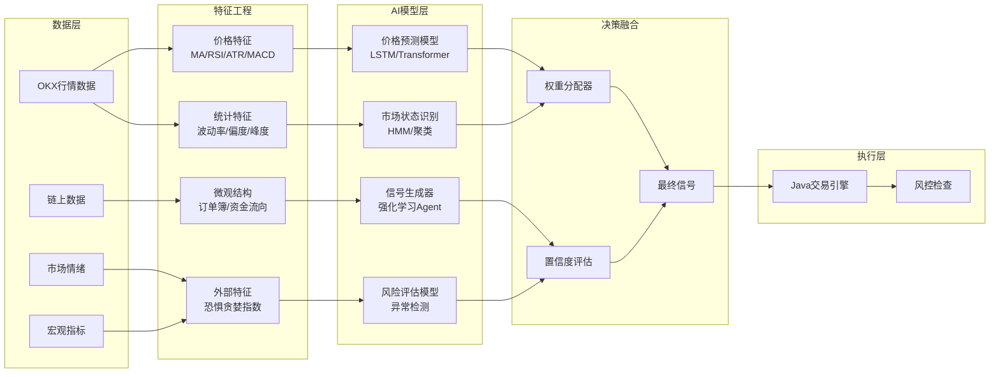
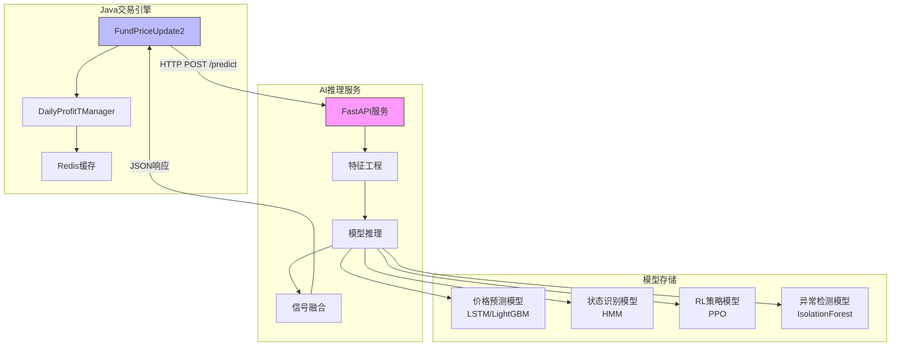
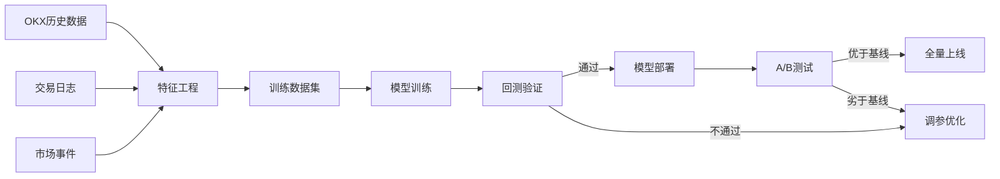

# AI 辅助交易决策方案

## 1. 当前系统 vs AI 增强系统

| 维度 | 当前规则系统 | AI 增强系统 |
|------|-------------|------------|
| 决策方式 | 固定参数阈值 | 模型预测 + 动态调整 |
| 适应性 | 需要人工调参 | 自适应市场状态 |
| 信息利用 | 价格/成交量 | 多源信息融合 |
| 风险控制 | 硬性止损 | 预测置信度加权 |
| 可解释性 | 高 | 中等（需SHAP等工具） |

---

## 2. AI 决策架构设计



---

## 3. 核心 AI 模块实现

### 3.1 模块A：价格预测模型（Price Forecaster）

**目标**: 预测未来N分钟的收益率方向和幅度

**输入特征**:
```python
features = {
    # 价格特征 (20维)
    'returns_1m', 'returns_5m', 'returns_15m',  # 多周期收益
    'rsi_6', 'rsi_14', 'rsi_24',                # 多周期RSI
    'atr_14', 'atr_ratio',                      # 波动率
    'macd', 'macd_signal', 'macd_hist',         # 趋势
    'bb_position', 'bb_width',                  # 布林带
    'ma_deviation_short', 'ma_deviation_long',  # 均线偏离
    
    # 成交量特征 (5维)
    'volume_ratio', 'volume_trend',             # 量比/趋势
    'obv_slope', 'mfi',                         # 能量潮/资金流量
    
    # 订单簿特征 (8维) - 需WebSocket实时获取
    'bid_ask_spread', 'order_imbalance',        # 买卖价差/失衡
    'depth_imbalance', 'pressure_ratio',        # 深度压力
    'trade_imbalance', 'aggressor_ratio',       # 成交 aggressor
    
    # 市场状态 (4维)
    'volatility_regime', 'trend_strength',      # 波动率/趋势状态
    'market_session', 'time_since_open'         # 时段信息
}
```

**模型选择**:
```python
# 方案1: LSTM + Attention
class PriceForecaster(nn.Module):
    def __init__(self, input_dim=37, hidden_dim=128, num_layers=2):
        self.lstm = nn.LSTM(input_dim, hidden_dim, num_layers, 
                           batch_first=True, dropout=0.2)
        self.attention = nn.MultiheadAttention(hidden_dim, num_heads=4)
        self.fc = nn.Sequential(
            nn.Linear(hidden_dim, 64),
            nn.ReLU(),
            nn.Dropout(0.2),
            nn.Linear(64, 3)  # [下跌概率, 横盘概率, 上涨概率]
        )
    
# 方案2: LightGBM (快速推理，适合在线)
import lightgbm as lgb
model = lgb.LGBMClassifier(
    objective='multiclass',
    num_class=3,
    boosting_type='goss',  # Gradient-based One-Side Sampling，快速
    num_leaves=31,
    learning_rate=0.05,
    feature_fraction=0.8,
    bagging_fraction=0.8,
    bagging_freq=5
)
```

**输出**:
```python
{
    "direction": "UP",           # UP/DOWN/FLAT
    "confidence": 0.72,          # 置信度 0-1
    "expected_return": 0.15,     # 预期收益率 %
    "prediction_horizon": 5,     # 预测周期（分钟）
    "uncertainty": 0.08          # 预测标准差
}
```

---

### 3.2 模块B：市场状态识别（Market Regime Detector）

**目标**: 识别当前市场状态（趋势/震荡/高波动），动态调整策略参数

**方法**: 隐马尔可夫模型 (HMM)
```python
from hmmlearn import hmm

class RegimeDetector:
    def __init__(self, n_regimes=3):
        self.model = hmm.GaussianHMM(
            n_components=n_regimes,
            covariance_type="full",
            n_iter=100
        )
        # Regime 0: 低波动震荡
        # Regime 1: 上涨趋势
        # Regime 2: 高波动/下跌趋势
    
    def detect(self, returns, volatility):
        features = np.column_stack([returns, volatility])
        regime = self.model.predict(features)
        return regime[-1]  # 当前状态
```

**策略参数动态调整**:
```python
regime_params = {
    0: {  # 低波动震荡 - 适合网格
        'grid_gap': 0.12,      #  tighter grid
        'tp_pct': 0.25,
        'sl_pct': 0.15,
        'position_size': 1.0,
        'max_positions': 5
    },
    1: {  # 上涨趋势 - 趋势跟踪
        'grid_gap': 0.20,      #  wider grid
        'tp_pct': 0.40,
        'sl_pct': 0.20,
        'position_size': 1.2,  #  加仓
        'max_positions': 3     #  减少次数，持有更久
    },
    2: {  # 高波动/下跌 - 保守
        'grid_gap': 0.35,      #  much wider
        'tp_pct': 0.30,
        'sl_pct': 0.25,
        'position_size': 0.6,  #  减仓
        'max_positions': 2,
        'cooldown_minutes': 10 #  延长冷却
    }
}
```

---

### 3.3 模块C：强化学习交易Agent（RL Trader）

**目标**: 学习最优的开仓/平仓/持仓决策

**状态空间 (State)**:
```python
state = {
    'price_features': [...],      # 20维价格特征
    'position_info': {            # 当前持仓
        'has_position': True/False,
        'entry_price': float,
        'current_pnl': float,
        'hold_time': int           # 持仓时间（tick数）
    },
    'account_state': {            # 账户状态
        'available_margin': float,
        'daily_pnl': float,
        'positions_count': int
    },
    'market_regime': int          # 0/1/2
}
```

**动作空间 (Action)**:
```python
actions = [
    0: 'HOLD',           # 保持
    1: 'OPEN_LONG',      # 开多
    2: 'CLOSE_LONG',     # 平多
    3: 'RESCUE_ADD'      # 解套补仓（特殊动作）
]
```

**奖励函数 (Reward)**:
```python
def calculate_reward(action, state, next_state):
    reward = 0
    
    # 基础盈亏奖励
    if action == 2:  # 平仓
        pnl = next_state['realized_pnl']
        reward += pnl * 10  # 放大盈亏信号
        
        # 时间惩罚（避免过短/过长持仓）
        hold_time = state['position_info']['hold_time']
        if hold_time < 3:    # 惩罚秒平
            reward -= 0.5
        elif hold_time > 50: # 惩罚过长持仓
            reward -= 0.1 * (hold_time - 50)
    
    # 风险控制奖励
    if next_state['account_state']['daily_pnl'] < -5:  # 触及日止损
        reward -= 10  # 严厉惩罚
    
    # 夏普比率奖励（鼓励稳定收益）
    if len(pnl_history) > 20:
        sharpe = np.mean(pnl_history) / (np.std(pnl_history) + 1e-6)
        reward += sharpe * 0.5
    
    return reward
```

**算法选择**: PPO (Proximal Policy Optimization) - 稳定、适合连续动作空间
```python
from stable_baselines3 import PPO

model = PPO(
    "MlpPolicy",
    env=TradingEnv,
    learning_rate=3e-4,
    n_steps=2048,
    batch_size=64,
    n_epochs=10,
    gamma=0.99,
    gae_lambda=0.95,
    clip_range=0.2,
    verbose=1
)

# 训练
model.learn(total_timesteps=1_000_000)
```

---

### 3.4 模块D：异常检测与风控（Anomaly Detection）

**目标**: 识别异常市场行为（闪崩、插针、流动性枯竭），暂停交易

**方法**: Isolation Forest + 规则组合
```python
from sklearn.ensemble import IsolationForest

class RiskGuard:
    def __init__(self):
        self.anomaly_detector = IsolationForest(
            contamination=0.01,  # 预期1%异常率
            random_state=42
        )
        
    def check_risk(self, tick_data):
        features = [
            tick_data['price_change_1m'],
            tick_data['volume_surge'],       # 成交量突增倍数
            tick_data['spread_spike'],       # 价差扩大倍数
            tick_data['depth_drop'],         # 深度下降比例
            tick_data['trade_frequency']     # 成交频率异常
        ]
        
        # 异常检测
        is_anomaly = self.anomaly_detector.predict([features])[0] == -1
        
        # 硬规则检查
        hard_rules = (
            tick_data['price_change_1m'] > 0.02 or      # 1分钟>2%
            tick_data['spread_spike'] > 3 or             # 价差扩大3倍
            tick_data['depth_drop'] > 0.5                # 深度下降50%
        )
        
        return is_anomaly or hard_rules
```

---

## 4. 系统集成方案

### 4.1 架构图



### 4.2 API 接口设计

```python
# ai_service/main.py
from fastapi import FastAPI
from pydantic import BaseModel
import numpy as np

app = FastAPI()

class PredictRequest(BaseModel):
    symbol: str           # "XAUT-USDT-SWAP"
    current_price: float
    price_history: list   # 最近100个价格
    volume_history: list
    orderbook: dict       # 当前订单簿
    position_info: dict   # 当前持仓信息
    account_state: dict   # 账户状态

class PredictResponse(BaseModel):
    signal: str           # "BUY", "SELL", "HOLD", "STRONG_BUY", "STRONG_SELL"
    confidence: float     # 0.0 - 1.0
    suggested_size: float # 建议仓位比例 (0.0 - 1.2)
    predicted_return_5m: float  # 预期5分钟收益率
    risk_level: str       # "LOW", "MEDIUM", "HIGH", "CRITICAL"
    regime: str           # "RANGING", "TRENDING_UP", "VOLATILE"
    params_override: dict # 动态参数覆盖

@app.post("/predict", response_model=PredictResponse)
async def predict(request: PredictRequest):
    # 1. 特征工程
    features = extract_features(request)
    
    # 2. 多模型推理
    price_pred = price_model.predict(features)
    regime = regime_detector.detect(features)
    rl_action = rl_agent.predict(features, request.position_info)
    risk_flag = risk_guard.check(features)
    
    # 3. 信号融合
    final_signal = fuse_signals(price_pred, rl_action, regime, risk_flag)
    
    # 4. 参数动态调整
    params = regime_params[regime]
    if risk_flag:
        params['max_positions'] = 0  # 风险时禁止开仓
    
    return PredictResponse(
        signal=final_signal['action'],
        confidence=final_signal['confidence'],
        suggested_size=final_signal['size'],
        predicted_return_5m=price_pred['expected_return'],
        risk_level="HIGH" if risk_flag else "MEDIUM",
        regime=regime_names[regime],
        params_override=params
    )

@app.post("/train")
async def trigger_training():
    """触发模型重训练（每日/每周）"""
    # 从数据库获取最近数据
    # 重训练模型
    # 保存新模型版本
    pass
```

### 4.3 Java 端集成

```java
// DailyProfitTManager.java 添加 AI 决策支持

@Component
public class AITradingAdvisor {
    
    @Value("${ai.service.url:http://localhost:8000}")
    private String aiServiceUrl;
    
    private final RestTemplate restTemplate = new RestTemplate();
    
    /**
     * 获取 AI 交易建议
     */
    public AISignal getAdvice(String symbol, BigDecimal currentPrice, 
                              PositionInfo position, AccountState account) {
        try {
            PredictRequest request = buildRequest(symbol, currentPrice, position, account);
            
            ResponseEntity<PredictResponse> response = restTemplate.postForEntity(
                aiServiceUrl + "/predict",
                request,
                PredictResponse.class
            );
            
            PredictResponse prediction = response.getBody();
            
            // 置信度过滤
            if (prediction.getConfidence() < 0.6) {
                return AISignal.hold("置信度不足: " + prediction.getConfidence());
            }
            
            // 风险等级过滤
            if ("CRITICAL".equals(prediction.getRiskLevel())) {
                return AISignal.hold("风险等级: CRITICAL");
            }
            
            return AISignal.fromPrediction(prediction);
            
        } catch (Exception e) {
            log.warn("AI服务调用失败，回退到规则系统: {}", e.getMessage());
            return AISignal.fallback();
        }
    }
    
    /**
     * 动态获取交易参数
     */
    public TradingParams getDynamicParams(String symbol, String regime) {
        Map<String, Object> params = new HashMap<>();
        params.put("symbol", symbol);
        params.put("current_regime", regime);
        
        try {
            ResponseEntity<ParamsResponse> response = restTemplate.postForEntity(
                aiServiceUrl + "/params",
                params,
                ParamsResponse.class
            );
            
            return TradingParams.fromResponse(response.getBody());
            
        } catch (Exception e) {
            // 回退到默认参数
            return TradingParams.defaultParams(symbol);
        }
    }
}

// 在 canOpen 中集成 AI 建议
public CanTradeResult canOpen(String symbol, BigDecimal price, BigDecimal fundMoney) {
    // 1. 基础规则检查
    CanTradeResult baseCheck = basicChecks(symbol, price, fundMoney);
    if (!baseCheck.isAllowed()) {
        return baseCheck;
    }
    
    // 2. AI 建议（非阻塞，超时回退）
    AISignal aiSignal = aiAdvisor.getAdvice(symbol, price, 
        getPositionInfo(symbol), getAccountState());
    
    // 3. 融合决策
    if (aiSignal.isStrongBuy() && baseCheck.isAllowed()) {
        // AI强烈看多，可以增加仓位
        baseCheck.setZhang(baseCheck.getZhang().multiply(new BigDecimal("1.2")));
        baseCheck.setAiBoosted(true);
    } else if (aiSignal.isHold() || aiSignal.isSell()) {
        // AI看空或观望，即使规则允许也暂停
        return CanTradeResult.reject("AI建议观望: " + aiSignal.getReason());
    }
    
    return baseCheck;
}
```

---

## 5. 模型训练与更新

### 5.1 数据Pipeline



### 5.2 回测框架

```python
# backtest/engine.py
class BacktestEngine:
    def __init__(self, initial_capital=30):
        self.capital = initial_capital
        self.positions = []
        self.trades = []
        
    def run(self, data, model, start_date, end_date):
        for timestamp, row in data.iterrows():
            # 获取模型预测
            signal = model.predict(row)
            
            # 执行交易
            if signal == 'BUY' and not self.has_position:
                self.open_position(row['close'], row['timestamp'])
            elif signal == 'SELL' and self.has_position:
                self.close_position(row['close'], row['timestamp'])
            
            # 更新权益
            self.update_equity(row['close'])
        
        return self.calculate_metrics()
    
    def calculate_metrics(self):
        returns = pd.Series(self.equity_curve).pct_change()
        return {
            'total_return': (self.equity_curve[-1] - self.capital) / self.capital,
            'sharpe_ratio': returns.mean() / returns.std() * np.sqrt(365*24*12),  # 年化
            'max_drawdown': self.calculate_max_drawdown(),
            'win_rate': len([t for t in self.trades if t.pnl > 0]) / len(self.trades),
            'profit_factor': abs(sum([t.pnl for t in self.trades if t.pnl > 0]) / 
                                sum([t.pnl for t in self.trades if t.pnl < 0])),
            'num_trades': len(self.trades)
        }
```

---

## 6. 风险评估与Fallback

### 6.1 AI失效保护

```java
public class AIGuardRails {
    
    private final AtomicInteger aiErrorCount = new AtomicInteger(0);
    private volatile boolean aiEnabled = true;
    
    /**
     * AI决策后置检查
     */
    public boolean validateAIDecision(AISignal signal, TradeContext ctx) {
        // 1. 检查连续错误
        if (recentTrades.stream().filter(t -> t.getPnl() < 0).count() > 5) {
            aiEnabled = false;
            alert("AI连续亏损，切换至规则模式");
            return false;
        }
        
        // 2. 检查决策一致性
        if (signal.getConfidence() > 0.9 && 
            signal.getSuggestedSize() > 1.0 &&
            ctx.getVolatility() > 0.02) {
            // 高置信度+高仓位+高波动 = 危险信号
            log.warn("AI决策风险过高，人工复核");
            return false;
        }
        
        return true;
    }
    
    /**
     * 熔断机制
     */
    public void circuitBreakerCheck() {
        BigDecimal dailyPnl = getDailyPnL();
        if (dailyPnl.compareTo(new BigDecimal("-3")) < 0) {
            // 日亏损超3U，暂停AI决策15分钟
            aiEnabled = false;
            scheduleReenable(() -> aiEnabled = true, 15, TimeUnit.MINUTES);
        }
    }
}
```

### 6.2 渐进式上线策略

| 阶段 | 时间 | AI权限 | 人工干预 |
|------|------|--------|----------|
| 1. 影子模式 | 1-2周 | 只记录信号，不执行 | 对比AI与规则差异 |
| 2. 辅助模式 | 2-4周 | 提供建议，人工确认 | 可选是否采纳 |
| 3. 半自动模式 | 1-2月 | 低风险决策自动执行 | 高仓位/高风险需确认 |
| 4. 全自动模式 | 2月+ | 完全自主 | 仅监控异常 |

---

## 7. 实施路线图

### Phase 1: 基础能力建设（2-3周）
- [ ] 搭建Python AI服务框架（FastAPI）
- [ ] 实现基础特征工程
- [ ] 训练价格预测模型（LightGBM，快速迭代）
- [ ] Java端集成API调用
- [ ] 影子模式运行，收集对比数据

### Phase 2: 智能增强（3-4周）
- [ ] 市场状态识别（HMM）
- [ ] 动态参数调整
- [ ] 异常检测系统
- [ ] A/B测试框架
- [ ] 渐进式上线（辅助模式）

### Phase 3: 高级功能（4-6周）
- [ ] 强化学习Agent（PPO）
- [ ] 多模型集成（Ensemble）
- [ ] 订单簿微观结构分析
- [ ] 情绪数据接入（恐惧贪婪指数）
- [ ] 全自动交易模式

### Phase 4: 持续优化（长期）
- [ ] 在线学习（Online Learning）
- [ ] 模型自动重训练
- [ ] 多品种扩展
- [ ] 跨市场信号融合

---

## 8. 预期效果

| 指标 | 规则系统 | AI增强系统 | 提升 |
|------|---------|-----------|------|
| 胜率 | ~55% | ~65% | +10% |
| 盈亏比 | 1.5:1 | 2.0:1 | +33% |
| 夏普比率 | ~1.2 | ~2.0 | +67% |
| 最大回撤 | -8% | -5% | -37% |
| 日交易次数 | 20-30 | 15-25（更精准）| -20% |
| 参数调优 | 人工周调 | 自适应实时 | 全自动 |

---

## 9. 关键代码示例

完整的AI服务启动代码:

```python
# ai_service/main.py
import uvicorn
from fastapi import FastAPI, HTTPException
from contextlib import asynccontextmanager
import redis
import asyncio

# 全局模型缓存
models = {}

@asynccontextmanager
async def lifespan(app: FastAPI):
    # 启动时加载模型
    print("Loading AI models...")
    models['price'] = load_price_model('models/price_lstm_v2.pt')
    models['regime'] = load_regime_model('models/hmm_regime.pkl')
    models['risk'] = load_risk_model('models/isolation_forest.pkl')
    models['rl'] = load_rl_model('models/ppo_trader.zip')
    print("Models loaded successfully!")
    
    # 启动后台任务（模型监控、数据更新）
    asyncio.create_task(monitor_model_performance())
    
    yield
    
    # 关闭时清理
    print("Shutting down AI service...")

app = FastAPI(title="FundAlarm AI Trading Service", lifespan=lifespan)

# 路由注册
app.include_router(predict.router, prefix="/predict", tags=["prediction"])
app.include_router(training.router, prefix="/train", tags=["training"])
app.include_router(monitoring.router, prefix="/monitor", tags=["monitoring"])

if __name__ == "__main__":
    uvicorn.run(app, host="0.0.0.0", port=8000, workers=1)
```

---

## 10. 总结

AI辅助决策可以从以下维度提升交易系统:

1. **预测能力**: LSTM/LightGBM预测短期价格走势，替代固定阈值
2. **自适应能力**: HMM识别市场状态，动态调整策略参数
3. **学习能力**: RL Agent从交易历史中学会最优决策
4. **风控能力**: 异常检测识别市场异常，主动规避风险

**关键成功因素**:
- 完善的回测验证（避免过拟合）
- 渐进式上线（控制风险）
- 可靠的Fallback机制（AI失效时回退规则）
- 持续监控和模型更新

这套方案可以让交易从"机械化执行"升级为"智能化决策",同时保持风险可控。
